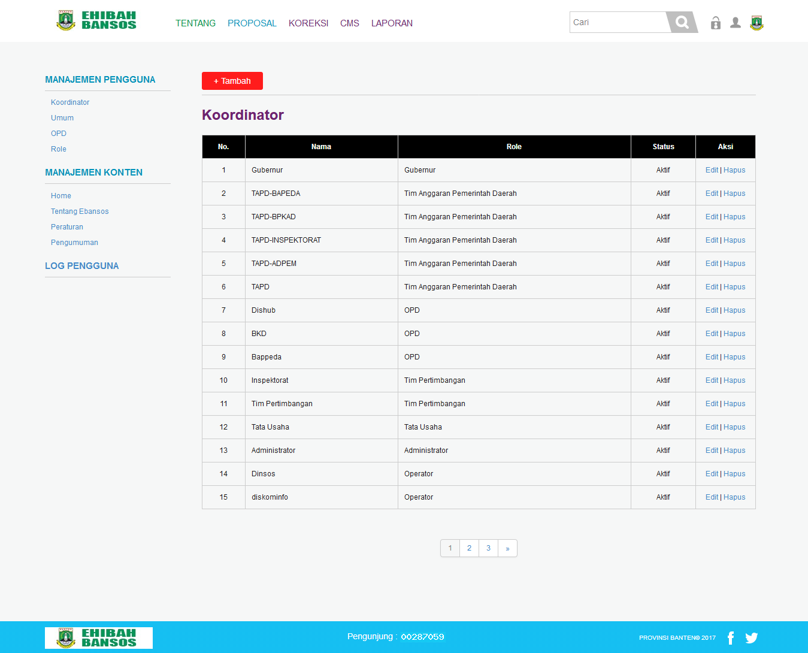

## Daftar Isi
* Will be replaced with the ToC, excluding the "Contents" header
{:toc}

## 1.	Pendahuluan
### 1.1 Tujuan Pembuatan Implementasi
Dokumen User Manual Apliksai Ehibah-Bansos ini dibuat untuk tujuan sebagai berikut:

  1. Menggambarkan dan menjelaskan penggunaan aplikasi Ehibah-Bansos untuk setiap pelapor atau operator OPD.
  2. Sebagai panduan konfigurasi dan penggunaan aplikasi E-Bansos.

### 1.2 Deskripsi Umum Sistem
  1. Deskripsi Umum Aplikasi
  Ehibah-Bansos adalah aplikasi yang berbasis web yang akan dipakai oleh setiap golongan masyarakat dan pihak terkait berhubungan dengan pengajuan dana hibah dan bantuan sosial dan proses-proses yang terdapat untuk mencairkan dana hibah atau bansos.

  2. Deskripsi Umum Kebutuhan Aplikasi yang Akan Diimplementasikan
  Deskripsi Umum kebutuhan aplikasi yang akan diimplementasikan meliputi semua informasi yang bersifat teknis dan menjadi acuan dalam pengembangan apliksi.

  ## 2.Menu dan Cara Penggunaan
### 2.1 Struktur Menu
Adapun struktur menu pada aplikasi E-Bansos adalah sebagai berikut:

1. Menu Dashboard
- Tentang
- Proposal Hibah
- Mendaftar  Hibah Bansos

2. Menu Tentang
- Tentang Ehibah-Bansos
- Tahapan

3. Menu Proposal Hibah
- Kategori Hibah Bansos
- Status hibah Bansos

4. Mendaftar Hibah Bansos

### 2.2 Penggunaan
Pada bagian ini akan dijelaskan mengenai tata cara memasukan data hibah masuk sebagai data sumber melalui alamat situs yang telah disediakan.
#### 2.2.1 Cara Membuka Situs
Untuk memulai akses terhadap aplikasi Ehibah-Bansos ini:
1. Bukalah aplikasi E-Bansos melalui web browser dengan alamat url sebagai berikut :  http://ehibahbansos.bantenprov.go.id
2. Kemudian tekan Enter pada tombol keyboard atau klik tombol GO pada browser.
3. Akan muncul tampilan halaman depan aplikasi E-Bansos sebagai berikut:

### 2.3 Menu Tentang

1. E-Hibah Bansos Provinsi Banten, yang membahas tentang apa itu E-Hibah Bansos.

2. E-Hibah Bansos, yang berisikan mengenai kriteria untuk pemberian hibah, kepada siapa saja pemberian bansos berupa uang dan barang, apa saja yang dapat dilakukan oleh seluruh masyarakat dan organisasi lingkup Provinsi Banten dalam kegiatan E-Hibah Bansos.

3. Tahapan E-Hibah Bansos, yang membahs mengenai tahapan dalam pengelolaan E-Hibah Bansos.

#### 2.3.1 Tahapan
Pada konten ini membahas mengenai workflow dalam pengelolaan dana E-Hibah Bansos dari penyerahan dokumen ke Gubernur oleh OPD dan masyarakat hingga ke proses pertanggungjawaban pelaporan masyarakat.

## 3. Tampilan Super Admin
Untuk melakukan login sebagai superadmin maka dapat mengklik icon "orang" pada sebelah kanan atas aplikasi Ehibah-Bansos. Maka pada layar akan tampak menu login situs Ehibah-Bansos seperti dibawah ini:

Setelah user memasukan Id dan Password untuk Log in sebagai super admin, maka tampilan akan menujukan seperti gambar dibawah ini:

Seperti Tampilan diatas terdapat modul-modul dari Aplikasi Ehibah-Bansos pada super admin seperti, Koreksi, CMS dan Laporan.

### 3.1 Menu Koreksi
Tampilan ini dapat diakses dengan cara mengklik "KOREKSI" pada bagian atas aplikasi Ehibah-Bansos, sehingga akan memunculkan tampilan seperti ini:

Pada tampilan ini Superadmin dapat melihat semua pelaporan hibah dan bansos dari setiap OPD, dari mulai proses permohonan sampai dengan persetujuan dari proposal pelapor tersebut.

### 3.2 Menu CMS
Tampilan ini dapat diakses dengan cara mengklik "CMS" pada bagian atas aplikasi Ehibah-Bansos, sehingga akan memunculkan tampilan seperti ini:

Pada tampilan ini Superadmin dapat melihat semua manajemen pengguna dari Aplikasi Ehibah-Bansos, mulai dari Koordinator, umum, sampai OPD.

### 3.3 Menu Laporan
Tampilan ini dapat diakses dengan cara mengklik "Laporan" pada bagian atas aplikasi Ehibah-Bansos, sehingga akan memunculkan tampilan seperti ini:

Pada tampilan ini Superadmin dapat membuat laporan pertanggung jawaban untuk setiap laporan yang ada, dengan cara mengklik “Tambah” pada seperti diatas dan mengisi form yang tersedia. Maka akan tampil seperti gambar dibawah ini:

## 4. Tampilan Pendaftar
Untuk melakukan login sebagai pendaftar maka dapat mengklik icon "orang" pada sebelah kanan atas aplikasi Ehibah-Bansos. Maka pada layar akan tampak menu login situs Ehibah-Bansos seperti dibawah ini:

Setelah user memasukan Id dan Password untuk Log in sebagai super admin, maka tampilan akan menujukan seperti gambar dibawah ini:

Seperti Tampilan diatas terdapat modul-modul dari Aplikasi Ehibah-Bansos pada pendaftar seperti, Daftar dan LPJ.

### 4.1 Menu Daftar Hibah/Bansos
Tampilan ini dapat di akses oleh Pengguna/pelapor dengan cara mengklik tulisan "DAFTAR" pada bagian atas aplikasi E-Bansos, sehingga akan muncul tampilan seperti ini:

Pada halaman ini terdapat formulir untuk mendaftarkan dana hibah bansos pada aplikasi E-Bansos, didalam formulir Pengguna/pelapor harus mengisi field-field yang disediakan seperti:
1. Tahun Anggaran
  Yang dimaksud dari “Tahun Anggaran” ini adalah tahun dimana pengajuan yang dibuat pengguna/pelapor
2. OPD
  Yang dimaksud dari “OPD” ditujukan untuk Dinas apa pengguna membuat pendaftaran ehibah bansos ini.
3. Jenis
  Yang dimaksud dari “jenis” ini adalah bentuk dari pelapor mendaftar, untuk hibah atau bansos (bantuan sosial).
4. Nama (Individu atau organisasi)
  Yang dimaksud dari "Nama Pengguna" disini adalah nama pelapor atau pembuat yang menginput proposal hibah / bansos kedalam aplikasi E-Bansos ini.
5. Alamat
  Yang dimaksud dari "Alamat" disini adalah alamat dari individu atau organisasi yang mengajukan proposal dana hibah / bansos.
6. Judul kegiatan
  Yang dimaksud dari "Judul Kegiatan" disini adalah judul kegiatan dari proposal dana hibah / bansos yang diajukan kedalam aplikasi E-Bansos ini.
7. Latar belakang
  Yang dimaksud dari "Latar Belakang" disini adalah latar belakang diajukannya proposal dana hibah / bansos tersebut.
8. Maksud dan tujuan
  Yang dimaksud dari "Maksud dan Tujuan" disini adalah maksud dan tujuan diajukannya proposal dana hibah / bansos tersebut.
9. Proposal kegiatan
  Dikonten "Proposal" ini pelapor atau pendaftar e-bansos dapat mengupload proposal pengajuan dana hibah / bansos tersebut kedalam aplikasi E-Bansos, file yang diupload kedalam aplikasi berupa file pdf.
10. Dana
  Pada konten "Dana" ini operator OPD dapat menginput dana proposal hibah beserta deskripsi dana tersebut untuk apa saja, operator OPD dapat menambahkan dana lagi dengan cara mengklik "Tambah Dana" yang berada dibawah field dana.
11. Foto kegiatan
   Pada konten "Foto" ini pembuat atau pelapor dapat mengupload foto kegiatan dari proposal hibah / bansos tersebut, operator OPD dapat menambahkan foto yang lain dengan cara mengklik "Tambah Foto" yang berada dibawah field foto.

Setelah semua terisi operator OPD dapat mengklik tombol "Daftar" untuk menyimpan data Hibah Bansos ke dalam aplikasi E-Bansos.

### 4.2 Menu LPJ
Tampilan ini dapat di akses oleh Pengguna/pelapor dengan cara mengklik tulisan "LPJ" pada bagian atas aplikasi E-Bansos, Jika Pengguna/Pelapor pernah melakukan pendaftaran ehibah-bansos akan ditampilan di Menu LPJ sebagai bentuk pertanggung jawaban.

Dalam menu LPJH ini setiap Pelapor yang sudah mengajukan Proposal atau mendaftar Proposal Hibah/Bansos akan mendaptkan Lembar Pertanggung Jawaban (LPJ) setiap pelapor yang mendaftar akan mendaptkan LPJ sebanyak pelapor melakukan Daftar atau mengajukan proposal. 

## 5. Tampilan OPD
Untuk melakukan login sebagai OPD maka dapat mengklik icon "orang" pada sebelah kanan atas aplikasi Ehibah-Bansos. Maka pada layar akan tampak menu login situs Ehibah-Bansos seperti dibawah ini:

Setelah user memasukan Id dan Password untuk Log in sebagai pendaftar, maka tampilan akan menujukan seperti gambar dibawah ini:

Seperti Tampilan diatas terdapat modul-modul dari Aplikasi Ehibah-Bansos pada OPD seperti, Daftar, cek berkas, dan pemberian rekomendasi.

### 5.1 Menu Daftar
Tampilan ini dapat di akses oleh OPD dengan cara mengklik tulisan "DAFTAR" pada bagian atas aplikasi E-Bansos, sehingga akan muncul tampilan seperti ini:

Pada tampilan ini operator OPD dapat mendaftar hibah atau bansos yang masuk pada OPD tersebut untuk diajukan lagi ke proses yang selanjutnya.

### 5.2 Menu Cek Berkas
Tampilan ini dapat di akses oleh OPD dengan cara mengklik tulisan "CEK BERKAS" pada bagian atas aplikasi E-Bansos, sehingga akan muncul tampilan seperti ini:

Pada tampilan ini operator OPD dapat melihat:
1. Pada menu pengecekan berkas ini OPD dapat melhat proposal Hibah Bansos sesuai dengan masing-masing OPD.
2. Pada menu pengecekan berkas ini OPD dapat melihat dan mengecek proposal   hibah dari pelapor untuk di proses lebih lanjut bila pengajuan proposal dan persyaratan sudah dilengkapi.

### 5.3 Menu Pemberian Rekomendasi
Tampilan ini dapat di akses oleh OPD dengan cara mengklik tulisan "PEMBERIAN REKOMENDASI" pada bagian atas aplikasi E-Bansos, sehingga akan muncul tampilan seperti ini:

Pada tampilan ini operator OPD dapat memberikan surat rekomendasi untuk setiap pelapor yang proposalnya sudah melewati sesuai proses yang ada.

## 6. Tampilan Inspektorat
Untuk melakukan login sebagai Inspektorat maka dapat mengklik icon "orang" pada sebelah kanan atas aplikasi Ehibah-Bansos.
Maka pada layar akan tampak menu login situs Ehibah-Bansos seperti dibawah ini:

Setelah user memasukan Id dan Password untuk Log in sebagai Inspektorat, maka tampilan akan menujukan seperti gambar dibawah ini:

Seperti Tampilan diatas terdapat modul dari Aplikasi Ehibah-Bansos pada Inspektorat seperti, Rekomendasi dan Verifikasi

### 6.1 Menu Rekomendasi dan Verifikasi
Tampilan ini dapat diakses dengan cara mengklik "REKOMENDASI DAN VERIFIKASI" pada bagian atas aplikasi Ehibah-Bansos, sehingga akan memunculkan tampilan "Proposal Hibah" seperti ini:

Pada tampilan ini Inspektorat dapat memeriksa kembali proposal dari setiap pelapor dan memberikan surat rekomendasi jika setiap proposal dari pelapor sudah melewati proses dan tahap-tahap yang diberikan sebelumnya untuk dilanjutkan ke proses selanjutnya.

## 7. Tampilan TAPD
Untuk melakukan login sebagai TAPD maka dapat mengklik icon "orang" pada sebelah kanan atas aplikasi Ehibah-Bansos. Maka pada layar akan tampak menu login situs Ehibah-Bansos seperti dibawah ini:

Setelah user memasukan Id dan Password untuk Log in sebagai TAPD, maka tampilan akan menujukan seperti gambar dibawah ini:

Seperti Tampilan diatas terdapat modul-modul dari Aplikasi Ehibah-Bansos pada TAPD seperti, Verifikasi, dan Generate.

### 7.1 Menu Verifikasi
Tampilan ini dapat di akses oleh TAPD dengan cara mengklik tulisan "VERIFIKASI" pada bagian atas aplikasi E-Bansos, sehingga akan muncul tampilan seperti ini:

Pada tampilan ini TAPD dapat melihat bagaimana proses dan perkembangan dari proposal pelapor ehibah-bansos, dan TAPD dapat mempertimbangkan proposal pelapor guna untuk melanjutkan proses yang telah dibuat.

### 7.2 Menu Generate
Tampilan ini dapat di akses oleh TAPD dengan cara mengklik tulisan "Generate" pada bagian atas aplikasi E-Bansos, sehingga akan muncul tampilan seperti ini:

Pada tampilan ini TAPD dapat melihat semua data Daftar Calon Normatif Penerimaan Belanja Hibah secara keseluruhan.
