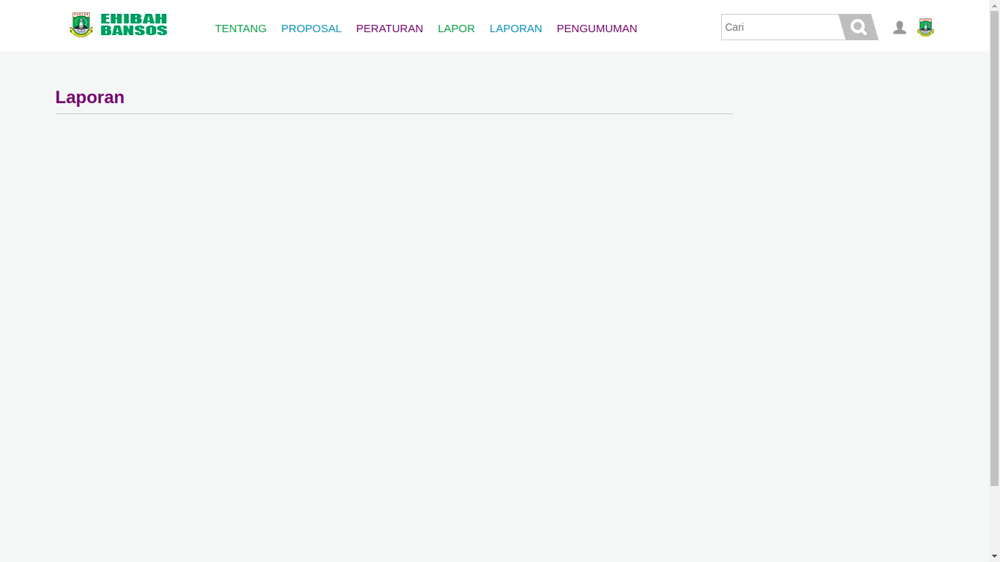

## Daftar Isi
* Will be replaced with the ToC, excluding the "Contents" header
{:toc}

E-hibahbansos adalah aplikasi yang berbasis web yang akan dipakai oleh setiap golongan masyarakat dan pihak terkait berhubungan dengan pengajuan dana hibah dan bantuan sosial dan proses-proses yang terdapat untuk mencairkan dana hibah atau bansos.
Deskripsi Umum kebutuhan aplikasi yang akan diimplementasikan meliputi semua informasi yang bersifat teknis dan menjadi acuan dalam pengembangan apliksi.

Berikut ini adalah tampilan - tampilan yang terdapat didalam apliaksi E-hibahbansos:

## 1. Tampilan Awal E-hibahbansos

Pada saat membuka aplikasi maka *user* akan ditampilkan halaman awal aplikasi yang berisikan mengenai info-info mengenai aplikasi E-hibahbansos.

### 1.1 Tampilan Tentang

Pada modul TENTANG ini *user* dapat mengetahui informasi mengenai aplikasi E-hibahbansos seperti apa itu e-hibahbansos, tujuan dan tahapan-tahapan yang terdapat di dalam aplikasi E-hibahbansos.

### 1.2 Proposal

Pada modul PROPOSAL ini *user* dapat melihat proposal-proposal yang sudah terinput kedalam apliaksi E-hibahbansos dan sudah berada pada tahapan mana proposal tersebut yang ditunjukan dengan angka 1 sampai 7 pada proposal tersebut.

### 1.3 Peraturan

Pada modul PERATURAN ini *user* dapat melihat peraturan-peraturan yang menjadi dasar dalam pembuatan aplikasi E-hibahbansos.

### 1.4 Lapor

Pada modul LAPOR ini *user* dapat membuat pelaporan mengenai kendala atau masalah yang dihadapi oleh *user* dalam penggunaan aplikasi.

### 1.5 Laporan

Pada modul LAPORAN ini *user* dapat melihat laporan-laporan yang telah dikirim oleh *user* kedalam aplikasi.

### 1.6 Pengumuman

Pada modul PENGUMUMAN ini *user* dapat melihat pengumuman yang  dikeluarkan oleh operator E-hibahbansos.

### 1.7 Login

Tampilan login ini berisikan 2 *field* yang harus diisi oleh *user* untuk masuk sebagai akun yang diinginkan.

### 1.8 Registrasi

Modul REGISTRASI ini digunakan untuk pendaftar yang belum memiliki akun E-hibahbansos.

## 2. Tampilan Superadmin

### 2.1 Tampilan Awal Superadmin

Tampilan awal superadmin ini dapat diakses ketika *user* login dengan id dan password superadmin. didalam tampilan ini terdapat beberapa modul seperti Koreksi, CMS dan Laporan

### 2.2 Tampilan Koreksi

Modul Koreksi ini dapat diakses oleh superadmin dengan cara mengklik tulisan "koreksi" di bagian atas aplikasi. Modul ini dapat digunakan untuk mengkoreksi data alur kegiatan E-hibahbansos

### 2.3 Tampilan CMS (Content Management System)

Modul CMS ini dapat diakses dengan mengklik tulisan "CMS" dibagian atas aplikasi. Modul CMS ini digunakan untuk mengatur konten-konten yang terdapat diaplikasi seperti Manajemen Pengguna, Manajemen Konten dan Log Pengguna.

### 2.4 Tampilan Laporan

Modul Laporan ini dapat diakses dengan cara mengklik tulisan "Laporan" pada bagian atas aplikasi. Didalam modul ini superadmin dapat melihat laporan mengenai proposal yang telah diproses di aplikasi E-hibahbansos.

## 3. Tampilan Pendaftar

Tampilan awal Pelapor ini dapat diakses ketika *user* login dengan id dan password yang sudah daftar sebelumnya. didalam tampilan ini terdapat beberapa modul seperti Daftar, LPJ.

### 3.1 Tampilan Daftar

Modul daftar ini dapat diakses dengan cara mengklik tulisan "Daftar" pada bagian atas aplikasi. Didalam modul ini pelapor dapat membuat proposal yang akan diajukan untuk OPD terkait di aplikasi E-hibahbansos.

### 3.2 Tampilan LPJ

Modul LPJ ini dapat diakses dengan cara mengklik "LPJ" pada bagian atas aplikasi Ehibah-Bansos. sehingga akan memunculkan tampilan banyaknya proposal yang diajukan di aplikasi ehibah-bansos.

## 4. Tampilan OPD

Tampilan awal OPD ini dapat diakses ketika *user* login dengan id dan password OPD. didalam tampilan ini terdapat beberapa modul seperti Daftar, Cek berkas, dan Pemberian rekomendasi.

### 4.1 Tampilan Daftar

Modul daftar ini dapat diakses dengan cara mengklik tulisan "Daftar" pada bagian atas aplikasi. Didalam modul ini OPD dapat membuat proposal yang akan diajukan melalui OPD terkait di aplikasi E-hibahbansos.

### 4.2 Tampilan Cek Berkas

Modul cek berkas ini dapat diakses dengan cara mengklik tulisan "Cek berkas" pada bagian atas aplikasi. Didalam modul ini setiap OPD dapat melihat dan mengecek kembali apakah proposal yang masuk sudah sesuai atau belum untuk di ajukan.

### 4.3 Tampilan Pemberian Rekomendasi

Modul pemberian rekomendasi ini dapat diakses dengan cara mengklik tulisan "pemberian rekomendasi" pada bagian atas aplikasi. Didalam modul ini setiap OPD dapat memberikan Rekomendasi untuk setiap proposal yang sudah sesuai dengan persyaratan yang ditentukan untuk melanjutkan ke proses/tahap selanjutnya.

## 5. Tampilan Inspektorat

Tampilan awal Inspektorat ini dapat diakses ketika *user* login dengan id dan password Inspektorat. didalam tampilan ini terdapat modul Rekomendasi dan Verifikasi.

### 5.1 Tampilan Rekomendasi dan Verifikasi

Modul Rekomendasi dan Verifikasi ini dapat diakses dengan cara mengklik tulisan "rekomendasi dan verifikasi" pada bagian atas aplikasi. Didalam modul ini Inspektorat dapat melihat setiap Proposal yang masuk dan mengecek setiap proposal, serta dapat memberikan pengajuan kepada setiap proposal yang sudah melengkapi dan melewati tahap-tahap sebelumnya untuk melanjutkan ke tahap selanjutnya.

## 6. Tampilan TAPD

Tampilan awal TAPD ini dapat diakses ketika *user* login dengan id dan password TAPD. Didalam tampilan ini terdapat beberapa modul seperti Verifikasi, dan Generate.

### 6.1 Tampilan Verifikasi

Modul Verifikasi ini dapat diakses dengan cara mengklik tulisan "verifikasi" pada bagian atas aplikasi. Didalam modul ini TAPD dapat melihat dan mengecek setiap proposal yang masuk, serta TAPD dapat memberikan verifikasi untuk setiap proposal yang sudah melewati proses tahap-tahap dan melengkapi persyaratan untuk dilanjutkan ke proses selanjutnya.

### 6.2 Tampilan Generate

Modul Generate ini dapat diakses dengan cara mengklik tulisan "Generate" pada bagian atas aplikasi. Didalam modul ini TAPD dapat
melihat seluruh proposal yang masuk dari berbagai OPD dan Status dari Proposal tersebut.
