## Abstrak

Pada akhir meledaknya bisnis dot-com pada tahun 1990-an, banyak pemerintah yang berkomitmen membuat situs portal sebagai layanan informasi bagi warganegara mereka. Di Amerika Serikat, portal utamanya adalah FirsGov.gov, di Inggris portal utama layanan informasi bagi warganegara adalah directgov dan busineslink.gov.uk untuk layanan informasi bisnis. Beberapa penelitian yang bersifat internasional dilakukan untuk mengukur kemampuan transaksional portal-portal ini, yang paling menyolok adalah penelitian yang diselenggarakan oleh Accenture. Website pemerintah daerah merupakan merupakan strategi *e-goverment* dengan sasaran agar maysarakat dapat dengan mudah memperoleh akses informasi. Untuk mencapai sasaran tersebut maka semua informasi perlu dikumpulkan dalam satu wadah portal web yang dapat dengan mudah diakses oleh masyarakat. dengan adanya web portal pemerintah ini dapat memudahkan masyarakat dalam mencari informasi tentang keadaan Pemerintah Banten dan tentang Provinsi Banten.

## Daftar Isi

* Will be replaced with the ToC, excluding the "Contents" header
{:toc}

## 1. Pendahuluan

### 1.1 Latar Beakang

*E-government* menjadi proses pemanfaatan tekhnologi informasi sebagai media untuk membantu menjalankan sistem pemerintahan secara lebih efektif dan efisien. Sebagai wujud dari penerapan e-government di Indonesia salah satunya adalah dengan pembuatan website pemerintah daerah.
Pembuatan website bagi pemerintah daerah di Indonesia merupakan implementasi dari Instruksi Presiden No. 3 Tahun 2003, yang isinya memanfaatan teknologi informasi (internet) dalam menunjang aktivitas pemerintahannya, baik pemerintah pusat maupun pemerintah daerah menuju terwujudnya *e-government* di Indonesia.

Pemerintahan yang baik harus memiliki sebuah wadah informasi yang dapat menjadi prasarana bagi masyarakat untuk mengetahui kegiatan kepemerintahan maupun info yang meliputi Profil Pemerintah, Profil Provinsi dan informasi-informasi lainnya yang dapat dibuka untuk umum yang nantinya akan terhubung langsung  terhubung dengan website yang ada.

Saat ini belum terdapat portal yang menampung informasi yang ada di Banten sehingga jika mnasyarakat ingin mencari suatu informasi ia harus mencari website terkait dengan informasi yang dicari, sehingga agak merepotkan bagi masyarakat. Dengan adanya **JAWARA E-gov** ini diharapkan dapat membantu masyarakat dalam mencari informasi yang terdapat didalam pemerintahan Provinsi Banten.

### 1.2 Tujuan

Tujuan dari perancangan portal web ini adalah sebagai berikut:

    1. Mempermudah masyarakat dalam mencari informasi
    2. Untuk satu pintu bagi semua apliaksi OPD yang terdapat dipemerintahan Banten

### 1.3 Karakteristik Produk

    1. dapat menyajikan informasi mengenai pemerintahan Provinsi Banten
    2. Dikembangkan menggunakan *framework* atau biasa dikenal dengan berbasis web
    3. *User Friendly* (menggunakan *interface* / antarmuka yang mudah digunakan oleh *user*

### 1.4 Keluaran yang diinginkan

    1. Tersedianya situs portal pemerintah Provonsi Banten (JAWARA E-gov) bagi sistem informasi/aplikasi/website
    2. Tersedianya dokumentasi API yang digunakan

## 2. METODE PENELITIAN

Untuk memperoleh data yang dapat menunjang aplikasi ini, maka di perlukan data teoritis dan data dinas terkait untuk mendapatkan data dan informasi yang berhubungan dengan aplikasi ini.
Adapun penyusun melakukan beberapa penelitian yang dilakukan dengan :

### 2.1 Metode yang Digunakan

Menggunakan metode *Prototyping* untuk melakukan perancangan sistem informasi berbasis web.

Ilustrasi alur *Prototyping*

### 2.2 Metode Pengumpulan Data

Untuk mengumpulkan data yang diperlukan untuk membangun sistem ini diadakan wawancara dan studi pustaka. Pengumpulan data ini dilakukan untuk mengetahui permasalahan dan gambaran sistem yang sedang berjalan sehingga dapat mengembangkannya untuk membentuk sistem baru yang dapat mendukung sistem yang sedang berjalan.

* Wawancara ini dilakukan kepada Pemprov Banten. Wawancara dilakukan kepada sistem analist Pemprov Banten untuk mengetahui permasalahan dalam proses pendataan yang sedang berjalan sekarang.
* Studi pustaka, melakukan pengumpulan informasi dari buku text, internet sebagai referensi.

### 2.3 Metode Analisis

Tim pengembang aplikasi akan melakukan analisis jika diperlukan dapat dilakukan survey pendahuluan untuk melihat sejauh mana kebutuhan pengguna akan sistem yang akan dibangun, fasilitas yang akan dibangun, data-data yang dibutuhkan, dll. Dalam analisis ini dilakukan diskusi-diskusi baik dengan bagian terkait pada satuan kerja.

### 2.4 Ruang Lingkup Sistem Informasi / Aplikasi

    1. Menyediakan situs portal pemerintah sebagai wadah bagi masyarakat dalam mencari informasi.
    2. Menyediakan situs portal pemerintah sebagai wadah untuk semua informasi aplikasi yang terdapat di setiap dinas / OPD dilingkungan pemerintah provinsi Banten

### 2.5 Waktu dan Jadwal Pelaksanaan dan Lokasi Kegiatan

    1. Waktu Pelaksanaan kegiatan : 4 bulan sejak dikeluarkan SPK sampai dengan Pemakaian
    2. Lokasi Kegiatan : Kantor OPD terkait dan Dinas Komunikasi Informasi Statistika dan Persandian Pemerintah Provinsi Banten

## 3. Hasil dan Pembahasan

### 3.1  Perencanaan Aplikasi

**JAWARA E-gov** adalah wadah untuk mengumpulkan informasi-informasi tentang kepemerintahan, yang dmana sistem ini akan mempermudah masyarakat dalam mencari informasi yang ada di kepemerintahan Provinsi Banten.

### 3.2 Perancangan Sistem

Permodelan rancangan sistem yang digunakan adalah UML *(Unified Modeling Language)*. Menurut Whitten dan Bentley (2007, p.381), Unified Modeling Language adalah kumpulan rancangan diagram untuk membangun sebuah sistem atau aplikasi yang dimana setiap diagram menyediakan sistem informasi kepada tim pengembang dengan berbagai sudut pandang yang berbeda – beda. UML yang digunakan terdiri dari use case diagram, activity diagram, sequence diagram, state chart diagram, deployment diagram dan technology stack diagram.

#### 3.2.1 *Use Case Diagram*

[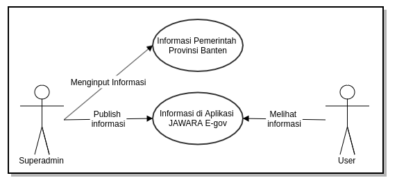](../images/jawara-egov/desain-dan-perancangan/usecase-jawara-egov.png)

#### 3.2.2 *Activity Diagram*

##### 3.2.2.1 *Activity Diagram* User

[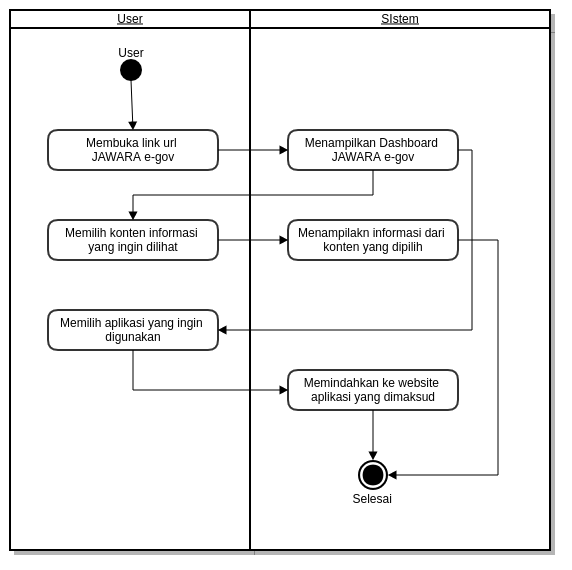](../images/jawara-egov/desain-dan-perancangan/activitydiagram-user.png)

##### 3.2.2.2 *Activity Diagram* Superadmin

[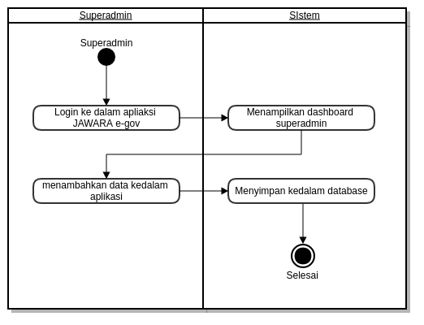](../images/jawara-egov/desain-dan-perancangan/activitydiagram-superadmin.png)

#### 3.2.3 *Sequence Diagram*

#### 3.2.4 *State Chart Diagram*

##### 3.2.4.1 *State Chart Diagram* User

[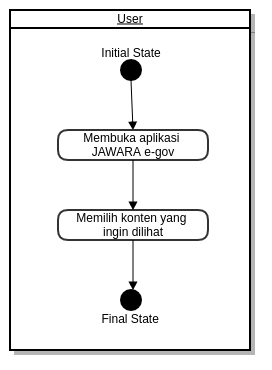](../images/jawara-egov/desain-dan-perancangan/statechart-user.png)

##### 3.2.4.2 *State Chart Diagram* Superadmin

[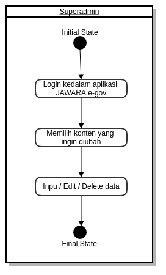](../images/jawara-egov/desain-dan-perancangan/statechart-superadmin.png)

#### 3.2.5 Deployment Diagram

#### 3.2.6 Technology Stack Diagram

### 3.3 Tahapan Pekerjaan

Tahap-tahap atau langkah yang dilakukan dalam mengembangkan Sistem Informasi Portal Web adalah sebagai berikut:

#### 3.3.1 Analisis dan Perancangan

**Analisis**

Tim pengembang aplikasi akan melakukan analisis jika diperlukan dapat dilakukan survey pendahuluan untuk melihat sejauh mana kebutuhan pengguna akan sistem yang akan dibangun, fasiitas yang akan dibangun, data-data yang dibutuhkan, dll. Dalam analisis ini akan dilakukan diskusi-diskusi dengan bagian terkait pada satuan kerja.

**Perancangan Sistem**

Perancangan sistem dilaksanakan setelah proses analisis dilaksanakan dan telah disepakati modul dan prosedur-prosedur yang akan diterapkan dalam sistem.

#### 3.3.2 Pembangunan Sistem

Setelah proses analisis dan perancangan sistem selesai dilakukan, tahapan selanjutnya adalah pembangunan sistem, yang meliputi kegiatan: pembuatan struktur database, pembuatan kode program/coding, pembuatan laporan-laporan.

#### 3.3.3 Integrasi dan Pengujian

**Integrasi**

Setelah proses pengembangan sistem selesai dilakukan, tahapan selanjutnya adalah Integrasi sistem, yang meliputi kegiatan: pembuatan struktur database terkait integrasi, pembuatan kode program/coding terkait integrasi, pembuatan laporan-laporan terkait integrasi.

**Pengujian**

Sistem yang telah selesai dibuat akan diuji coba menggunakan data test sebelum sistem dijalankan. Dalam uji coba sistem ini akan diterapkan metode *prototype*, yaitu jika terjadi kesalahan/kekurangan baik proses maupun *output* sistem, maka kesalahan/kekurangan tersebut akan diperbaiki/ditambahkan,
sehingga memungkinkan pengembang untuk kembali ke tahapan pertama yaitu analisa (jika kekurangan sistem memang tidak terdefinisikan dalam dokumen perancangan sistem).

### 3.4 Hasil

Berikut ini adalah hasil eksekusi sistem informasi portal

#### 3.4.1 Layout Tampilan Pada Superadmin

* Layout Tampilan Login Superadmin:

[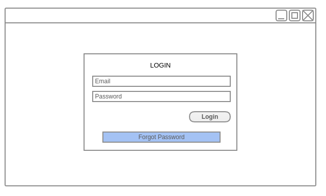](../images/jawara-egov/desain-dan-perancangan/layout-login.png)

* Layout Tampilan Dashboard Superadmin:

[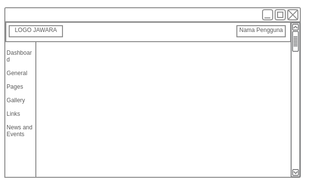](../images/jawara-egov/desain-dan-perancangan/dashboard-superadmin.png)

Layout tampilan Dasboard ini berisikan beberapa menu yaitu *Dashboard, General, Pages, Galeery, Links* dan *News and Events*.

* Layout Tampilan Submenu Banner:

[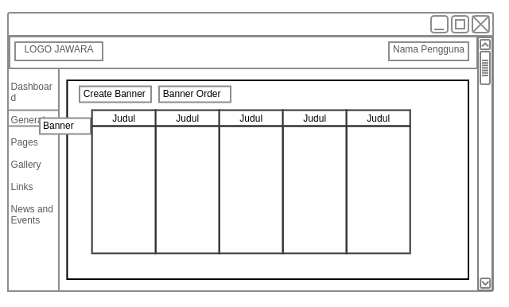](../images/jawara-egov/desain-dan-perancangan/layout-banner.png)

layout tampllan submenu banner ini dapat diakses dengan mengklik Banner pada menu General. di layout Banner ini superadmin dapat mengatur tampilan fontend JAGARAWA e-gov seperti images slider dan foto yang ditampilkan.

* Layout Tampilan Menu Pages:

Layout tampilan pages dapat diakses dengan mengklik menu Pages pada kolom menu. Halaman pages ini berguna untuk mengatur tampilan menu yang terdapat di frontend aplikasi JAGARAWA e-gov.

* Layout Tampilan Submenu Album:

[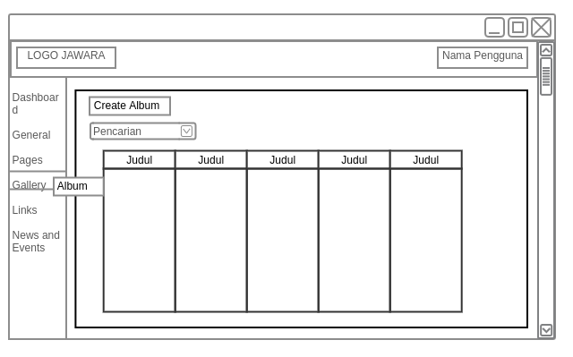](../images/jawara-egov/desain-dan-perancangan/layout-album.png)

Layout tampilan Album dapat diakses dengan mengklik submenu Album pada menu Gallery. Halaman pages ini berguna untuk mengatur album foto yang terdapat pada aplikasi JAWARA e-gov.

* Layout Tampilan Submenu Category Links:

[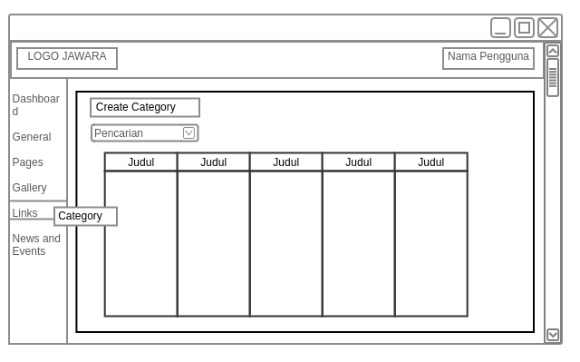](../images/jawara-egov/desain-dan-perancangan/layout-category-links.png)

Layout tampilan Category dapat diakses dengan mengklik submenu Category pada menu Links. Halaman pages ini berguna untuk mengatur Kategori aplikasi-aplikasi yang terdapat pada Pemerintahan Provinsi Banten.

* Layout Tampilan Submenu Links:

[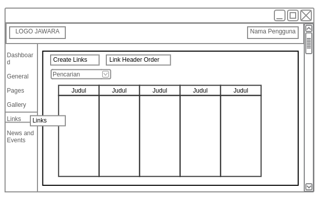](../images/jawara-egov/desain-dan-perancangan/layout-links.png)

Layout tampilan Links dapat diakses dengan mengklik submenu Link pada menu Links. Halaman pages ini berguna untuk mengatur aplikasi-aplikasi yang dimasukan kedalam frontend aplikasi JAGARAWA e-gov.

* Layout Tampilan Submenu Category News and Events:

[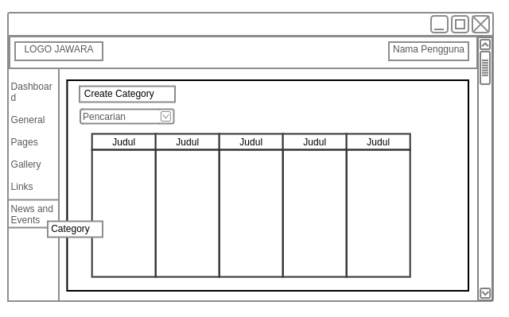](../images/jawara-egov/desain-dan-perancangan/layout-category-news.png)

Layout tampilan Category dapat diakses dengan mengklik submenu Category pada menu News and Events. Halaman pages ini berguna untuk mengatur Kategori Berita yang terdapat pada Pemerintahan Provinsi Banten.

* Layout Tampilan Submenu News and Events:

[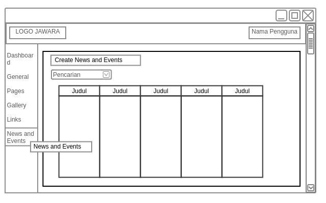](../images/jawara-egov/desain-dan-perancangan/layout-news.png)

Layout tampilan News and Events dapat diakses dengan mengklik submenu News and Events pada menu News and Events. Halaman pages ini berguna untuk mengatur Berita yang akan di*publish* dalam apliaksi JAWARA e-gov.

#### 3.4.2 Layout Tampilan User

[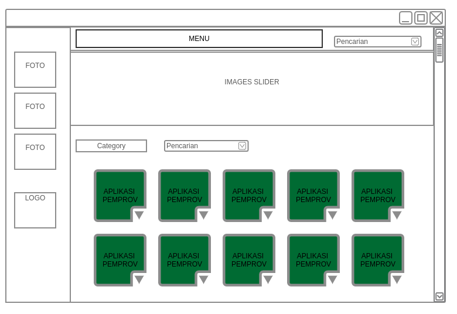](../images/jawara-egov/desain-dan-perancangan/layout-user.png)

Tampilan layout user ini berbeda dengan tampilan layout superadmin pada layout ini nantinya *user* hanya bisa melihat informasi dan aplikasi-aplikasi yang terdapat pada apliaksi JAWARA e-gov.

## 4. Penutup

Dengan adanya pembuatan dari sistem informasi portal ini dapat membantu dalam mencari informasi atau laporan yang terdapat di pemerintahan Banten, sehingga masyarakat tidak bingung jika ingin mencari informasi atau laporan yang ada.

