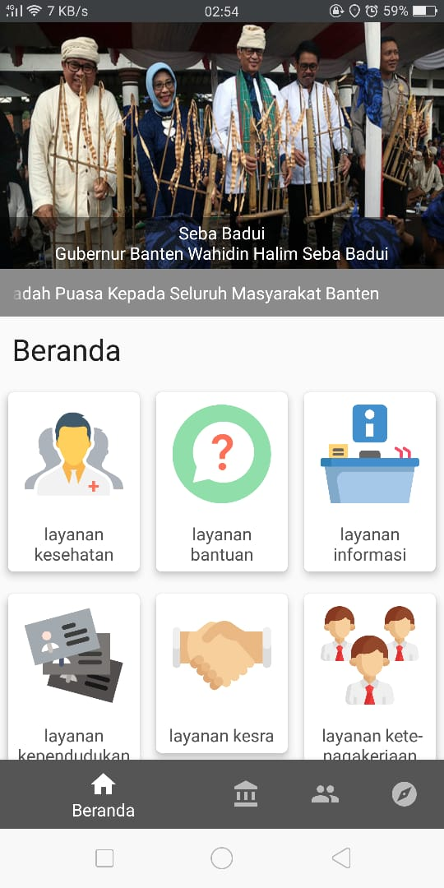

# Integrasi dan Pengujian JAWARA e-Gov

JAWARA e-Gov adalah sebuah aplikasi sistem informasi portal pemerintahan Provinsi Banten yang berbasis website dan android yang dikeluarkan oleh pemerintah Provinsi Banten untuk memudahkan bagi masyarakat dalam melakukan pencarian informasi serta menjadi satu pintu bagi semua aplikasi Pemerintahan Provinsi Banten.

## 1. Integrasi JAWARA e-Gov
Integrasi aplikasi dilakukan dengan:
1. melalui antar muka aplikasi atau melalui method
2. *focus method level*
3. method di*share* dengan meletakannnya pada sebuah server pusat / dengan mengakses *method* pada aplikasi.

*Application Programming Interface*
mekanisme terdefinisi dibuat untuk berhubungan dengan sumber daya seperti server aplikasi, *middleware*, dan basis data.

Dibawah ini adalah pengintegrasian yang terdapat didalam JAWARA e-Gov:

### 1.1 Integrasi Menu Controller

#### 1.1.1 Protected Function Banner

#### 1.1.2 Public Function Content

#### 1.1.3 Public Function Index

#### 1.1.4 Public Function Menu

#### 1.1.5 Public Function Pemerintahan

#### 1.1.6 Public Function Slide Utama

#### 1.1.7 Public Function Submenu

#### 1.1.8 Public Function Test

#### 1.1.9 Public Function Umum

Pada Integrasi **Menu Controller** semua response baik *Success Response* maupun *Error Response* hasilnya akan ditampilkan dalam bentuk Json. 

### 1.2 Integrasi Mobile Controller

#### 1.2.1 Public Function Content

#### 1.2.2 Public Function Index

#### 1.2.3 Public Function Menu

#### 1.2.4 Public Function Submenu

Pada Integrasi **Mobile Controller** semua response baik *Success Response* maupun *Error Response* hasilnya akan ditampilkan dalam bentuk Json. 

## 2. Pengujian JAWARA e-Gov

Pada pengujian ini akan menggunakan User Acceptance Test (UAT).

Dibawah ini adalah pengujian yang dilakukan didalam aplikasi JAWARA e-Gov:

### 2.1 Pengujian Website

Pada pengujian website ini akan menguji yang terdapat di dalam **superadmin** dan yang terdapat untuk **user publik**.

#### 2.1.1 Login Superadmin

| Akses       | URL/ Image                               | Ada  | Tidak |
| --------------- | ---------------------------------------- | ---- | ----- |
| Login Superadmin |  |      |       |

Dalam tabel ini *user* dapat melakukan test kepada aplikasi apakah **Login Superadmin** sudah dapat diakses oleh *user* atau tidak. Untuk mengecek dapat diakses tidaknya subkonten ini *user* dapat membuka link url http://dev2018.bantenprov.go.id/admin , jika sudah dapat diakses *user* dapat meceklis pada kolom "Ada" sedangkan jika belum dapat diakses maka *user* dapat menceklis pada kolom "tidak".

#### 2.1.2 Dashboard (Superadmin)

| Akses       | URL/ Image                               | Ada  | Tidak |
| --------------- | ---------------------------------------- | ---- | ----- |
| Dashboard Superadmin |  |      |       |

Dalam tabel ini *user* dapat melakukan test kepada aplikasi apakah **Dashboard Superadmin** sudah dapat diakses oleh *user* atau tidak. Untuk mengecek dapat diakses tidaknya subkonten ini *user* dapat membuka link url http://dev2018.bantenprov.go.id/admin , jika sudah dapat diakses *user* dapat meceklis pada kolom "Ada" sedangkan jika belum dapat diakses maka *user* dapat menceklis pada kolom "tidak".

#### 2.1.3 Submenu Banners (Superadmin)

| Akses       | URL/ Image                               | Ada  | Tidak |
| --------------- | ---------------------------------------- | ---- | ----- |
| Submenu Banners |  |      |       |

Dalam tabel ini *user* dapat melakukan test kepada aplikasi apakah **Submenu Banners** sudah dapat diakses oleh *user* atau tidak. Untuk mengecek dapat diakses tidaknya konten ini *user* dapat membuka link url http://dev2018.bantenprov.go.id/admin/general/banners , jika sudah dapat diakses *user* dapat meceklis pada kolom "Ada" sedangkan jika belum dapat diakses maka *user* dapat menceklis pada kolom "tidak".

#### 2.1.4 Create Banner (Superadmin)

| Akses       | URL/ Image                               | Ada  | Tidak |
| --------------- | ---------------------------------------- | ---- | ----- |
| Create Banner |  |      |       |

Dalam tabel ini *user* dapat melakukan test kepada aplikasi apakah **Create Banner** sudah dapat diakses oleh *user* atau tidak. Untuk mengecek dapat diakses tidaknya subkonten ini *user* dapat membuka link url http://dev2018.bantenprov.go.id/admin/general/banners/create , jika sudah dapat diakses *user* dapat meceklis pada kolom "Ada" sedangkan jika belum dapat diakses maka *user* dapat menceklis pada kolom "tidak".

#### 2.1.5 Banner Order (Superadmin)

| Akses       | URL/ Image                               | Ada  | Tidak |
| --------------- | ---------------------------------------- | ---- | ----- |
| Banner Order |  |      |       |

Dalam tabel ini *user* dapat melakukan test kepada aplikasi apakah **Banner Order** sudah dapat diakses oleh *user* atau tidak. Untuk mengecek dapat diakses tidaknya subkonten ini *user* dapat membuka link url http://dev2018.bantenprov.go.id/admin/general/banners/order , jika sudah dapat diakses *user* dapat meceklis pada kolom "Ada" sedangkan jika belum dapat diakses maka *user* dapat menceklis pada kolom "tidak".

#### 2.1.6 Menu Pages (Superadmin)

| Akses       | URL/ Image                               | Ada  | Tidak |
| --------------- | ---------------------------------------- | ---- | ----- |
| Menu Pages |  |      |       |

Dalam tabel ini *user* dapat melakukan test kepada aplikasi apakah **Menu Pages** sudah dapat diakses oleh *user* atau tidak. Untuk mengecek dapat diakses tidaknya konten ini *user* dapat membuka link url http://dev2018.bantenprov.go.id/admin/pages , jika sudah dapat diakses *user* dapat meceklis pada kolom "Ada" sedangkan jika belum dapat diakses maka *user* dapat menceklis pada kolom "tidak".

#### 2.1.7 Create Page (Superadmin)

| Akses       | URL/ Image                               | Ada  | Tidak |
| --------------- | ---------------------------------------- | ---- | ----- |
| Create Pages |  |      |       |

Dalam tabel ini *user* dapat melakukan test kepada aplikasi apakah **Create Pages** sudah dapat diakses oleh *user* atau tidak. Untuk mengecek dapat diakses tidaknya subkonten ini *user* dapat membuka link url http://dev2018.bantenprov.go.id/admin/pages/create , jika sudah dapat diakses *user* dapat meceklis pada kolom "Ada" sedangkan jika belum dapat diakses maka *user* dapat menceklis pada kolom "tidak".

#### 2.1.8 Pages General order (Superadmin)

| Akses       | URL/ Image                               | Ada  | Tidak |
| --------------- | ---------------------------------------- | ---- | ----- |
| Pages General Order |  |      |       |

Dalam tabel ini *user* dapat melakukan test kepada aplikasi apakah **Pages General Order** sudah dapat diakses oleh *user* atau tidak. Untuk mengecek dapat diakses tidaknya subkonten ini *user* dapat membuka link url http://dev2018.bantenprov.go.id/admin/pages/order, jika sudah dapat diakses *user* dapat meceklis pada kolom "Ada" sedangkan jika belum dapat diakses maka *user* dapat menceklis pada kolom "tidak".

#### 2.1.9 Submenu Albums (Superadmin)

| Akses       | URL/ Image                               | Ada  | Tidak |
| --------------- | ---------------------------------------- | ---- | ----- |
| Submenu Albums |  |      |       |

Dalam tabel ini *user* dapat melakukan test kepada aplikasi apakah **Submenu Albums** sudah dapat diakses oleh *user* atau tidak. Untuk mengecek dapat diakses tidaknya subkonten ini *user* dapat membuka link url http://dev2018.bantenprov.go.id/admin/photos/albums, jika sudah dapat diakses *user* dapat meceklis pada kolom "Ada" sedangkan jika belum dapat diakses maka *user* dapat menceklis pada kolom "tidak".

#### 2.1.10 Create Albums (Superadmin)

| Akses       | URL/ Image                               | Ada  | Tidak |
| --------------- | ---------------------------------------- | ---- | ----- |
| Create Albums |  |      |       |

Dalam tabel ini *user* dapat melakukan test kepada aplikasi apakah **Create Albums** sudah dapat diakses oleh *user* atau tidak. Untuk mengecek dapat diakses tidaknya subkonten ini *user* dapat membuka link url http://dev2018.bantenprov.go.id/admin/photos/albums/create, jika sudah dapat diakses *user* dapat meceklis pada kolom "Ada" sedangkan jika belum dapat diakses maka *user* dapat menceklis pada kolom "tidak".

#### 2.1.11 Submenu Category Links (Superadmin)

| Akses       | URL/ Image                               | Ada  | Tidak |
| --------------- | ---------------------------------------- | ---- | ----- |
| Submenu Category Links |  |      |       |

Dalam tabel ini *user* dapat melakukan test kepada aplikasi apakah **Submenu Category Links** sudah dapat diakses oleh *user* atau tidak. Untuk mengecek dapat diakses tidaknya subkonten ini *user* dapat membuka link url http://dev2018.bantenprov.go.id/admin/link/categories, jika sudah dapat diakses *user* dapat meceklis pada kolom "Ada" sedangkan jika belum dapat diakses maka *user* dapat menceklis pada kolom "tidak".

#### 2.1.12 Create Category Links (Superadmin)

| Akses       | URL/ Image                               | Ada  | Tidak |
| --------------- | ---------------------------------------- | ---- | ----- |
| Create Category Links |  |      |       |

Dalam tabel ini *user* dapat melakukan test kepada aplikasi apakah **Create Category Links** sudah dapat diakses oleh *user* atau tidak. Untuk mengecek dapat diakses tidaknya subkonten ini *user* dapat membuka link url http://dev2018.bantenprov.go.id/admin/link/categories/create, jika sudah dapat diakses *user* dapat meceklis pada kolom "Ada" sedangkan jika belum dapat diakses maka *user* dapat menceklis pada kolom "tidak".

#### 2.1.13 Submenu Links (Superadmin)

| Akses       | URL/ Image                               | Ada  | Tidak |
| --------------- | ---------------------------------------- | ---- | ----- |
| Submenu Links |  |      |       |

Dalam tabel ini *user* dapat melakukan test kepada aplikasi apakah **Submenu Links** sudah dapat diakses oleh *user* atau tidak. Untuk mengecek dapat diakses tidaknya subkonten ini *user* dapat membuka link url http://dev2018.bantenprov.go.id/admin/link/links, jika sudah dapat diakses *user* dapat meceklis pada kolom "Ada" sedangkan jika belum dapat diakses maka *user* dapat menceklis pada kolom "tidak".

#### 2.1.14 Create Links (Superadmin)

| Akses       | URL/ Image                               | Ada  | Tidak |
| --------------- | ---------------------------------------- | ---- | ----- |
| Create Links |  |      |       |

Dalam tabel ini *user* dapat melakukan test kepada aplikasi apakah **Create Links** sudah dapat diakses oleh *user* atau tidak. Untuk mengecek dapat diakses tidaknya subkonten ini *user* dapat membuka link url http://dev2018.bantenprov.go.id/admin/link/links/create, jika sudah dapat diakses *user* dapat meceklis pada kolom "Ada" sedangkan jika belum dapat diakses maka *user* dapat menceklis pada kolom "tidak".

#### 2.1.15 Link Header Order (Superadmin)

| Akses       | URL/ Image                               | Ada  | Tidak |
| --------------- | ---------------------------------------- | ---- | ----- |
| Link Header Order |  |      |       |

Dalam tabel ini *user* dapat melakukan test kepada aplikasi apakah **Link Header Order** sudah dapat diakses oleh *user* atau tidak. Untuk mengecek dapat diakses tidaknya subkonten ini *user* dapat membuka link url http://dev2018.bantenprov.go.id/admin/link/links/order/header, jika sudah dapat diakses *user* dapat meceklis pada kolom "Ada" sedangkan jika belum dapat diakses maka *user* dapat menceklis pada kolom "tidak".

#### 2.1.16 Submenu Category News and Events (Superadmin)

| Akses       | URL/ Image                               | Ada  | Tidak |
| --------------- | ---------------------------------------- | ---- | ----- |
| Submenu Category News and Events |  |      |       |

Dalam tabel ini *user* dapat melakukan test kepada aplikasi apakah **Submenu Category News and Events** sudah dapat diakses oleh *user* atau tidak. Untuk mengecek dapat diakses tidaknya subkonten ini *user* dapat membuka link url http://dev2018.bantenprov.go.id/admin/news-and-events/categories, jika sudah dapat diakses *user* dapat meceklis pada kolom "Ada" sedangkan jika belum dapat diakses maka *user* dapat menceklis pada kolom "tidak".

#### 2.1.17 Create Category News and Events (Superadmin)

| Akses       | URL/ Image                               | Ada  | Tidak |
| --------------- | ---------------------------------------- | ---- | ----- |
| Create Category News and Events |  |      |       |

Dalam tabel ini *user* dapat melakukan test kepada aplikasi apakah **Create Category News and Events** sudah dapat diakses oleh *user* atau tidak. Untuk mengecek dapat diakses tidaknya subkonten ini *user* dapat membuka link url http://dev2018.bantenprov.go.id/admin/news-and-events/categories/create, jika sudah dapat diakses *user* dapat meceklis pada kolom "Ada" sedangkan jika belum dapat diakses maka *user* dapat menceklis pada kolom "tidak".

#### 2.1.18 Submenu News and Events (Superadmin)

| Akses       | URL/ Image                               | Ada  | Tidak |
| --------------- | ---------------------------------------- | ---- | ----- |
| Submenu News and Events |  |      |       |

Dalam tabel ini *user* dapat melakukan test kepada aplikasi apakah **Submenu News and Events** sudah dapat diakses oleh *user* atau tidak. Untuk mengecek dapat diakses tidaknya subkonten ini *user* dapat membuka link url http://dev2018.bantenprov.go.id/admin/news-and-events/news, jika sudah dapat diakses *user* dapat meceklis pada kolom "Ada" sedangkan jika belum dapat diakses maka *user* dapat menceklis pada kolom "tidak".

#### 2.1.19 Create News and Events (Superadmin)

| Akses       | URL/ Image                               | Ada  | Tidak |
| --------------- | ---------------------------------------- | ---- | ----- |
| Create News and Events |  |      |       |

Dalam tabel ini *user* dapat melakukan test kepada aplikasi apakah **Create News and Events** sudah dapat diakses oleh *user* atau tidak. Untuk mengecek dapat diakses tidaknya subkonten ini *user* dapat membuka link url http://dev2018.bantenprov.go.id/admin/news-and-events/news/create, jika sudah dapat diakses *user* dapat meceklis pada kolom "Ada" sedangkan jika belum dapat diakses maka *user* dapat menceklis pada kolom "tidak".

#### 2.1.20 Create News and Events (Superadmin)

| Akses       | URL/ Image                               | Ada  | Tidak |
| --------------- | ---------------------------------------- | ---- | ----- |
| Create News and Events |  |      |       |

Dalam tabel ini *user* dapat melakukan test kepada aplikasi apakah **Create News and Events** sudah dapat diakses oleh *user* atau tidak. Untuk mengecek dapat diakses tidaknya subkonten ini *user* dapat membuka link url http://dev2018.bantenprov.go.id/admin/news-and-events/news/create, jika sudah dapat diakses *user* dapat meceklis pada kolom "Ada" sedangkan jika belum dapat diakses maka *user* dapat menceklis pada kolom "tidak".

#### 2.1.21 Dashboard (User Publik)

| Akses       | URL/ Image                               | Ada  | Tidak |
| --------------- | ---------------------------------------- | ---- | ----- |
| Dashboard |  |      |       |

Dalam tabel ini *user* dapat melakukan test kepada aplikasi apakah **Dashboard** sudah dapat diakses oleh *user* atau tidak. Untuk mengecek dapat diakses tidaknya konten ini *user* dapat membuka link url http://dev2018.bantenprov.go.id/, jika sudah dapat diakses *user* dapat meceklis pada kolom "Ada" sedangkan jika belum dapat diakses maka *user* dapat menceklis pada kolom "tidak".

#### 2.1.22 Profil Provinsi (User Publik)

| Akses       | URL/ Image                               | Ada  | Tidak |
| --------------- | ---------------------------------------- | ---- | ----- |
| Profil Provinsi |  |      |       |

Dalam tabel ini *user* dapat melakukan test kepada aplikasi apakah **Profil Provinsi** sudah dapat diakses oleh *user* atau tidak. Untuk mengecek dapat diakses tidaknya konten ini *user* dapat membuka link url http://dev2018.bantenprov.go.id/profil-provinsi, jika sudah dapat diakses *user* dapat meceklis pada kolom "Ada" sedangkan jika belum dapat diakses maka *user* dapat menceklis pada kolom "tidak".

#### 2.1.23 Profil Pemerintah (User Publik)

| Akses       | URL/ Image                               | Ada  | Tidak |
| --------------- | ---------------------------------------- | ---- | ----- |
| Profil Pemerintah |  |      |       |

Dalam tabel ini *user* dapat melakukan test kepada aplikasi apakah **Profil Pemerintah** sudah dapat diakses oleh *user* atau tidak. Untuk mengecek dapat diakses tidaknya konten ini *user* dapat membuka link url http://dev2018.bantenprov.go.id/profil-pemerintah, jika sudah dapat diakses *user* dapat meceklis pada kolom "Ada" sedangkan jika belum dapat diakses maka *user* dapat menceklis pada kolom "tidak".

#### 2.1.24 Layanan Informasi (User Publik)

| Akses       | URL/ Image                               | Ada  | Tidak |
| --------------- | ---------------------------------------- | ---- | ----- |
| Layanan Informasi |  |      |       |

Dalam tabel ini *user* dapat melakukan test kepada aplikasi apakah **Layanan Informasi** sudah dapat diakses oleh *user* atau tidak. Untuk mengecek dapat diakses tidaknya konten ini *user* dapat membuka link url http://dev2018.bantenprov.go.id/pages/pelayanan-informasi, jika sudah dapat diakses *user* dapat meceklis pada kolom "Ada" sedangkan jika belum dapat diakses maka *user* dapat menceklis pada kolom "tidak".

#### 2.1.25 Informasi Pembangunan Daerah (User Publik)

| Akses       | URL/ Image                               | Ada  | Tidak |
| --------------- | ---------------------------------------- | ---- | ----- |
| Informasi Pembangunan Daerah |  |      |       |

Dalam tabel ini *user* dapat melakukan test kepada aplikasi apakah **Informasi Pembangunan Daerah** sudah dapat diakses oleh *user* atau tidak. Untuk mengecek dapat diakses tidaknya konten ini *user* dapat membuka link url http://dev2018.bantenprov.go.id/informasi-pembangunan-daerah, jika sudah dapat diakses *user* dapat meceklis pada kolom "Ada" sedangkan jika belum dapat diakses maka *user* dapat menceklis pada kolom "tidak".

#### 2.1.26 Press Release (User Publik)

| Akses       | URL/ Image                               | Ada  | Tidak |
| --------------- | ---------------------------------------- | ---- | ----- |
| Press Release |  |      |       |

Dalam tabel ini *user* dapat melakukan test kepada aplikasi apakah **Press Release** sudah dapat diakses oleh *user* atau tidak. Untuk mengecek dapat diakses tidaknya konten ini *user* dapat membuka link url http://dev2018.bantenprov.go.id/pressrealease, jika sudah dapat diakses *user* dapat meceklis pada kolom "Ada" sedangkan jika belum dapat diakses maka *user* dapat menceklis pada kolom "tidak".

### 2.2 Pengujian Android

#### 2.2.1 Loading JAWARA e-Gov

| Akses       | URL/ Image                               | Ada  | Tidak |
| --------------- | ---------------------------------------- | ---- | ----- |
| Loading JAWARA e-Gov |  |      |       |

Dalam tabel ini *user* dapat melakukan test kepada aplikasi apakah **Loading JAWARA e-Gov** sudah dapat diakses oleh *user* atau tidak. Untuk mengecek dapat diakses tidaknya konten ini *user* dapat melihat di aplikasi android JAWARA e-Gov, jika sudah dapat diakses *user* dapat meceklis pada kolom "Ada" sedangkan jika belum dapat diakses maka *user* dapat menceklis pada kolom "tidak".

#### 2.2.2 Dashboard JAWARA e-Gov

| Akses       | URL/ Image                               | Ada  | Tidak |
| --------------- | ---------------------------------------- | ---- | ----- |
| Dashboard JAWARA e-Gov |  |      |       |

Dalam tabel ini *user* dapat melakukan test kepada aplikasi apakah **Dashboard JAWARA e-Gov** sudah dapat diakses oleh *user* atau tidak. Untuk mengecek dapat diakses tidaknya konten ini *user* dapat melihat di aplikasi android JAWARA e-Gov, jika sudah dapat diakses *user* dapat meceklis pada kolom "Ada" sedangkan jika belum dapat diakses maka *user* dapat menceklis pada kolom "tidak".

#### 2.2.3 Aplikasi Pemerintah

| Akses       | URL/ Image                               | Ada  | Tidak |
| --------------- | ---------------------------------------- | ---- | ----- |
| Aplikasi Pemerintah |  |      |       |

Dalam tabel ini *user* dapat melakukan test kepada aplikasi apakah **Aplikasi Pemerintah** sudah dapat diakses oleh *user* atau tidak. Untuk mengecek dapat diakses tidaknya konten ini *user* dapat melihat di aplikasi android JAWARA e-Gov, jika sudah dapat diakses *user* dapat meceklis pada kolom "Ada" sedangkan jika belum dapat diakses maka *user* dapat menceklis pada kolom "tidak".

#### 2.2.4 Aplikasi Publik

| Akses       | URL/ Image                               | Ada  | Tidak |
| --------------- | ---------------------------------------- | ---- | ----- |
| Apliaksi Publik |  |      |       |

Dalam tabel ini *user* dapat melakukan test kepada aplikasi apakah **Aplikasi Publik** sudah dapat diakses oleh *user* atau tidak. Untuk mengecek dapat diakses tidaknya konten ini *user* dapat melihat di aplikasi android JAWARA e-Gov, jika sudah dapat diakses *user* dapat meceklis pada kolom "Ada" sedangkan jika belum dapat diakses maka *user* dapat menceklis pada kolom "tidak".

#### 2.2.5 Jelajah Banten

| Akses       | URL/ Image                               | Ada  | Tidak |
| --------------- | ---------------------------------------- | ---- | ----- |
| Jelajah Banten |  |      |       |

Dalam tabel ini *user* dapat melakukan test kepada aplikasi apakah **Jelajah Banten** sudah dapat diakses oleh *user* atau tidak. Untuk mengecek dapat diakses tidaknya konten ini *user* dapat melihat di aplikasi android JAWARA e-Gov, jika sudah dapat diakses *user* dapat meceklis pada kolom "Ada" sedangkan jika belum dapat diakses maka *user* dapat menceklis pada kolom "tidak".
