## DAFTAR ISI
* Will be replaced with the ToC, excluding the "Contents" header
{:toc}

## JAWARA e-Gov

JAWARA e-Gov adalah sebuah aplikasi sistem informasi portal pemerintahan Provinsi Banten yang berbasis website dan android yang dikeluarkan oleh pemerintah Provinsi Banten untuk memudahkan bagi masyarakat dalam melakukan pencarian informasi serta menjadi satu pintu bagi semua aplikasi Pemerintahan Provinsi Banten.

Berikut ini adalah tampilan-tampilan yang terdapat di aplikasi JAWARA e-Gov:

## 1. Tampilan Website

### 1.1 Tampilan Superadmin

Untuk memulai akses kedalah JAWARA e-Gov superadmin dapat mengklik link url berikut ini http://dev2018.bantenprov.go.id/admin sehingga akan menampilkan tampilan login.

#### 1.1.1 Tampilan Login Superadmin

[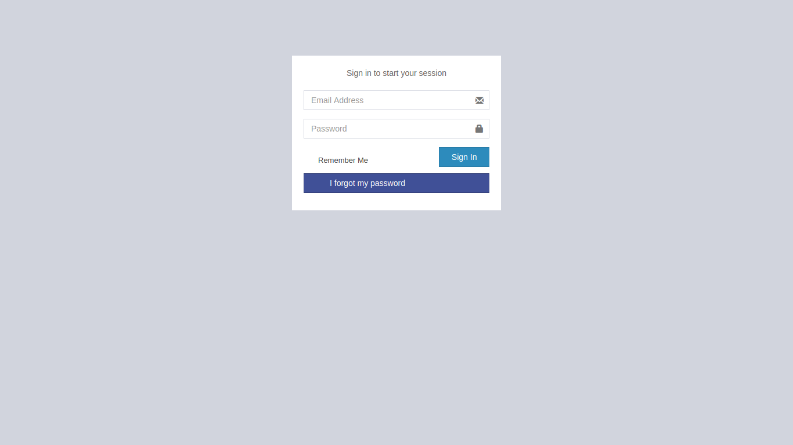](../images/jawara-egov/pengembangan/login-superadmin.png)

Setelah membuka link url diatas maka akan timbul *Page Sign In*. Terdapat 2 *field* yang harus diisi yaitu email dan passwor untuk melakukan *sign In* kedalam aplikasi JAWARA e-Gov.

#### 1.1.2 Tampilan Dashboard Superadmin

[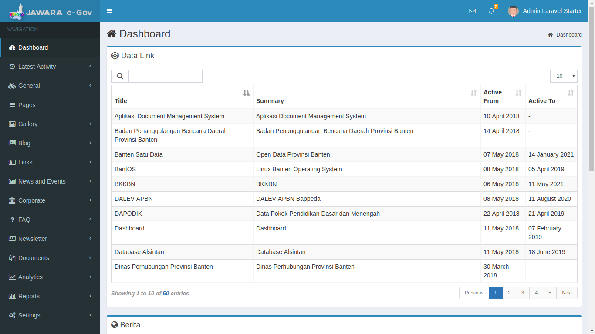](../images/jawara-egov/pengembangan/dashboard-superadmin.png)

Di page Dashboard Superadmin ini, superadmin dapat mengakses beberapa menu.

#### 1.1.3 Tampilan Menu General

#### 1.1.3.1 Tampilan Submenu Banners

[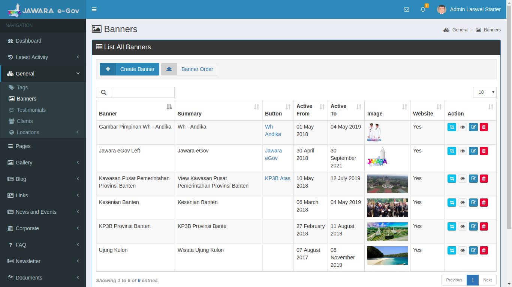](../images/jawara-egov/pengembangan/banners.png)

*Page* Banners ini dapat diakses dengan mengklik General pada kolom menu lalu klik Banners. Pada *page* ini superadmin dapat mengedit, menambahkan, menghapus serta mengatur letak dan posisi gambar maupun images slider pada *frontend* aplikasi JAWARA e-Gov.

##### 1.1.3.1.1 Create Banner

[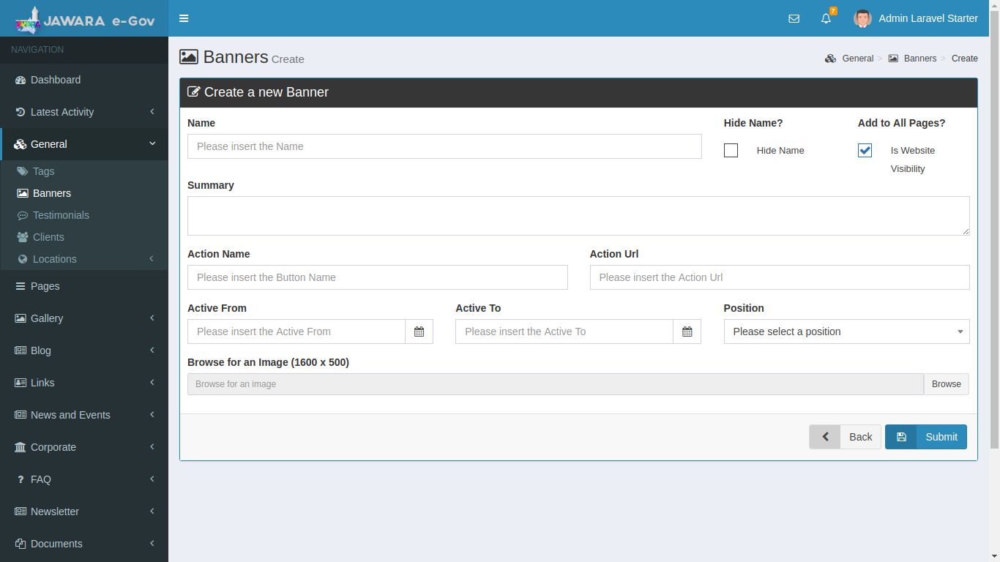](../images/jawara-egov/pengembangan/banners-create.png)

*Page* Create Banner ini menampilkan formulir untuk menambahkan images/banners kedalam database aplikasi JAWARA e-Gov.

##### 1.1.3.1.2 Banner Order

[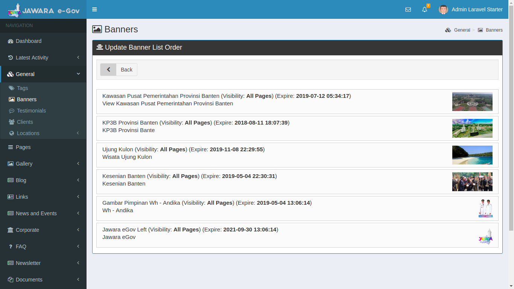](../images/jawara-egov/pengembangan/banners-order.png)

*Page* Banner Order ini untuk mengatur tata letak images/banner pada *frontend* aplikasi JAWARA e-Gov

#### 1.1.4 Tampilan Menu Pages

[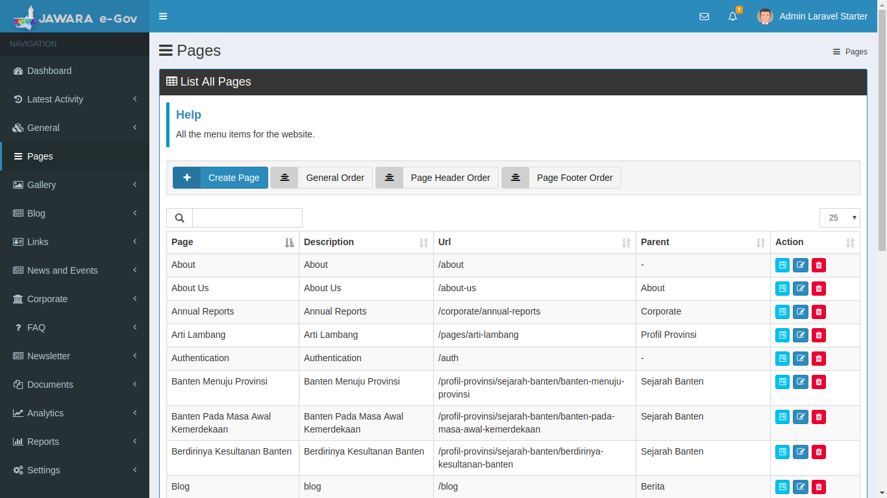](../images/jawara-egov/pengembangan/pages.png)

Tampilan Pages ini dapat diakses dengan cara mengklik Pages pada kolom menu. Pada halaman Pages ini superadmin dapat menambahkan dan mengatur tampilan menu yang terdapat di *frontend* aplikasi JAWARA e-Gov.

##### 1.1.4.1 Create Pages

[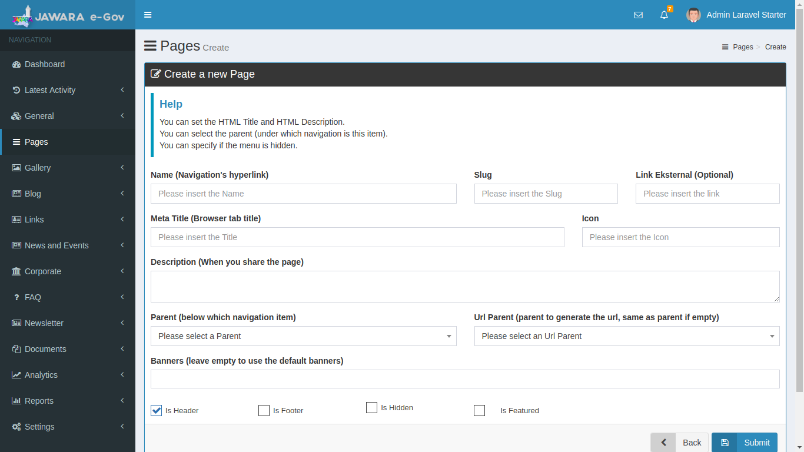](../images/jawara-egov/pengembangan/pages-create.png)

*Page* Create Pages ini menampilkan formulir untuk menambahkan pages kedalam database aplikasi JAWARA e-Gov.

##### 1.1.4.2 General Order

[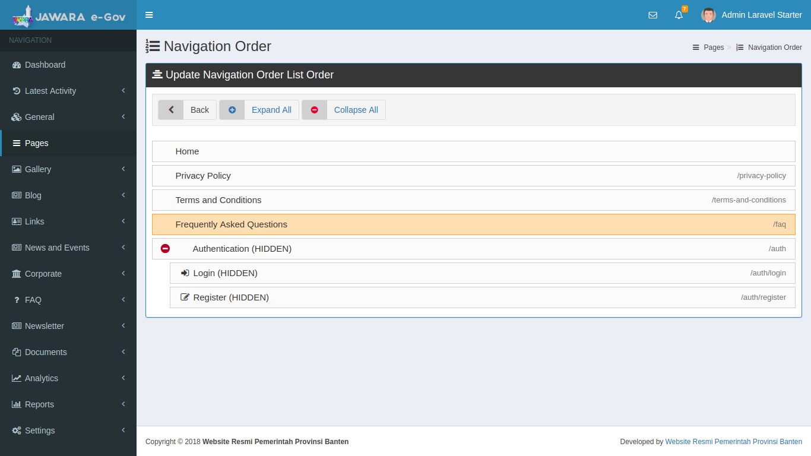](../images/jawara-egov/pengembangan/pages-order.png)

*Page* General Order ini mengatur menu yang terdapat didalam aplikasi JAWARA e-Gov.

#### 1.1.5 Tampilan Menu Gallery

#### 1.1.5.1 Tampilan Submenu Albums

[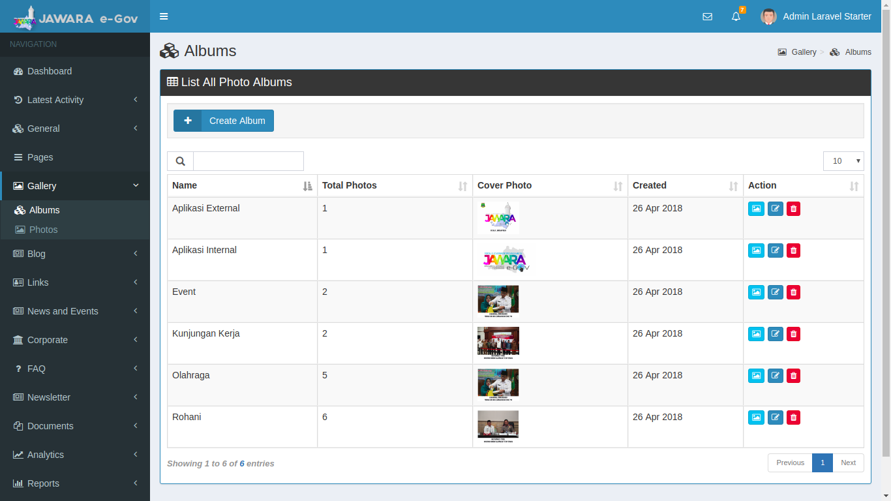](../images/jawara-egov/pengembangan/albums.png)

*Page* Albums ini dapat diakses dengan cara mengklik Gallery pada kolom menu lalu mengklik Albums. Pada page ini superadmin dapat membuat, mengedit album pada aplikasi JAWARA e-Gov.

##### 1.1.5.1.1 Create Album

[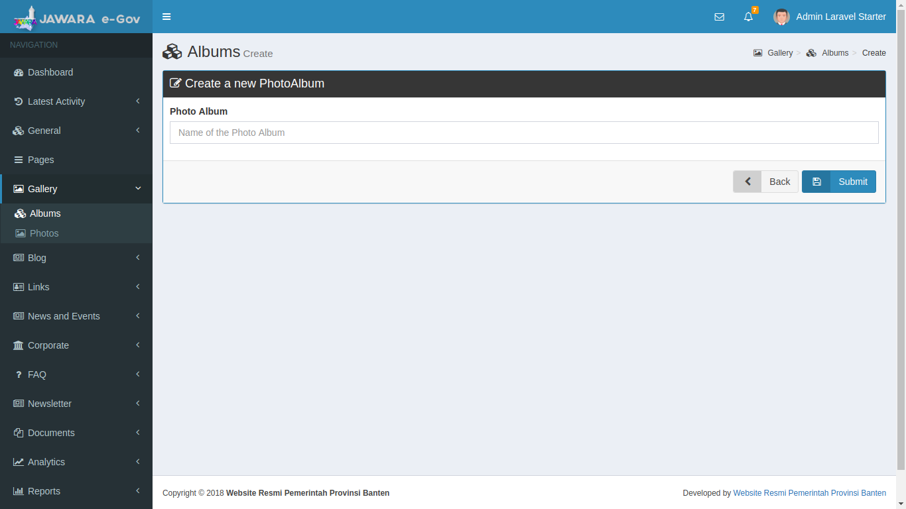](../images/jawara-egov/pengembangan/albums-create.png)

*Page* Create Album ini menampilkan form untuk menambahkan album ke dalam database aplikasi JAWARA e-Gov.

#### 1.1.6 Tampilan Menu Links

#### 1.1.6.1 Tampilan Submenu Category

[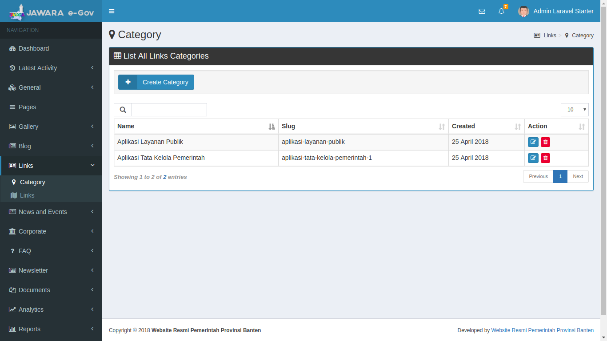](../images/jawara-egov/pengembangan/link-category.png)

*Page* Category ini dapat diakses dengan cara mengklik Links pada kolom menu lalu klik Category. Pada *page* ini superadmin dapat membuat kategori-kategori link aplikasi pemerintahan di Provinsi Banten.

##### 1.1.6.1.1 Create Category

[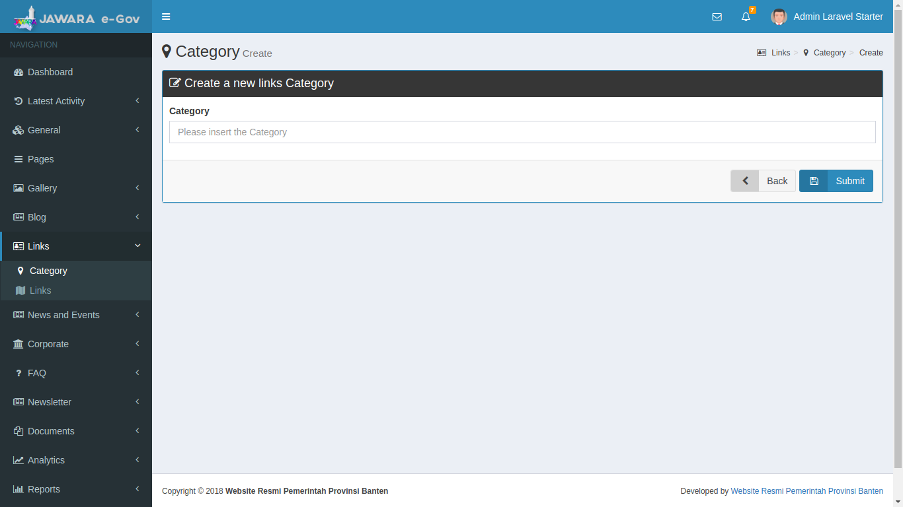](../images/jawara-egov/pengembangan/link-category-create.png)

*page* ini akan menampilkan formulir untuk menambahkan kategori links kedalam database aplikasi JAWARA e-Gov.

#### 1.1.6.2 Tampilan Submenu Link

*Page* Links ini dapat diakses dengan cara mengklik Links pada kolom menu lalu klik Links. Pada halaman ini superadmin dapat menambah, mengedit, menghapus dan mengatur link apliaksi-aplikasi OPD pada *frontend* apliksai JAWARA e-Gov.

##### 1.1.6.2.1 Create Link

[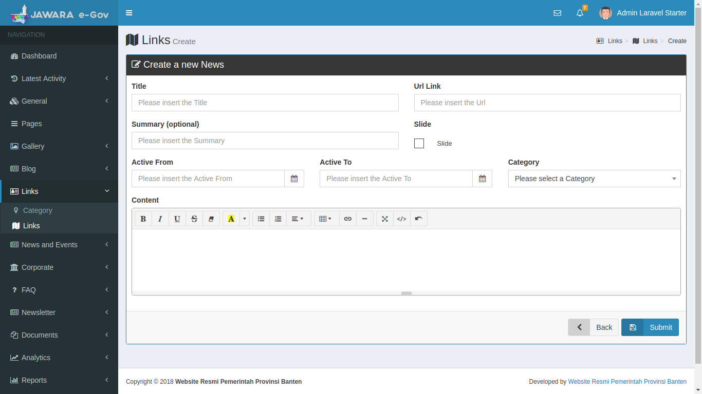](../images/jawara-egov/pengembangan/links-links-create.png)

Pada *page* Create Links akan menampilkan formulir untuk menambahkan Links kedalam database aplikasi JAWARA e-Gov.

##### 1.1.6.2.2 Link Header Order

[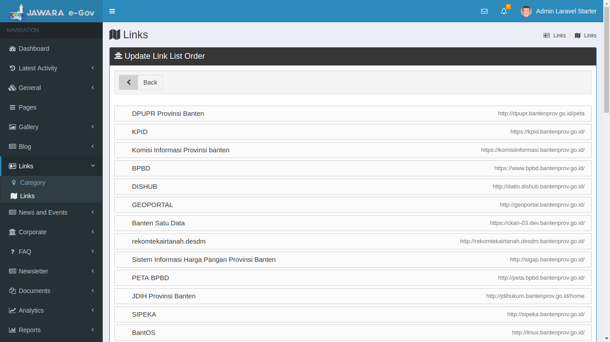](../images/jawara-egov/pengembangan/links-links-order.png)

Pada *page* ini superadmin dapat mengatur tata letak aplikasi-aplikasi yang akan ditampilkan ke *frontend* aplikasi JAWARA e-Gov.

#### 1.1.7 Tampilan Menu News and Events

#### 1.1.7.1 Tampilan Submenu Category

[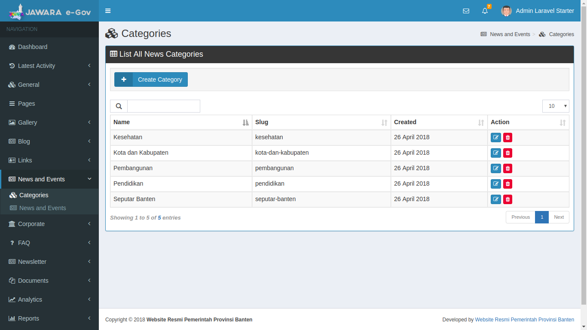](../images/jawara-egov/pengembangan/news-category.png)

*Page* Category ini dapat diakses dengan cara mengklik News and Events pada kolom menu lalu klik Category. Pada *page* ini superadmin dapat membuat kategori-kategori Berita aplikasi pemerintahan di Provinsi Banten.

##### 1.1.7.1.1 Create Category

*Page* ini akan menampilkan formulir untuk menambahkan kategori berita kedalam database aplikasi JAWARA e-Gov.

#### 1.1.7.2 Tampilan Submenu News and Events

[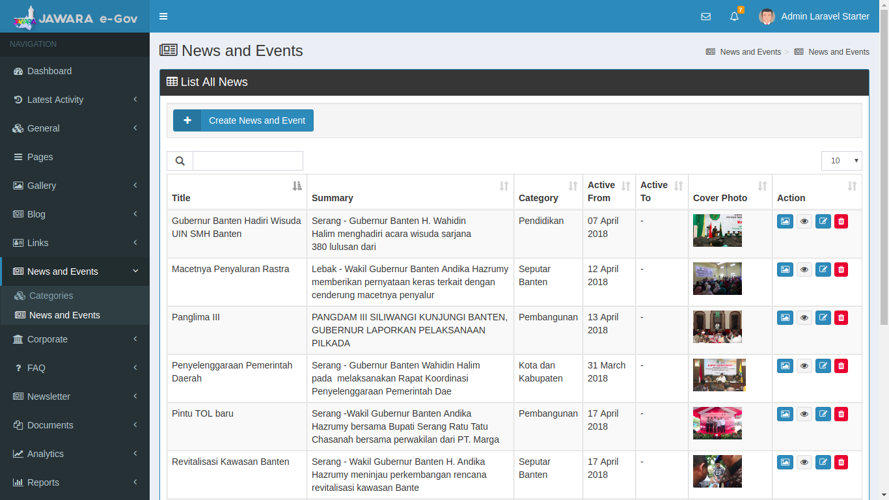](../images/jawara-egov/pengembangan/news-and-events.png)

*Page* News and Events ini bisa diakses dengan cara mengklik News and Events pada kolom menu lalu mengklik News and Event pada kolom submenu. pada *page* ini superadmin dapat menampilkan berita-berita yang akan ditampilkan kedalam *frontend* JAWARA e-Gov.

##### 1.1.7.2.1 Create News and Event

[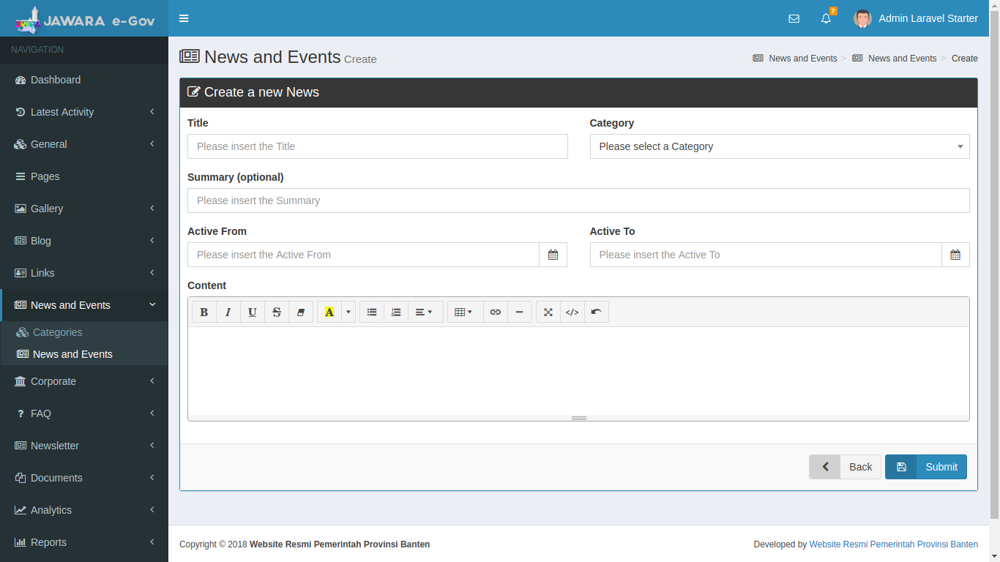](../images/jawara-egov/pengembangan/news-and-events-create.png)

*Page* ini akan menampilkan formulir untuk menambahkan berita kedalam database aplikasi JAWARA e-Gov

### 1.2 Tampilan User

#### 1.2.1 Tampilan Halaman Awal

[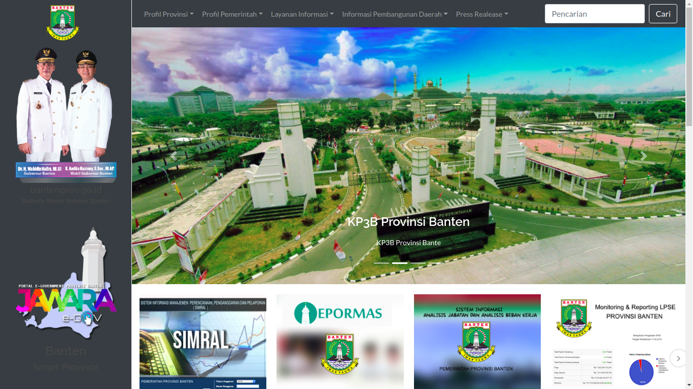](../images/jawara-egov/pengembangan/awal-jawara-egov.png)

Pada halaman awal ini user dapat melihat menu-menu yang terdapat pada bagian atas aplikasi. Dihalaman ini user dapat melihat aplikasi-aplikasi apa saja yang terdapat pada Pemerintahan Provinsi Banten yang jika diklik akan memindahkan ke link url aplikasi yang diklik tersebut.

#### 1.2.2 Tampilan Profil Provinsi

[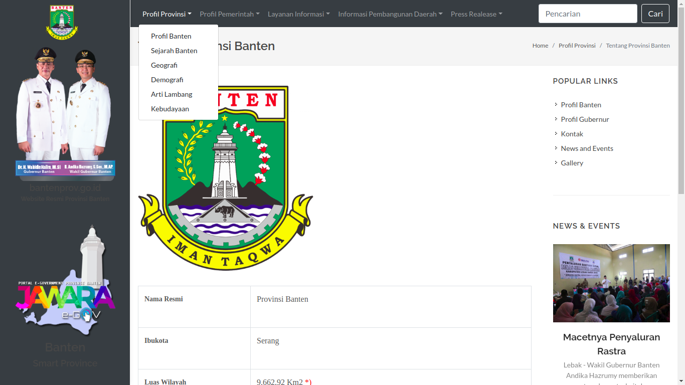](../images/jawara-egov/pengembangan/profil-provinsi.png)

Pada Tampilan ini terdapat beberapa submenu yaitu Profil Banten, Sejarah Banten, Geografi, Demografi, Arti Lambang dan Kebudayaan.

#### 1.2.3 Tampilan Profil Pemerintah

[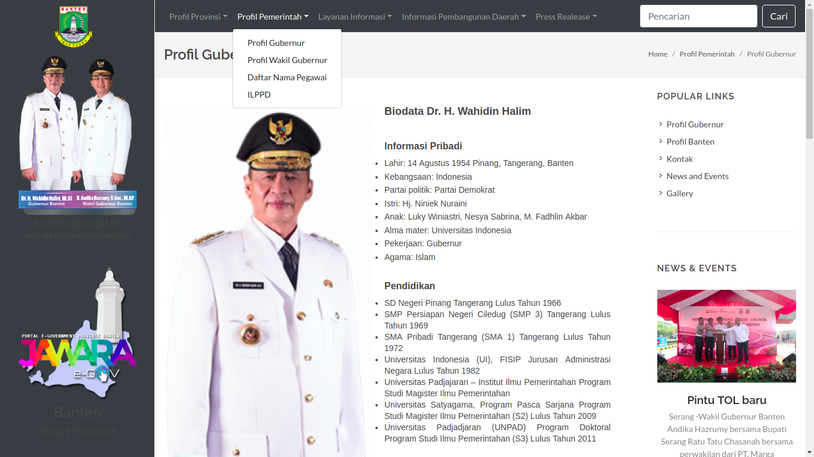](../images/jawara-egov/pengembangan/profil-pemerintah.png)

Pada Tampilan ini terdapat beberapa submenu yaitu Profil Gubernur, Profil Wakil Gubernur, Daftar Nama Pegawai dan ILPPD.

#### 1.2.4 Tampilan Layanan Informasi

.[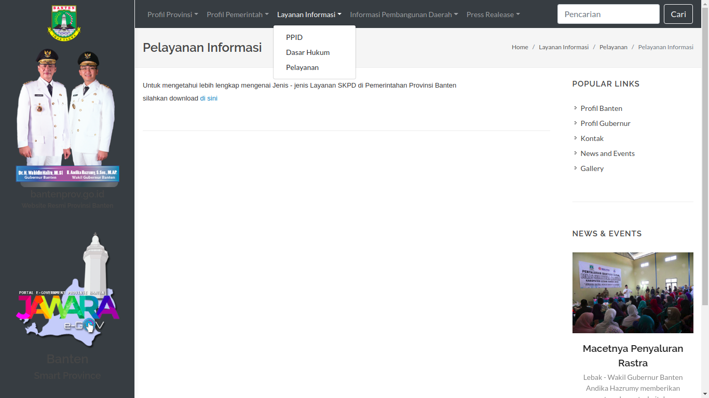](../images/jawara-egov/pengembangan/layanan-informasi.png)

Pada Tampilan ini terdapat beberapa submenu yaitu PPID, Dasar Hukum dan Pelayanan.

#### 1.2.5 Tampilan Informasi Pembangunan Daerah

.[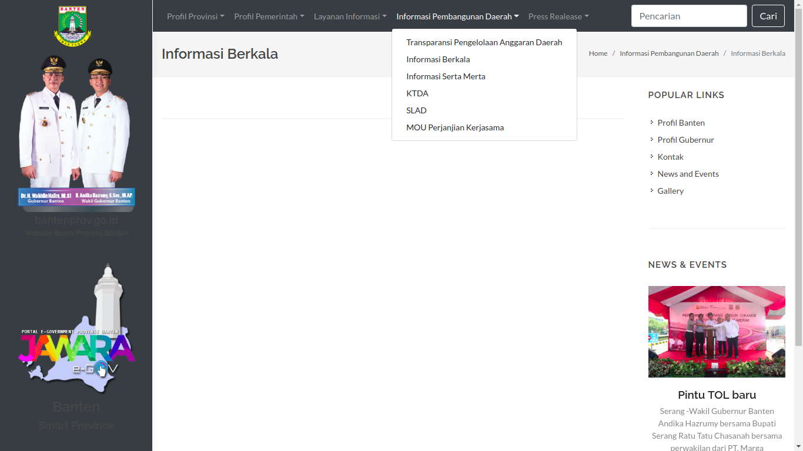](../images/jawara-egov/pengembangan/informasi-pembangunan-daerah.png)

Pada Tampilan ini terdapat beberapa submenu yaitu Transparansi Pengelolaan Anggaran Daerah, Informasi Berkala, Informasi Serta Merta, KTDA, SLAD dan MOU Perjanjian Kerjasama.

#### 1.2.6 Tampilan Press Release

.[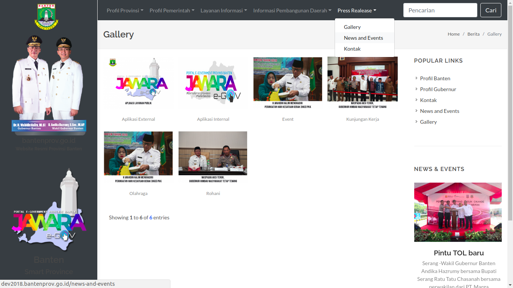](../images/jawara-egov/pengembangan/press-release.png)

Pada Tampilan ini terdapat beberapa submenu yaitu Gallery, News and Events dan Kontak.

## 2. Tampilan Android

### 2.1 Tampilan Loading JAWARA e-Gov

[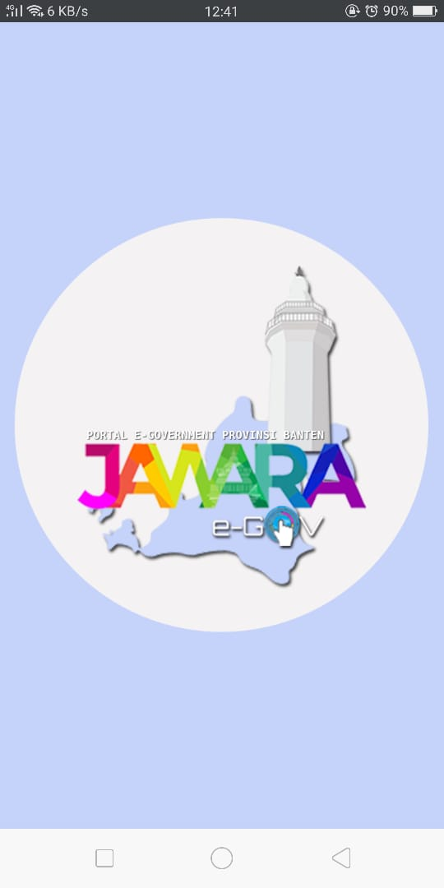](../images/jawara-egov/pengembangan/loading.jpeg)

### 2.1 Tampilan Dashboard JAWARA e-Gov

[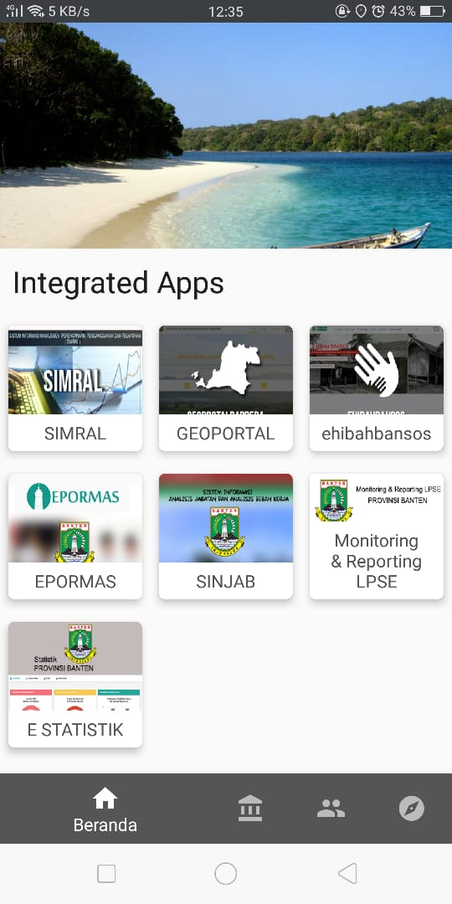](../images/jawara-egov/pengembangan/dashboard1.jpeg)

Pada tampilan ini *user* dapat melihat aplikasi-aplikasi yang telah terintegrasi dengan JAWARA e-Gov.

### 2.2 Tampilan Apliaksi Pemerintah

[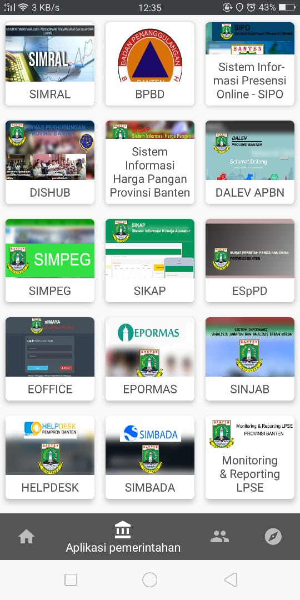](../images/jawara-egov/pengembangan/aplikasi-pemerintah1.jpeg)

Pada tampilan ini *user* dapat melihat aplikasi-aplikasi yang digunakan khusus untuk pemerintahan saja.

### 2.3 Tampilan Apliaksi Publik

[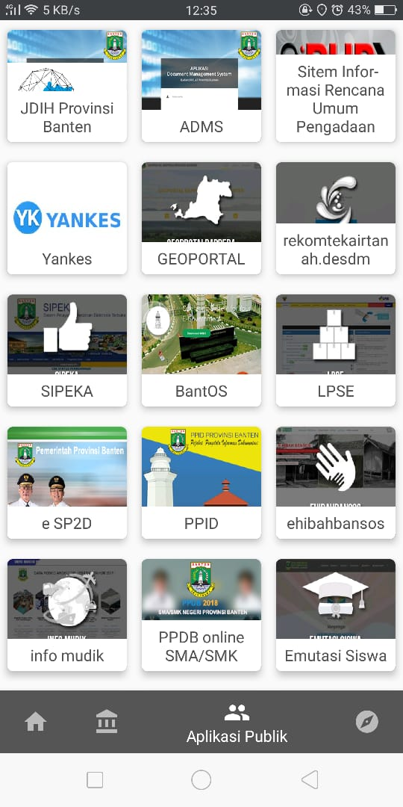](../images/jawara-egov/pengembangan/aplikasi-publik1.jpeg)

Pada tampilan ini *user* dapat melihat aplikasi-aplikasi yang dapat digunakan oleh masyarakat khususnya dalam ruang lingkiup Provinsi Banten.

### 2.4 Tampilan Jelajah Banten

Pada tampilan ini *user* dapat melihat lokasi-lokasi daerah seperti ATM, Bank, Tempat Ibadah, Rumah Sakit dll.
