## Daftar Isi
* will be replaced with the ToC, excluing the "Contents" header
{:toc}

### Implementasi

Untuk memulai akses terhadap aplikasi **SOP Online**. Buka web browser (IE, Mozila Firefox atau yang lainnya) dengan menulis alamat url http://sop.bantenprov.go.id/ kemudian tekan **Enter** pada tombol keyboard atau klik tombol **Go** pada browser. Akan muncul tampilan halaman login aplikasi aop online seperti gambar dibawah ini.

#### Tampilan Login  
[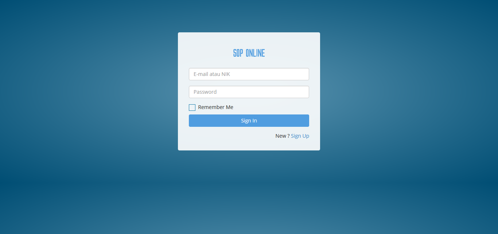](../images/sop-online/implementasi/01-tampilan-login.png)

Masukkan User Id dan Password, Setelah di isi lengkap dan benar, klik button **Sign in** atau tekan tombol **Enter** pada keyboard. Sehingga akan menampilkan halaman utama sebagai berikut.

#### Tampilan Dashboard 
[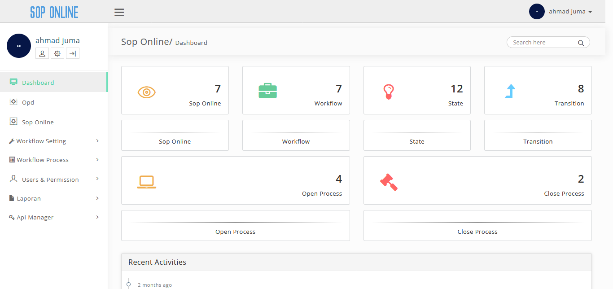](../images/sop-online/implementasi/02-tampilan-dashboard.png)

####  Menu Home
Pada halaman ini kita dapat melihat list menu yang terdapat di "SOP Online" yaitu:

- *Opd*
- *Sop Online*
- *Workflow Setting*
- *Workflow Process*
- *User & Permission*
- *Laporan*
  Didalam list menu ini kita bisa melihat isi konten dan subkonten yang terdapat didalamnya

#### Tampilan Opd
Konten Opd ini menampilkan list-list apa saja Opd yang dapat dilakukan admin didalam SOP Online ini, didalam konten ini kita bisa menambah, data Opd seperti gambar dibawah ini.

[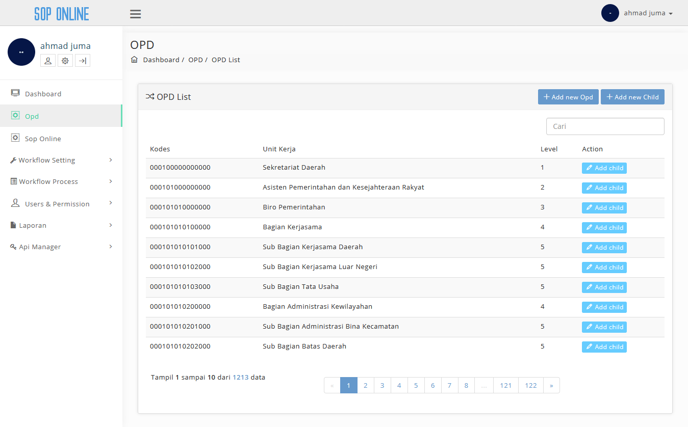](../images/sop-online/implementasi/03-tampilan-opd.png)

##### Tampilan Add New Opd 

Didalam page ini terdapat menambahkan atau form input tambah Konten Opd yang harus diisi oleh super admin atau pengguna yang diberi hak akses oleh super admin untuk bisa menambahkan Konten Opd. Jika data sudah ada atau kurang lengkap maka pengguna dapat menekan tombol " Submit " dan jika tidak ada masalah maka akan dialihkan ke page Opd List.

##### Tampilan Add New Child 
[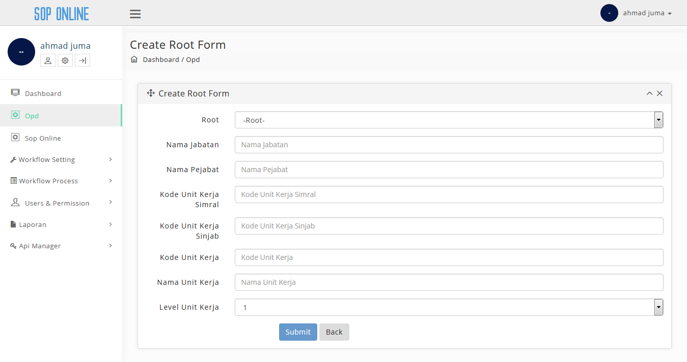](../images/sop-online/implementasi/17-tampilan-tambah-child.png)

Didalam page ini terdapat menambahkan atau form input tambah Konten Child yang harus diisi oleh super admin atau pengguna yang diberi hak akses oleh super admin untuk bisa menambahkan Konten Child. Jika data sudah ada atau kurang lengkap maka pengguna dapat menekan tombol " Submit " dan jika tidak ada masalah maka akan dialihkan ke page Opd List.

#### Tampilan Sop Online
Konten Sop Online ini menampilkan list-list apa saja Sop Online yang dapat dilakukan admin didalam SOP Online ini, didalam konten ini kita bisa menambah, menghapus, mengedit data SOP Online seperti gambar dibawah ini. 

[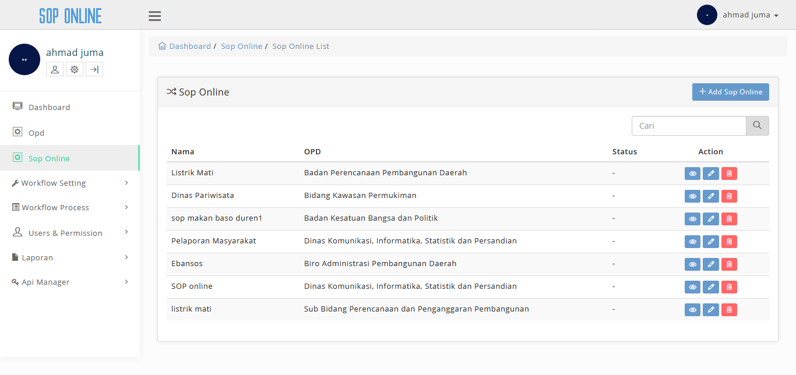](../images/sop-online/implementasi/04-tampilan-sop-online.png)

##### Tampilan Add Sop Online 
[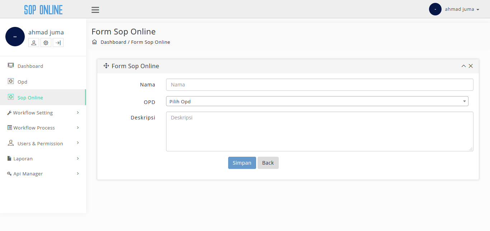](../images/sop-online/implementasi/18-tampilan-add-sop-online.png)

Didalam page ini terdapat menambahkan atau form input Konten Add New Sop Online yang harus diisi oleh super admin atau pengguna yang diberi hak akses oleh super admin untuk bisa menambahkan Konten Sop Online. Jika data sudah ada atau kurang lengkap maka pengguna dapat menekan tombol " Simpan " dan jika tidak ada masalah maka akan dialihkan ke page Sop Online List.

##### Tampilan View Sop Online 

Didalam page ini terdapat melihat detail Konten Sop Online yang harus diisi oleh super admin atau pengguna yang diberi hak akses oleh super admin untuk bisa melihat detail Konten Sop Online. Jika data sudah dilihat maka pengguna dapat menekan tombol " Back " dan jika tidak ada masalah maka akan dialihkan ke page Sop Online List.

##### Tampilan Edit Sop Online 
[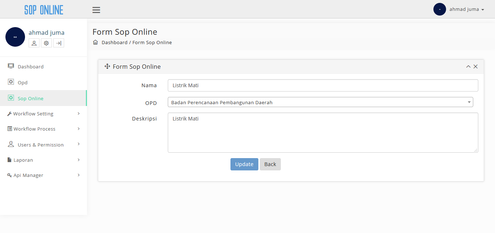](../images/sop-online/implementasi/20-tampilan-edit-sop-online.png)

Didalam page ini terdapat edit atau update form input Konten Edit Sop Online yang harus diisi oleh super admin atau pengguna yang diberi hak akses oleh super admin untuk bisa edit atau update Konten Sop Online. Jika data sudah ada atau kurang lengkap maka pengguna dapat menekan tombol " Update " dan jika tidak ada masalah maka akan dialihkan ke page Sop Online List.

#### Tampilan Workflows
Konten Workflows ini menampilkan list-list apa saja Workflows yang dapat dilakukan admin didalam Workflows ini, didalam konten ini kita bisa menambah, mengedit dan melihat data Workflows seperti gambar dibawah ini. 

[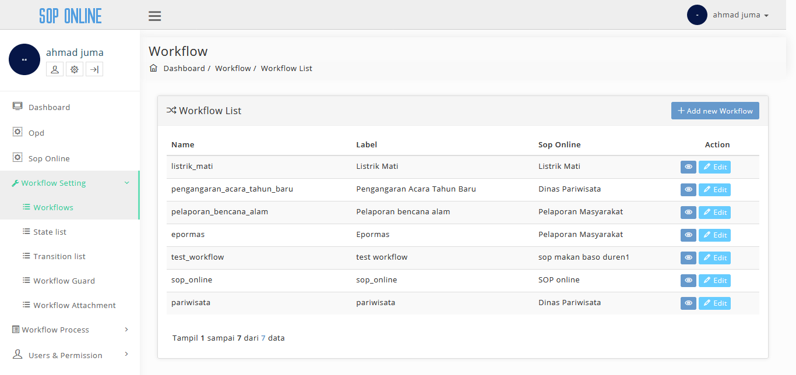](../images/sop-online/implementasi/05-tampilan-workflows.png)

##### Tampilan Add New Workflows 

Didalam page ini terdapat menambahkan atau form input Konten Add New Workflow yang harus diisi oleh super admin atau pengguna yang diberi hak akses oleh super admin untuk bisa menambahkan Konten Workflow. Jika data sudah ada atau kurang lengkap maka pengguna dapat menekan tombol " Add " dan jika tidak ada masalah maka akan dialihkan ke page Workflows List.

##### Tampilan Edit Workflow 

Didalam page ini terdapat edit atau update form input Konten Edit Workflow yang harus diisi oleh super admin atau pengguna yang diberi hak akses oleh super admin untuk bisa edit atau update Konten Workflow. Jika data sudah ada atau kurang lengkap maka pengguna dapat menekan tombol " add " dan jika tidak ada masalah maka akan dialihkan ke page workflow List.

#### Tampilan State List
Konten State List ini menampilkan list-list apa saja State yang dapat dilakukan admin didalam State ini, didalam konten ini kita bisa menambah, mengedit dan melihat data State seperti gambar dibawah ini. 

##### Tampilan Add new State 
[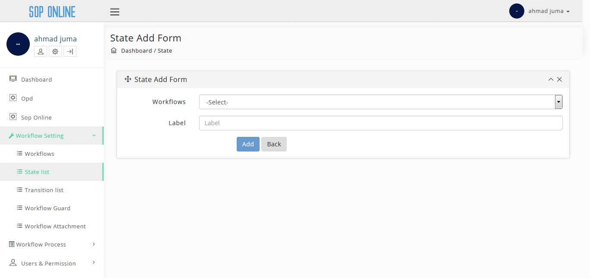](../images/sop-online/implementasi/24-tampilan-add-state.png)

Didalam page ini terdapat menambahkan atau form input Konten Add New State yang harus diisi oleh super admin atau pengguna yang diberi hak akses oleh super admin untuk bisa menambahkan Konten State. Jika data sudah ada atau kurang lengkap maka pengguna dapat menekan tombol " Add " dan jika tidak ada masalah maka akan dialihkan ke page State List.

##### Tampilan Edit State 

Didalam page ini terdapat edit atau update form input Konten Edit State yang harus diisi oleh super admin atau pengguna yang diberi hak akses oleh super admin untuk bisa edit atau update Konten State. Jika data sudah ada atau kurang lengkap maka pengguna dapat menekan tombol " Update " dan jika tidak ada masalah maka akan dialihkan ke page State List.

#### Tampilan Transition List
Konten Trasition List ini menampilkan list-list apa saja Transition yang dapat dilakukan admin didalam Transition List ini, didalam konten ini kita bisa menambah, mengedit dan melihat data Transition List seperti gambar dibawah ini. 

##### Tampilan Add New Transition 

Didalam page ini terdapat menambahkan atau form input Konten Add New Transition yang harus diisi oleh super admin atau pengguna yang diberi hak akses oleh super admin untuk bisa menambahkan Konten Transition. Jika data sudah ada atau kurang lengkap maka pengguna dapat menekan tombol " Add " dan jika tidak ada masalah maka akan dialihkan ke page Transition List.

##### Tampilan Edit Transition 

Didalam page ini terdapat edit atau update form input Konten Edit transition yang harus diisi oleh super admin atau pengguna yang diberi hak akses oleh super admin untuk bisa edit atau update Konten Transition. Jika data sudah ada atau kurang lengkap maka pengguna dapat menekan tombol " Update " dan jika tidak ada masalah maka akan dialihkan ke page Transition List.

#### Tampilan Workflow Guard
Konten Workflow Guard ini menampilkan list-list apa saja Workflow Guard yang dapat dilakukan admin didalam Workflow Guard ini, didalam konten ini kita bisa menambah, mengedit dan melihat data Worflow Guard List seperti gambar dibawah ini. 

##### Tampilan Add New Guard 
[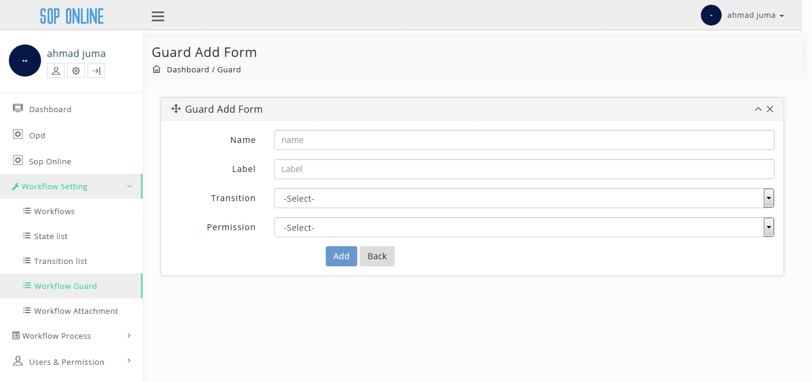](../images/sop-online/implementasi/28-tampilan-add-guard.png)

Didalam page ini terdapat menambahkan atau form input Konten Add New Guard yang harus diisi oleh super admin atau pengguna yang diberi hak akses oleh super admin untuk bisa menambahkan Konten Workflow Guard. Jika data sudah ada atau kurang lengkap maka pengguna dapat menekan tombol " Add " dan jika tidak ada masalah maka akan dialihkan ke page Guard List.

##### Tampilan Edit Guard 

Didalam page ini terdapat edit atau update form input Konten Edit Workflow Guard yang harus diisi oleh super admin atau pengguna yang diberi hak akses oleh super admin untuk bisa edit atau update Konten Transition. Jika data sudah lengkap atau kurang lengkap maka pengguna dapat menekan tombol " Update " dan jika tidak ada masalah maka akan dialihkan ke page Guard List.

#### Tampilan Workflow Attachment
Konten Workflow Attachment ini menampilkan list-list apa saja Workflow Attachment yang dapat dilakukan admin didalam Workflow Attachment ini, didalam konten ini kita bisa menambah, mengedit dan melihat data Worflow Attachment List seperti gambar dibawah ini. 

##### Tampilan Add New Attachment 
[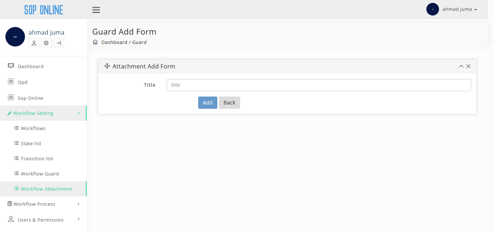](../images/sop-online/implementasi/30-tampilan-add-attachment.png)

Didalam page ini terdapat menambahkan atau form input Konten Add New Attachment yang harus diisi oleh super admin atau pengguna yang diberi hak akses oleh super admin untuk bisa menambahkan Konten Workflow Attachment. Jika data sudah ada atau kurang lengkap maka pengguna dapat menekan tombol " Add " dan jika tidak ada masalah maka akan dialihkan ke page Attachment List.

##### Tampilan Edit Attachment 
[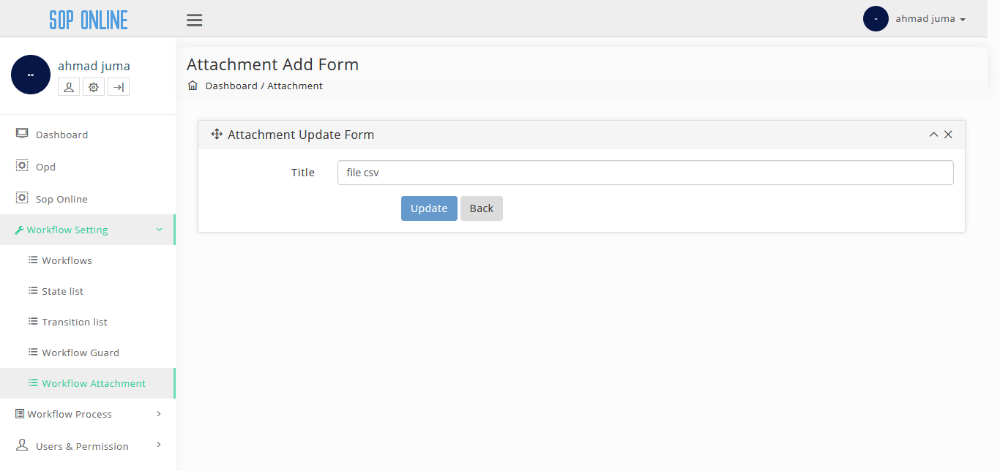](../images/sop-online/implementasi/31-tampilan-edit-attachment.png)

Didalam page ini terdapat edit atau update form input Konten Edit Workflow Attachment yang harus diisi oleh super admin atau pengguna yang diberi hak akses oleh super admin untuk bisa edit atau update Konten Attachment. Jika data sudah lengkap atau kurang lengkap maka pengguna dapat menekan tombol " Update " dan jika tidak ada masalah maka akan dialihkan ke page Attachment List.

#### Tampilan Workflow Content
Konten Workflow Content ini menampilkan list-list apa saja Workflow Content yang dapat dilakukan admin didalam Workflow Content ini, didalam konten ini kita bisa menambah, mengedit dan melihat data Worflow Content List seperti gambar dibawah ini. 

##### Tampilan Add New Content 
[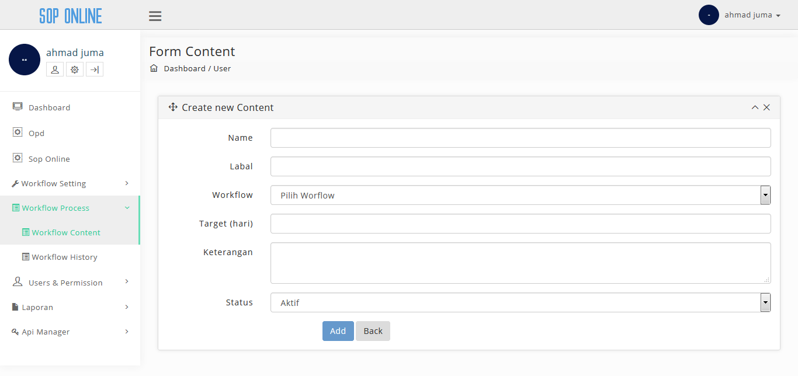](../images/sop-online/implementasi/32-tampilan-add-content.png)

Didalam page ini terdapat menambahkan atau form input Konten Add New Content yang harus diisi oleh super admin atau pengguna yang diberi hak akses oleh super admin untuk bisa menambahkan Konten Workflow Content. Jika data sudah ada atau kurang lengkap maka pengguna dapat menekan tombol " Add " dan jika tidak ada masalah maka akan dialihkan ke page Content List.

##### Tampilan Edit Content 
[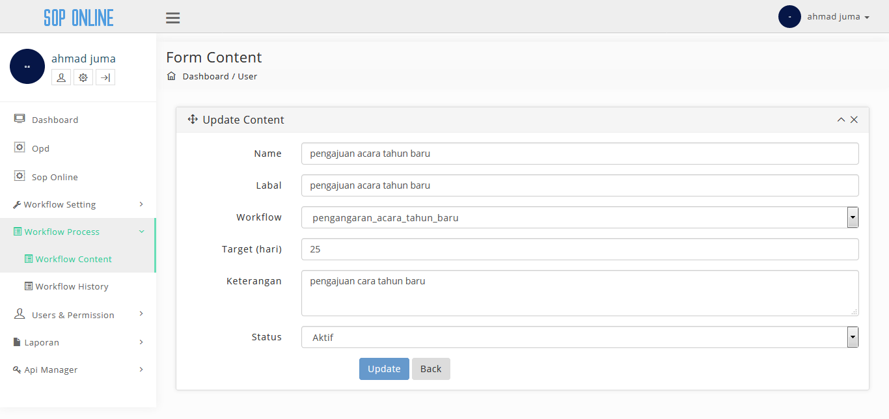](../images/sop-online/implementasi/33-tampilan-edit-content.png)

Didalam page ini terdapat edit atau update form input Konten Edit Workflow Content yang harus diisi oleh super admin atau pengguna yang diberi hak akses oleh super admin untuk bisa edit atau update Konten Content. Jika data sudah lengkap atau kurang lengkap maka pengguna dapat menekan tombol " Update " dan jika tidak ada masalah maka akan dialihkan ke page Content List.

#### Tampilan Workflow History
Konten Workflow History ini menampilkan list-list apa saja Workflow History yang dapat dilakukan admin didalam Workflow Content ini, didalam konten ini kita bisa menambah, mengedit dan melihat data Worflow History List seperti gambar dibawah ini. 

#### Tampilan User
Konten User ini menampilkan list-list apa saja User yang dapat dilakukan admin didalam User ini, didalam konten ini kita bisa menambah, mengedit dan melihat data User List seperti gambar dibawah ini. 

[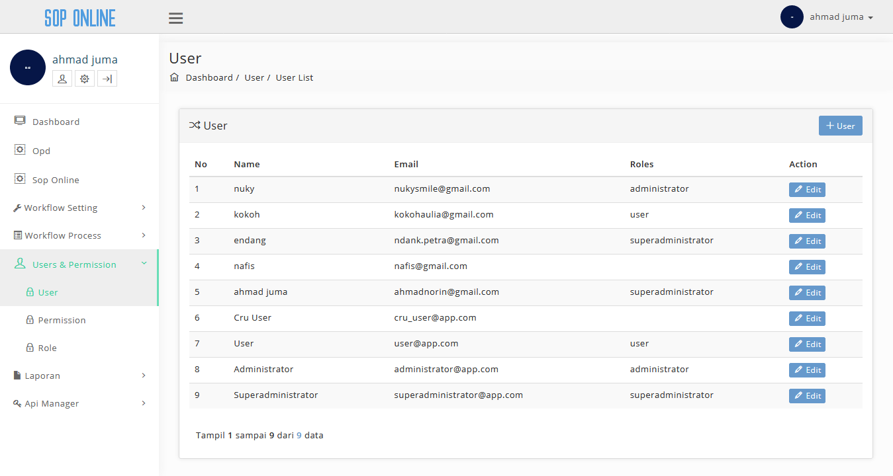](../images/sop-online/implementasi/12-tampilan-user.png.png)

##### Tampilan Add User 
[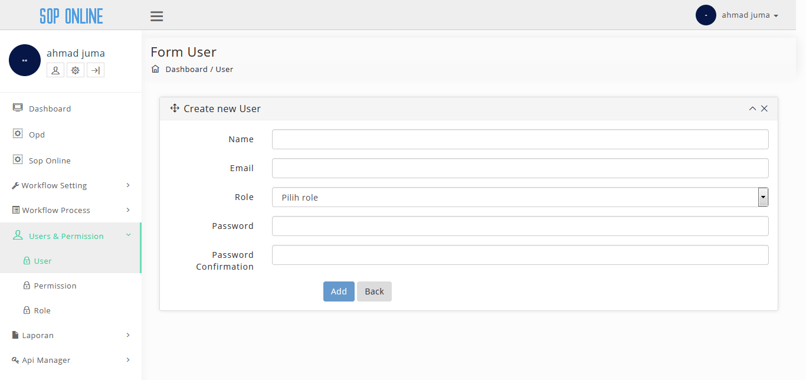](../images/sop-online/implementasi/34-tampilan-add-user.png)

Didalam page ini terdapat menambahkan atau form input Konten Add New User yang harus diisi oleh super admin atau pengguna yang diberi hak akses oleh super admin untuk bisa menambahkan Konten User. Jika data sudah ada atau kurang lengkap maka pengguna dapat menekan tombol " Add " dan jika tidak ada masalah maka akan dialihkan ke page User List. 

##### Tampilan Edit User
[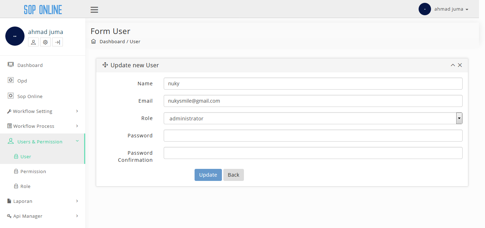](../images/sop-online/implementasi/35-tampilan-edit-user.png)

Didalam page ini terdapat edit atau update form input Konten Edit User yang harus diisi oleh super admin atau pengguna yang diberi hak akses oleh super admin untuk bisa edit atau update Konten User. Jika data sudah lengkap atau kurang lengkap maka pengguna dapat menekan tombol " Update " dan jika tidak ada masalah maka akan dialihkan ke page User List.

#### Tampilan Permission
Konten Permission ini menampilkan list-list apa saja Permission yang dapat dilakukan admin didalam Permission ini, didalam konten ini kita bisa menambah, menghapus, mengedit dan melihat data Permission List seperti gambar dibawah ini. 

##### Tampilan Add New Permission 

Didalam page ini terdapat menambahkan atau form input Konten Add New Permission yang harus diisi oleh super admin atau pengguna yang diberi hak akses oleh super admin untuk bisa menambahkan Konten Permission. Jika data sudah ada atau kurang lengkap maka pengguna dapat menekan tombol " Add " dan jika tidak ada masalah maka akan dialihkan ke page Permission List.

##### Tampilan View Permission 
[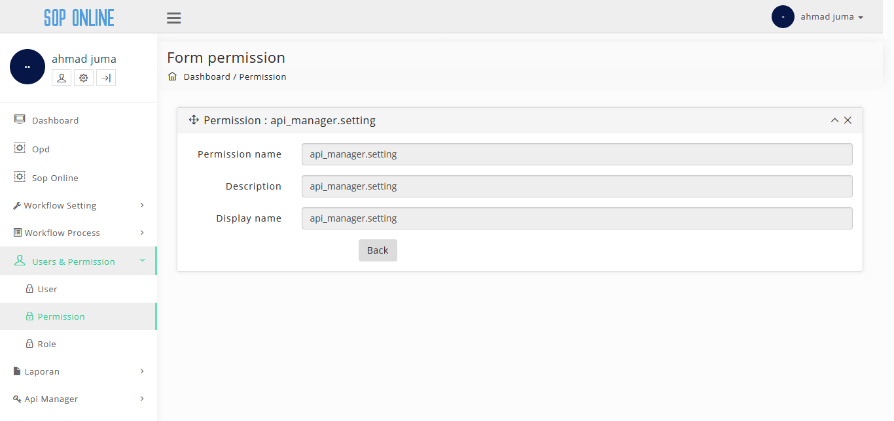](../images/sop-online/implementasi/37-tampilan-view-permission.png)

Didalam page ini terdapat melihat detail Konten Permission yang harus diisi oleh super admin atau pengguna yang diberi hak akses oleh super admin untuk bisa melihat detail Konten Permission. Jika data sudah dilihat maka pengguna dapat menekan tombol " Back " dan jika tidak ada masalah maka akan dialihkan ke page Permission List.
 
##### Tampilan Edit Permission 
[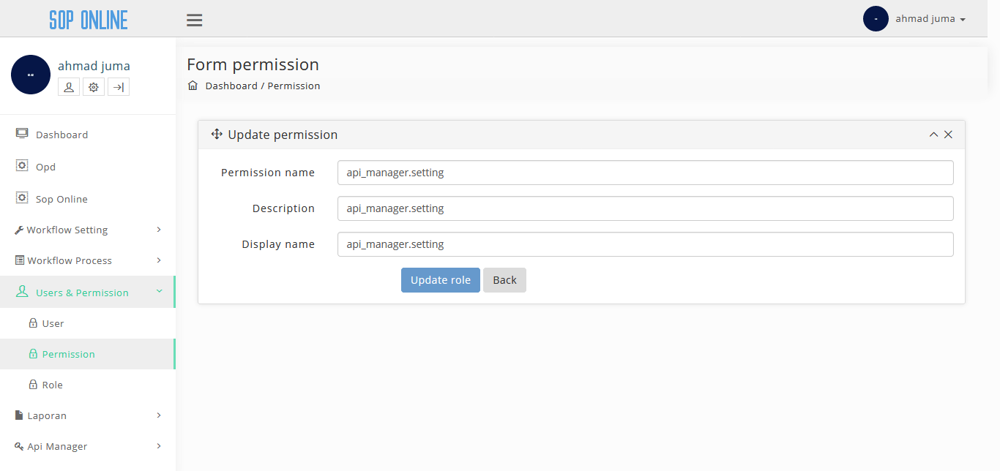](../images/sop-online/implementasi/38-tampilan-edit-permission.png)

Didalam page ini terdapat edit atau update form input Konten Edit Permission yang harus diisi oleh super admin atau pengguna yang diberi hak akses oleh super admin untuk bisa edit atau update Konten Permission. Jika data sudah lengkap atau kurang lengkap maka pengguna dapat menekan tombol " Update " dan jika tidak ada masalah maka akan dialihkan ke page Permission List.

#### Tampilan Role
Konten Role ini menampilkan list-list apa saja Role yang dapat dilakukan admin didalam Role ini, didalam konten ini kita bisa menambah, menghapus, mengedit dan melihat data Role List seperti gambar dibawah ini. 

[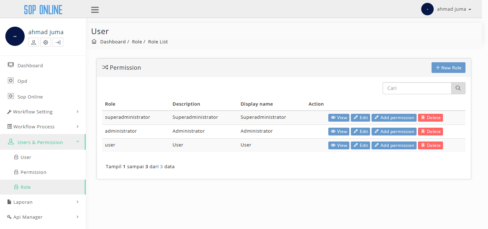](../images/sop-online/implementasi/14-tampilan-role.png)

##### Tampilan New Role 
[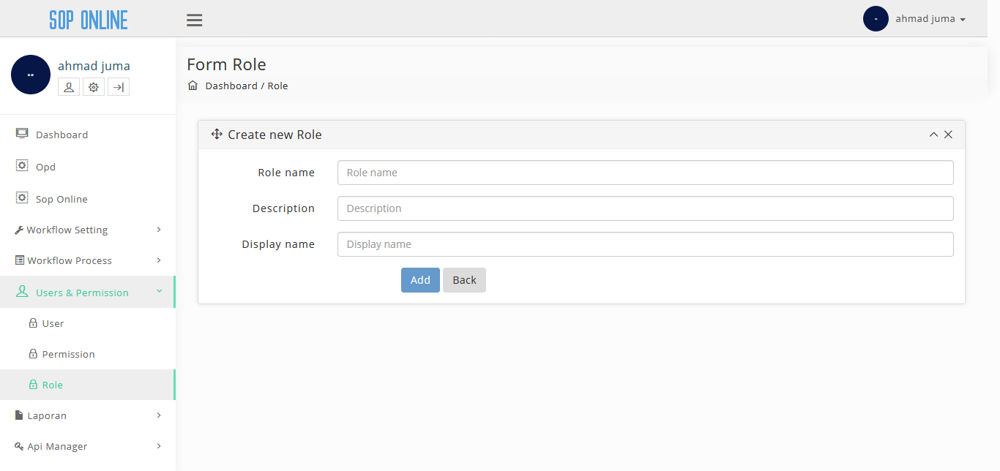](../images/sop-online/implementasi/39-tampilan-new-role.png)

Didalam page ini terdapat menambahkan atau form input Konten Add New Role yang harus diisi oleh super admin atau pengguna yang diberi hak akses oleh super admin untuk bisa menambahkan Konten Role. Jika data sudah ada atau kurang lengkap maka pengguna dapat menekan tombol " Add " dan jika tidak ada masalah maka akan dialihkan ke page Role List.

##### Tampilan View Role 

Didalam page ini terdapat melihat detail Konten Role yang harus diisi oleh super admin atau pengguna yang diberi hak akses oleh super admin untuk bisa melihat detail Konten Role. Jika data sudah dilihat maka pengguna dapat menekan tombol " Back " dan jika tidak ada masalah maka akan dialihkan ke page Role List.

##### Tampilan Edit Role 

Didalam page ini terdapat edit atau update form input Konten Edit Role yang harus diisi oleh super admin atau pengguna yang diberi hak akses oleh super admin untuk bisa edit atau update Konten Role. Jika data sudah lengkap atau kurang lengkap maka pengguna dapat menekan tombol " Update " dan jika tidak ada masalah maka akan dialihkan ke page Role List.

#### Tampilan Laporan Workflow
Konten Laporan Workflow ini menampilkan list-list apa saja Laporan Workflow yang dapat dilakukan admin didalam Laporan ini, didalam konten ini kita bisa Mencetak dan melihat data Laporan Workflow List seperti gambar dibawah ini.

[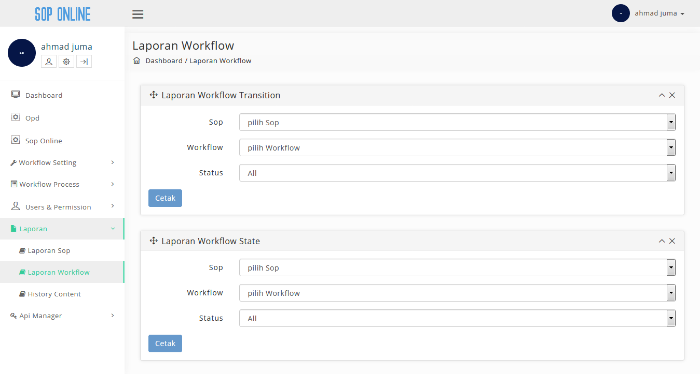](../images/sop-online/implementasi/15-tampilan-laporan.png)
