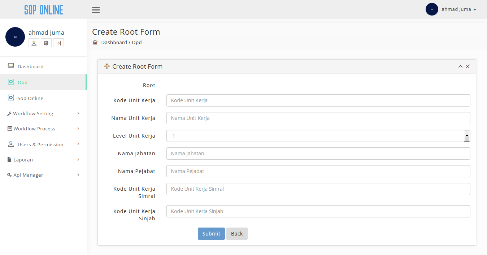
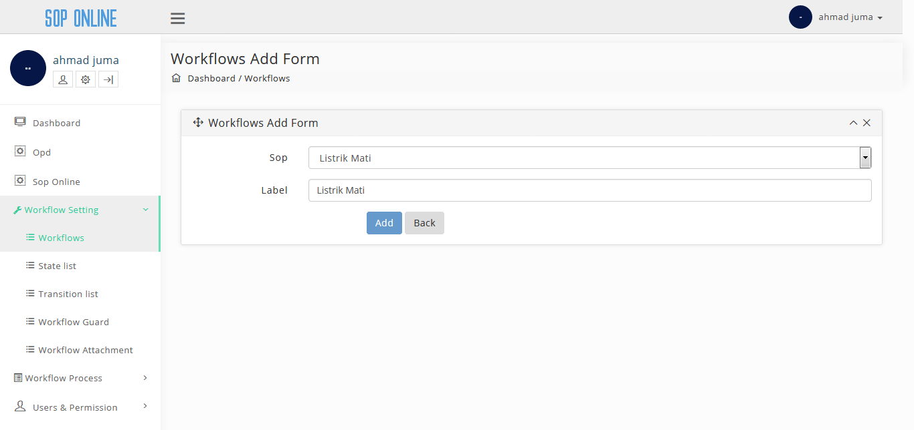
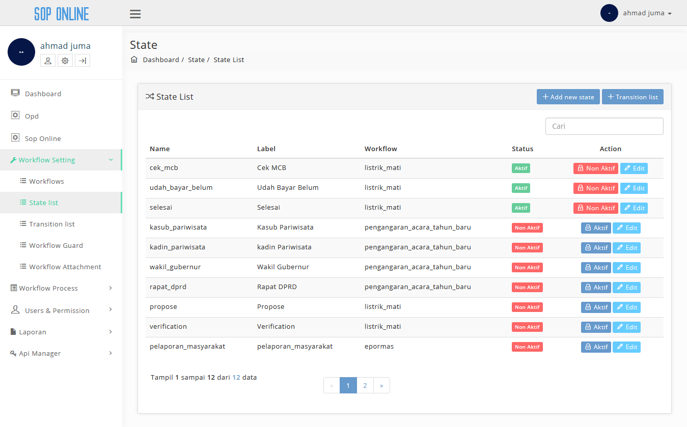
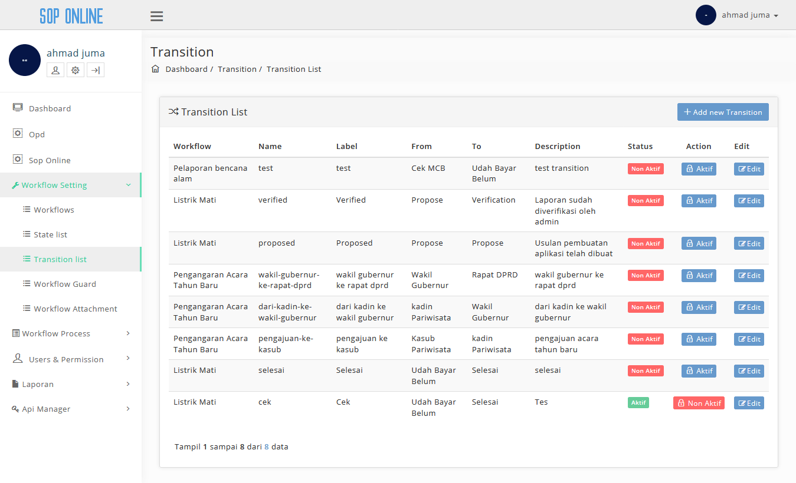
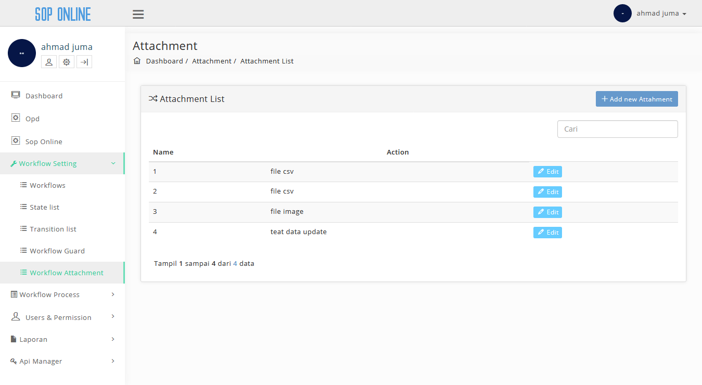
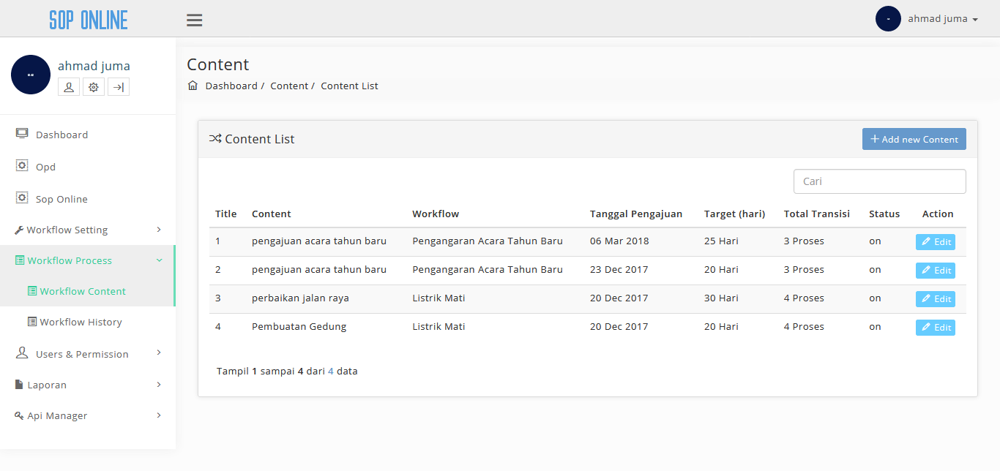
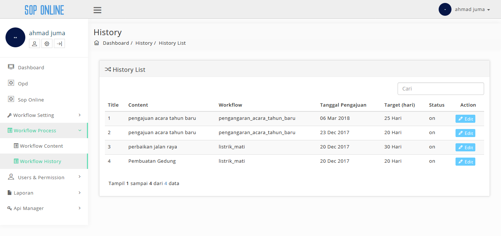
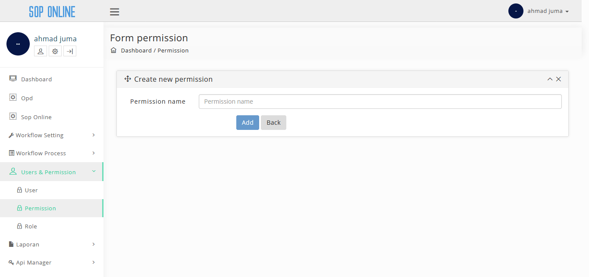

## Daftar Isi
* will be replaced with the ToC, excluing the "Contents" header
{:toc}

### Integrasi dan Pengujian SOP Online
Pada laporan ini akan membahas tentang Integrasi dan Pengujian SOP Online, untuk pengujiannya menggunakan User Acceptance Test.

### Integrasi SOP Online

Salah satu sasaran Dinas Komunikasi, Informasi, Statistika dan Persandian adalah membuat sebuah sistem yang terkelola rapi dalam segala hal, baik dalam bidang IT maupun bidang yang lainnya agar mampu menyelenggarakan seluruh kegiatannya secara mandiri dan sesuai dengan ketentuan yang berlaku.

Untuk mencapai hal tersebut, diperlukan suatu prosedur operasional yang jelas dan standar bagi semua pihak yang terlibat dalam mencapai sasaran tersebut. Praktik-praktik baik yang telah berlangsung di KOMINFO Banten perlu distandarisasi dan didokumentasikan agar menjadi acuan bagi manejemen dalam menjalankan tugas dan fungsinya serta menjamin keberlangsungan implementasi praktik-praktik tersebut.

Terkait dengan sasaran tersebut kami bertujuan akan membangun standarisasi sistem pengembangan apliaksi yang dapat meningkatkan efisiensi dan efektifitas kinerja dinas terkait serta mampu mebagikan informasi yang dibutuhkan oleh berbagai pihak untuk kepentingan proses pengambilan keputusan. Untuk menuju kepada standarisasi dalam pengembangan aplikasi perlu diciptakan terlebih dahulu sistem manual  terstandar atau semacam *Standar Operating Procedur* (SOP) untuk seluruh pengembangan aplikasi yang ada sehingga dapat dipahami oleh semua pihak yang terlibat.

Integrasi aplikasi dilakukan dengan:

1. melalui antar muka aplikasi atau melalui method
2. focus method level
3. method dishare dengan meletakannnya pada sebuah server pusat / dengan mengakses method pada aplikasi.

Application Programming Interface mekanisme terdefinisi dibuat untuk berhubungan dengan sumber daya seperti server aplikasi, middleware, dan basis data.
Dibawah ini adalah contoh method, parameter dan response yang terdapat didalam SOP Online:

#### Tampilan Permission

Pada page ini terdapat method yang berupa tombol **GET** dan link url untuk konten get permission, method ini digunakan untuk menambahkan data baru aplikasi ke server. Parameter yang terdapat didalam konten ini berisi field, type dan description. Terdapat 2 response didalam page ini yaitu:

1. *Success Response* yang ditampilkan dalam "Success 200" dan hasilnya ditampilkan dalam bentuk Json.
2. *Error Response* yang ditampilkan dalam "Error 4xx" dan hasilnya akan ditampilkan dalam bentuk Json

#### Tampilan Role

Pada page ini terdapat method yang berupa tombol **GET** dan link url untuk konten get role, method ini digunakan untuk menambahkan data baru aplikasi ke server. Parameter yang terdapat didalam konten ini berisi field, type dan description. Terdapat 2 response didalam page ini yaitu:

1. *Success Response* yang ditampilkan dalam "Success 200" dan hasilnya ditampilkan dalam bentuk Json.
2. *Error Response* yang ditampilkan dalam "Error 4xx" dan hasilnya akan ditampilkan dalam bentuk Json

#### Pengujian SOP Online
Sistem informasi saat ini semakin berkembang pesat membuat semua pekerjaan dikehidupan ini banyak yang sudah beralih dibantu oleh teknologi informasi. Teknologi yang dapat membantu lebih mudah, cepat, aman dan efektif jelas sangatlah membantu siapa saja yang memanfaatkannya, document dibuat untuk memberikan panduan penggunaan aplikasi SOP Online.

Untuk memulai akses aplikasi SOP Online. Buka web browser (IE, Mozila Firefox atau yang lainnya) dengan menulis alamat url http://http://sop.bantenprov.go.id/ kemudian tekan Enter pada tombol keyboard atau klik tombol Go pada browser.

##### Tampilan Login

| Tampilan | URL/ Image                               | Ada  | Tidak |
| -------- | ---------------------------------------- | ---- | ----- |
| Login    |  |      |       |

Dalam tabel ini *user* dapat melakukan test kepada aplikasi apakah tampilan login sudah dapat diakses oleh *user* atau tidak. Jika sudah dapat diakses *user* dapat meceklis pada kolom "Ada" sedangkan jika belum dapat diakses maka *user* dapat menceklis pada kolom "tidak".

##### Tampilan Dashboard

| Tampilan  | URL/ Image                               | Ada  | Tidak |
| --------- | ---------------------------------------- | ---- | ----- |
| Dashboard |  |      |       |

Dalam tabel ini *user* dapat melakukan test kepada aplikasi apakah tampilan dashboard sudah dapat diakses oleh *user* atau tidak. Jika sudah dapat diakses *user* dapat meceklis pada kolom "Ada" sedangkan jika belum dapat diakses maka *user* dapat menceklis pada kolom "tidak".

##### Tampilan Opd

| Tampilan | URL/ Image                               | Ada  | Tidak |
| -------- | ---------------------------------------- | ---- | ----- |
| Opd      |  |      |       |

Dalam tabel ini *user* dapat melakukan test kepada aplikasi apakah tampilan opd sudah dapat diakses oleh *user* atau tidak. Jika sudah dapat diakses *user* dapat meceklis pada kolom "Ada" sedangkan jika belum dapat diakses maka *user* dapat menceklis pada kolom "tidak".

##### Tampilan Add New Opd

| Tampilan    | URL/ Image                               | Ada  | Tidak |
| ----------- | ---------------------------------------- | ---- | ----- |
| Add New Opd |  |      |       |

Dalam tabel ini *user* dapat melakukan test kepada aplikasi apakah tampilan add new opd sudah dapat diakses oleh *user* atau tidak. Jika sudah dapat diakses *user* dapat meceklis pada kolom "Ada" sedangkan jika belum dapat diakses maka *user* dapat menceklis pada kolom "tidak".

##### Tampilan Add New Child

| Tampilan      | URL/ Image                               | Ada  | Tidak |
| ------------- | ---------------------------------------- | ---- | ----- |
| Add New Child |  |      |       |

Dalam tabel ini *user* dapat melakukan test kepada aplikasi apakah tampilan add new child sudah dapat diakses oleh *user* atau tidak. Jika sudah dapat diakses *user* dapat meceklis pada kolom "Ada" sedangkan jika belum dapat diakses maka *user* dapat menceklis pada kolom "tidak".

##### Tampilan Sop Online

| Konten     | URL/ Image                               | Ada  | Tidak |
| ---------- | ---------------------------------------- | ---- | ----- |
| Sop Online |  |      |       |

Dalam tabel ini *user* dapat melakukan test kepada aplikasi apakah tampilan sop online sudah dapat diakses oleh *user* atau tidak. Jika sudah dapat diakses *user* dapat meceklis pada kolom "Ada" sedangkan jika belum dapat diakses maka *user* dapat menceklis pada kolom "tidak".

##### Tampilan Add Sop Online

| Tampilan       | URL/ Image                               | Ada  | Tidak |
| -------------- | ---------------------------------------- | ---- | ----- |
| Add Sop Online |  |      |       |

Dalam tabel ini *user* dapat melakukan test kepada aplikasi apakah tampilan add sop online sudah dapat diakses oleh *user* atau tidak. Jika sudah dapat diakses *user* dapat meceklis pada kolom "Ada" sedangkan jika belum dapat diakses maka *user* dapat menceklis pada kolom "tidak".

##### Tampilan View Sop Online

| Subkonten       | URL/ Image                               | Ada  | Tidak |
| --------------- | ---------------------------------------- | ---- | ----- |
| View Sop Online |  |      |       |

Dalam tabel ini *user* dapat melakukan test kepada aplikasi apakah tampilan view sop online sudah dapat diakses oleh *user* atau tidak. Jika sudah dapat diakses *user* dapat meceklis pada kolom "Ada" sedangkan jika belum dapat diakses maka *user* dapat menceklis pada kolom "tidak".

##### Tampilan Edit Sop Online

| Tampilan        | URL/ Image                               | Ada  | Tidak |
| --------------- | ---------------------------------------- | ---- | ----- |
| Edit Sop Online |  |      |       |

Dalam tabel ini *user* dapat melakukan test kepada aplikasi apakah tampilan edit sop online sudah dapat diakses oleh *user* atau tidak. Jika sudah dapat diakses *user* dapat meceklis pada kolom "Ada" sedangkan jika belum dapat diakses maka *user* dapat menceklis pada kolom "tidak".

##### Tampilan Workflows

| Subkonten | URL/ Image                               | Ada  | Tidak |
| --------- | ---------------------------------------- | ---- | ----- |
| Workflows |  |      |       |

Dalam tabel ini *user* dapat melakukan test kepada aplikasi apakah tampilan workflows sudah dapat diakses oleh *user* atau tidak. Jika sudah dapat diakses *user* dapat meceklis pada kolom "Ada" sedangkan jika belum dapat diakses maka *user* dapat menceklis pada kolom "tidak".

##### Tampilan Add New Workflows

| Tampilan         | URL/ Image                               | Ada  | Tidak |
| ---------------- | ---------------------------------------- | ---- | ----- |
| Add New Workflow |  |      |       |

Dalam tabel ini *user* dapat melakukan test kepada aplikasi apakah tampilan add new workflow sudah dapat diakses oleh *user* atau tidak. Jika sudah dapat diakses *user* dapat meceklis pada kolom "Ada" sedangkan jika belum dapat diakses maka *user* dapat menceklis pada kolom "tidak".

##### Tampilan Edit Workflow

| Tampilan      | URL/ Image                               | Ada  | Tidak |
| ------------- | ---------------------------------------- | ---- | ----- |
| Edit Workflow |  |      |       |

Dalam tabel ini *user* dapat melakukan test kepada aplikasi apakah tampilan edit workflow sudah dapat diakses oleh *user* atau tidak. Jika sudah dapat diakses *user* dapat meceklis pada kolom "Ada" sedangkan jika belum dapat diakses maka *user* dapat menceklis pada kolom "tidak".

##### Tampilan State List

| Tampilan   | URL/ Image                               | Ada  | Tidak |
| ---------- | ---------------------------------------- | ---- | ----- |
| State List |  |      |       |

Dalam tabel ini *user* dapat melakukan test kepada aplikasi apakah tampilan state list sudah dapat diakses oleh *user* atau tidak. Jika sudah dapat diakses *user* dapat meceklis pada kolom "Ada" sedangkan jika belum dapat diakses maka *user* dapat menceklis pada kolom "tidak".

##### Tampilan Add new State

| Tampilan      | URL/ Image                               | Ada  | Tidak |
| ------------- | ---------------------------------------- | ---- | ----- |
| Add New State |  |      |       |

Dalam tabel ini *user* dapat melakukan test kepada aplikasi apakah tampilan add new state sudah dapat diakses oleh *user* atau tidak. Jika sudah dapat diakses *user* dapat meceklis pada kolom "Ada" sedangkan jika belum dapat diakses maka *user* dapat menceklis pada kolom "tidak".

##### Tampilan Edit State

| Tampilan   | URL/ Image                               | Ada  | Tidak |
| ---------- | ---------------------------------------- | ---- | ----- |
| Edit State |  |      |       |

Dalam tabel ini *user* dapat melakukan test kepada aplikasi apakah tampilan edit state sudah dapat diakses oleh *user* atau tidak. Jika sudah dapat diakses *user* dapat meceklis pada kolom "Ada" sedangkan jika belum dapat diakses maka *user* dapat menceklis pada kolom "tidak".

##### Tampilan Transition List

| Tampilan        | URL/ Image                               | Ada  | Tidak |
| --------------- | ---------------------------------------- | ---- | ----- |
| Transition List |  |      |       |

Dalam tabel ini *user* dapat melakukan test kepada aplikasi apakah tampilan transition sudah dapat diakses oleh *user* atau tidak. Jika sudah dapat diakses *user* dapat meceklis pada kolom "Ada" sedangkan jika belum dapat diakses maka *user* dapat menceklis pada kolom "tidak".

##### Tampilan Add New Transition

| Tampilan           | URL/ Image                               | Ada  | Tidak |
| ------------------ | ---------------------------------------- | ---- | ----- |
| Add New Transition |  |      |       |

Dalam tabel ini *user* dapat melakukan test kepada aplikasi apakah tampilan add new transition sudah dapat diakses oleh *user* atau tidak. Jika sudah dapat diakses *user* dapat meceklis pada kolom "Ada" sedangkan jika belum dapat diakses maka *user* dapat menceklis pada kolom "tidak".

##### Tampilan Edit Transition

| Tampilan        | URL/ Image                               | Ada  | Tidak |
| --------------- | ---------------------------------------- | ---- | ----- |
| Edit Transition |  |      |       |

Dalam tabel ini *user* dapat melakukan test kepada aplikasi apakah tampilan edit transition sudah dapat diakses oleh *user* atau tidak. Jika sudah dapat diakses *user* dapat meceklis pada kolom "Ada" sedangkan jika belum dapat diakses maka *user* dapat menceklis pada kolom "tidak".

##### Tampilan Workflow Guard
##### Tampilan Add New Guard

| Tampilan      | URL/ Image                               | Ada  | Tidak |
| ------------- | ---------------------------------------- | ---- | ----- |
| Add New Guard |  |      |       |

Dalam tabel ini *user* dapat melakukan test kepada aplikasi apakah tampilan add new guard sudah dapat diakses oleh *user* atau tidak. Jika sudah dapat diakses *user* dapat meceklis pada kolom "Ada" sedangkan jika belum dapat diakses maka *user* dapat menceklis pada kolom "tidak".

##### Tampilan Edit Guard

| Konten     | URL/ Image                               | Ada  | Tidak |
| ---------- | ---------------------------------------- | ---- | ----- |
| Edit Guard |  |      |       |

Dalam tabel ini *user* dapat melakukan test kepada aplikasi apakah tampilan edit guard sudah dapat diakses oleh *user* atau tidak. Jika sudah dapat diakses *user* dapat meceklis pada kolom "Ada" sedangkan jika belum dapat diakses maka *user* dapat menceklis pada kolom "tidak".

##### Tampilan Workflow Attachment

| Tampilan            | URL/ Image                               | Ada  | Tidak |
| ------------------- | ---------------------------------------- | ---- | ----- |
| Workflow Attachment |  |      |       |

Dalam tabel ini *user* dapat melakukan test kepada aplikasi apakah tampilan workflow attachment sudah dapat diakses oleh *user* atau tidak. Jika sudah dapat diakses *user* dapat meceklis pada kolom "Ada" sedangkan jika belum dapat diakses maka *user* dapat menceklis pada kolom "tidak".

##### Tampilan Add New Attachment

| Tampilan           | URL/ Image                               | Ada  | Tidak |
| ------------------ | ---------------------------------------- | ---- | ----- |
| Add New Attachment |  |      |       |

Dalam tabel ini *user* dapat melakukan test kepada aplikasi apakah tampilan add new attachment sudah dapat diakses oleh *user* atau tidak. Jika sudah dapat diakses *user* dapat meceklis pada kolom "Ada" sedangkan jika belum dapat diakses maka *user* dapat menceklis pada kolom "tidak".

##### Tampilan Edit Attachment

| Subkonten         | URL/ Image                               | Ada  | Tidak |
| ----------------- | ---------------------------------------- | ---- | ----- |
| Edit Attachment |  |      |       |

Dalam tabel ini *user* dapat melakukan test kepada aplikasi apakah tampilan Edit attachment sudah dapat diakses oleh *user* atau tidak. Jika sudah dapat diakses *user* dapat meceklis pada kolom "Ada" sedangkan jika belum dapat diakses maka *user* dapat menceklis pada kolom "tidak".

##### Tampilan Workflow Content

| Tampilan         | URL/ Image                               | Ada  | Tidak |
| ---------------- | ---------------------------------------- | ---- | ----- |
| Workflow Content |  |      |       |

Dalam tabel ini *user* dapat melakukan test kepada aplikasi apakah tampilan workflow content sudah dapat diakses oleh *user* atau tidak. Jika sudah dapat diakses *user* dapat meceklis pada kolom "Ada" sedangkan jika belum dapat diakses maka *user* dapat menceklis pada kolom "tidak".

##### Tampilan Add New Content

##### Konten Transition List

| Konten          | URL/ Image                               | Ada  | Tidak |
| --------------- | ---------------------------------------- | ---- | ----- |
| Add New Content |  |      |       |

Dalam tabel ini *user* dapat melakukan test kepada aplikasi apakah tampilan add new content sudah dapat diakses oleh *user* atau tidak. Jika sudah dapat diakses *user* dapat meceklis pada kolom "Ada" sedangkan jika belum dapat diakses maka *user* dapat menceklis pada kolom "tidak".

##### Tampilan Workflow History

| Tampilan         | URL/ Image                               | Ada  | Tidak |
| ---------------- | ---------------------------------------- | ---- | ----- |
| Workflow History |  |      |       |

Dalam tabel ini *user* dapat melakukan test kepada aplikasi apakah tampilan workflow history sudah dapat diakses oleh *user* atau tidak. Jika sudah dapat diakses *user* dapat meceklis pada kolom "Ada" sedangkan jika belum dapat diakses maka *user* dapat menceklis pada kolom "tidak".

##### Tampilan User

| Tampilan | URL/ Image                               | Ada  | Tidak |
| -------- | ---------------------------------------- | ---- | ----- |
| User     |  |      |       |

Dalam tabel ini *user* dapat melakukan test kepada aplikasi apakah tampilan user sudah dapat diakses oleh *user* atau tidak. Jika sudah dapat diakses *user* dapat meceklis pada kolom "Ada" sedangkan jika belum dapat diakses maka *user* dapat menceklis pada kolom "tidak".

##### Tampilan Add User

| Tampilan | URL/ Image                               | Ada  | Tidak |
| -------- | ---------------------------------------- | ---- | ----- |
| Add User |  |      |       |

Dalam tabel ini *user* dapat melakukan test kepada aplikasi apakah tampilan add user sudah dapat diakses oleh *user* atau tidak. Jika sudah dapat diakses *user* dapat meceklis pada kolom "Ada" sedangkan jika belum dapat diakses maka *user* dapat menceklis pada kolom "tidak".

##### Tampilan Edit User

| Tampilan  | URL/ Image                               | Ada  | Tidak |
| --------- | ---------------------------------------- | ---- | ----- |
| Edit User |  |      |       |

Dalam tabel ini *user* dapat melakukan test kepada aplikasi apakah tampilan edit user sudah dapat diakses oleh *user* atau tidak. Jika sudah dapat diakses *user* dapat meceklis pada kolom "Ada" sedangkan jika belum dapat diakses maka *user* dapat menceklis pada kolom "tidak".

##### Tampilan Permission

| Tampilan   | URL/ Image                               | Ada  | Tidak |
| ---------- | ---------------------------------------- | ---- | ----- |
| Permission |  |      |       |

Dalam tabel ini *user* dapat melakukan test kepada aplikasi apakah tampilan permission sudah dapat diakses oleh *user* atau tidak. Jika sudah dapat diakses *user* dapat meceklis pada kolom "Ada" sedangkan jika belum dapat diakses maka *user* dapat menceklis pada kolom "tidak".

##### Tampilan Add New Permission

| Tampilan           | URL/ Image                               | Ada  | Tidak |
| ------------------ | ---------------------------------------- | ---- | ----- |
| Add New Permission |  |      |       |

Dalam tabel ini *user* dapat melakukan test kepada aplikasi apakah tampilan add new permission sudah dapat diakses oleh *user* atau tidak. Jika sudah dapat diakses *user* dapat meceklis pada kolom "Ada" sedangkan jika belum dapat diakses maka *user* dapat menceklis pada kolom "tidak".

##### Tampilan View Permission

| Tampilan        | URL/ Image                               | Ada  | Tidak |
| --------------- | ---------------------------------------- | ---- | ----- |
| View Permission |  |      |       |

Dalam tabel ini *user* dapat melakukan test kepada aplikasi apakah tampilan view permission sudah dapat diakses oleh *user* atau tidak. Jika sudah dapat diakses *user* dapat meceklis pada kolom "Ada" sedangkan jika belum dapat diakses maka *user* dapat menceklis pada kolom "tidak".

##### Tampilan Edit Permission

| Tampilan        | URL/ Image                               | Ada  | Tidak |
| --------------- | ---------------------------------------- | ---- | ----- |
| Edit Permission |  |      |       |

Dalam tabel ini *user* dapat melakukan test kepada aplikasi apakah tampilan edit permission sudah dapat diakses oleh *user* atau tidak. Jika sudah dapat diakses *user* dapat meceklis pada kolom "Ada" sedangkan jika belum dapat diakses maka *user* dapat menceklis pada kolom "tidak".

##### Tampilan Role

| Tampilan | URL/ Image                               | Ada  | Tidak |
| -------- | ---------------------------------------- | ---- | ----- |
| Role     |  |      |       |

Dalam tabel ini *user* dapat melakukan test kepada aplikasi apakah tampilan role sudah dapat diakses oleh *user* atau tidak. Jika sudah dapat diakses *user* dapat meceklis pada kolom "Ada" sedangkan jika belum dapat diakses maka *user* dapat menceklis pada kolom "tidak".

##### Tampilan New Role

| Tampilan | URL/ Image                               | Ada  | Tidak |
| -------- | ---------------------------------------- | ---- | ----- |
| New Role |  |      |       |

Dalam tabel ini *user* dapat melakukan test kepada aplikasi apakah tampilan new role sudah dapat diakses oleh *user* atau tidak. Jika sudah dapat diakses *user* dapat meceklis pada kolom "Ada" sedangkan jika belum dapat diakses maka *user* dapat menceklis pada kolom "tidak".

##### Tampilan View Role

| Tampilan  | URL/ Image                               | Ada  | Tidak |
| --------- | ---------------------------------------- | ---- | ----- |
| View Role |  |      |       |

Dalam tabel ini *user* dapat melakukan test kepada aplikasi apakah tampilan view role sudah dapat diakses oleh *user* atau tidak. Jika sudah dapat diakses *user* dapat meceklis pada kolom "Ada" sedangkan jika belum dapat diakses maka *user* dapat menceklis pada kolom "tidak".

##### Tampilan Edit Role

| Tampilan  | URL/ Image                               | Ada  | Tidak |
| --------- | ---------------------------------------- | ---- | ----- |
| Edit Role |  |      |       |

Dalam tabel ini *user* dapat melakukan test kepada aplikasi apakah tampilan edit role sudah dapat diakses oleh *user* atau tidak. Jika sudah dapat diakses *user* dapat meceklis pada kolom "Ada" sedangkan jika belum dapat diakses maka *user* dapat menceklis pada kolom "tidak".

##### Tampilan Laporan Workflow

| Tampilan         | URL/ Image                               | Ada  | Tidak |
| ---------------- | ---------------------------------------- | ---- | ----- |
| Laporan Workflow |  |      |       |

Dalam tabel ini *user* dapat melakukan test kepada aplikasi apakah tampilan laporan workflow sudah dapat diakses oleh *user* atau tidak. jika sudah dapat diakses *user* dapat meceklis pada kolom "Ada" sedangkan jika belum dapat diakses maka *user* dapat menceklis pada kolom "tidak".
