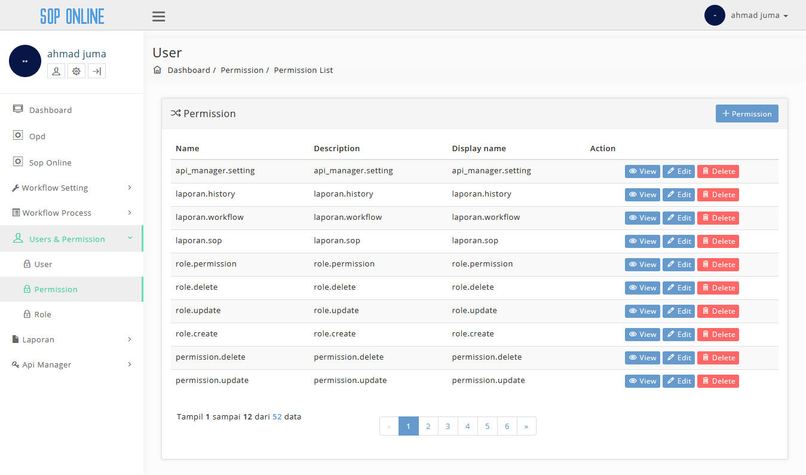
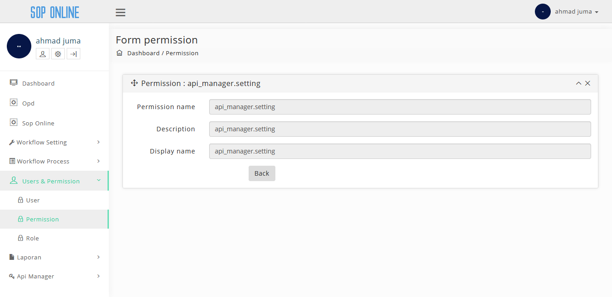
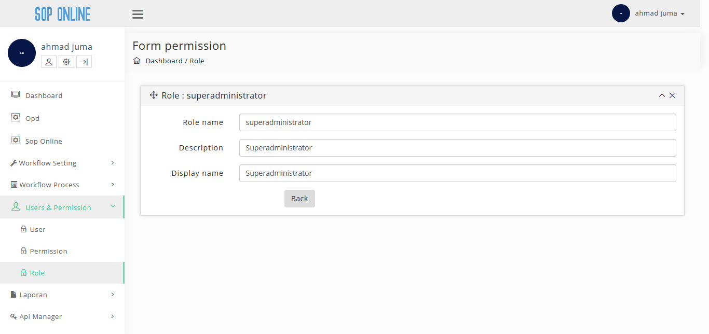
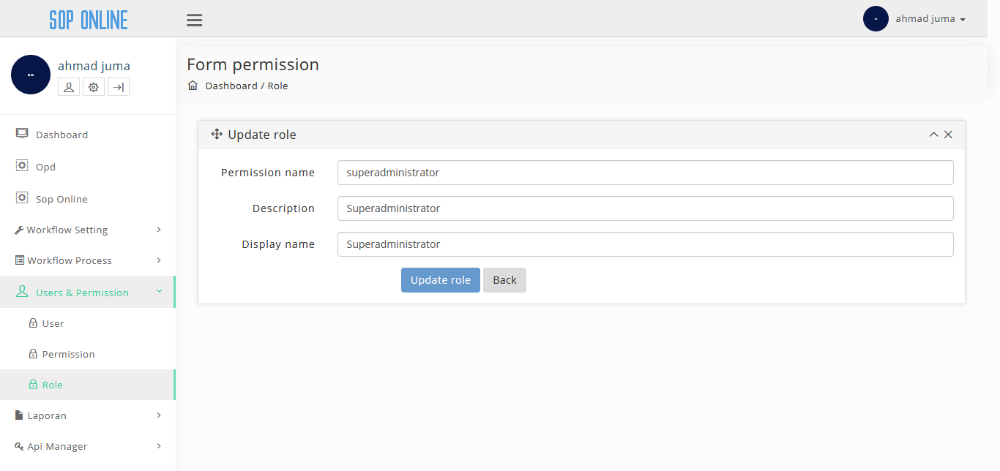
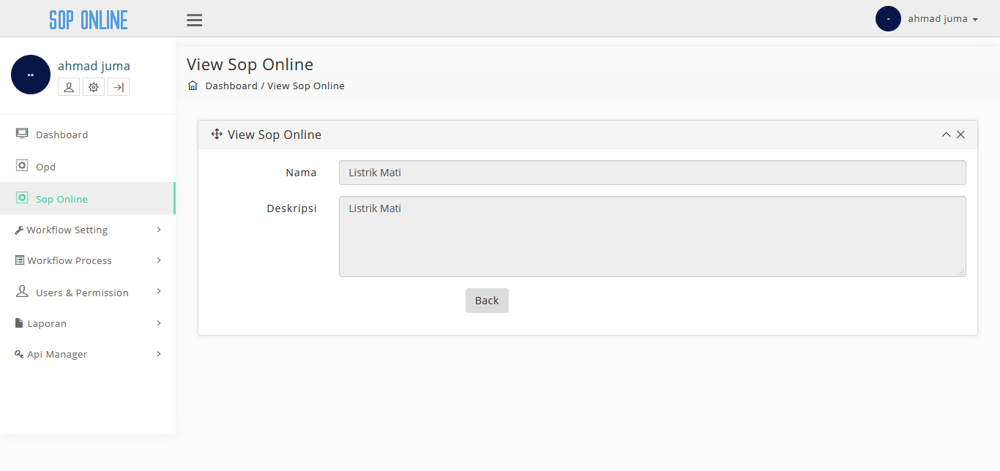
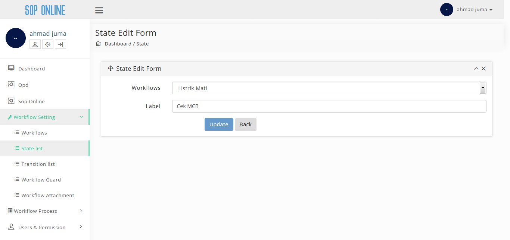
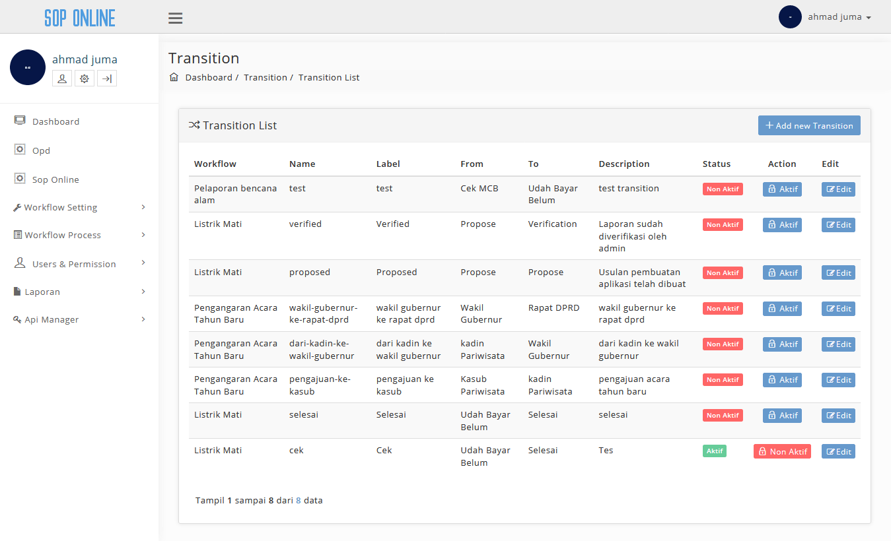

## Pengembangan SOP Online

Berikut ini adalah tampilan pengembangan untuk aplikasi SOP Online:

Untuk memulai akses terhadap aplikasi **SOP Online**. Buka web browser (IE, Mozila Firefox atau yang lainnya) dengan menulis alamat url http://sop.bantenprov.go.id/ kemudian tekan **Enter** pada tombol keyboard atau klik tombol **Go** pada browser. Akan muncul tampilan halaman login aplikasi aop online seperti gambar dibawah ini.

### Tampilan Login 

Masukkan User Id dan Password, Setelah di isi lengkap dan benar, klik button **Sign in** atau tekan tombol **Enter** pada keyboard. Sehingga akan menampilkan halaman utama sebagai berikut.

### Tampilan Awal / Dashboard SOP Online 

###  Menu Home
Pada halaman ini kita dapat melihat list menu yang terdapat di "SOP Online" yaitu:

- *Permission*
- *Role*
- *SOP*
- *State List*
- *Transition List*

Didalam list menu ini kita bisa melihat isi konten dan subkonten yang terdapat didalamnya

### Konten Permission
Konten Permission ini menampilkan list-list apa saja permission yang dapat dilakukan admin didalam SOP Online ini, didalam konten ini kita bisa menambah, melihat detail, mengedit dan menghapus data permission seperti gambar dibawah ini. 

### Subkonten Tambah Permission
Didalam subkonten ini terdapat *form input* permission untuk menambahkan permission yang dapat dilakukan oleh admin seperti gambar dibawah ini. 

### Subkonten View Permission
Didalam subkonten ini admin dapat melihat detail dari permission yang ingin dilihat seperti pada gambar dibawah ini. 

### Subkonten Edit Permission
Didalam subkonten ini terdapat *form edit permission* untuk mengedit permission yang ingin admin rubah seperti gambar dibawah ini. 

### Konten Role
Konten Role ini menampilkan list-list apa saja role yang terdapat d didalam SOP Online ini, didalam konten ini kita bisa menambah, melihat detail, mengedit dan menghapus data role seperti gambar dibawah ini. 

### Subkonten Tambah Role
Didalam subkonten ini terdapat *form input* role untuk menambahkan role yang terdapat pada aplikasi seperti gambar dibawah ini.

### Subkonten View Role
Didalam subkonten ini admin dapat melihat detail dari role yang ingin dilihat seperti pada gambar dibawah ini. 

### Subkonten Edit Role
Didalam subkonten ini terdapat *form edit role* untuk mengedit role yang ingin admin rubah seperti gambar dibawah ini.

### Konten SOP
Konten Request ini menampilkan list-list apa saja SOP yang terdapat d didalam SOP Online ini, didalam konten ini kita bisa menambah, melihat detail, mengedit dan menghapus data SOP seperti gambar dibawah ini.

### Subkonten Tambah SOP
Didalam subkonten ini terdapat *form input* request untuk menambahkan request yang terdapat pada aplikasi seperti gambar dibawah ini. 

### Subkonten View SOP
Didalam subkonten ini admin dapat melihat detail dari request yang ingin dilihat seperti pada gambar dibawah ini. 

### Subkonten Edit SOP 
Didalam subkonten ini terdapat *form edit request* untuk mengedit permintaan yang ingin admin rubah seperti gambar dibawah ini.

### Konten State List
Konten State List ini menampilkan list-list apa saja state list yang terdapat d didalam SOP Online ini, didalam konten ini kita bisa menambah dan  mengedit data state list seperti gambar dibawah ini.

### Subkonten Tambah State List
Didalam subkonten ini terdapat *form input state list* untuk menambahkan state list yang terdapat pada aplikasi seperti gambar dibawah ini. 

### Subkonten Edit State List
Didalam subkonten ini terdapat *form edit state list* untuk mengedit state list yang ingin admin rubah seperti gambar dibawah ini. 

### Konten Transition List
Konten transiton List ini menampilkan list-list apa saja transition list yang terdapat d didalam SOP Online ini, didalam konten ini kita bisa menambah data transition list seperti gambar dibawah ini. 

### Subkonten Tambah Transition List
Didalam subkonten ini terdapat *form input transition list* untuk menambahkan transition list yang terdapat pada aplikasi seperti gambar dibawah ini. 

