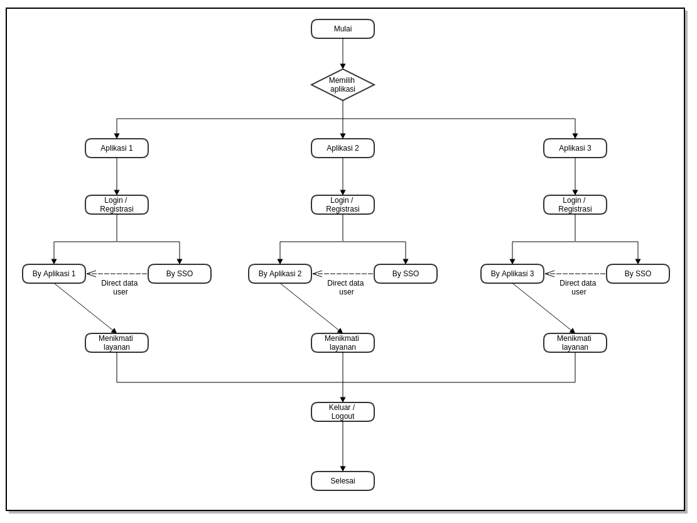
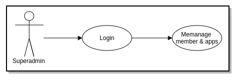
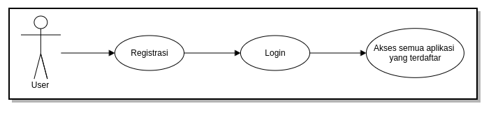
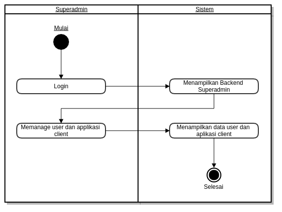
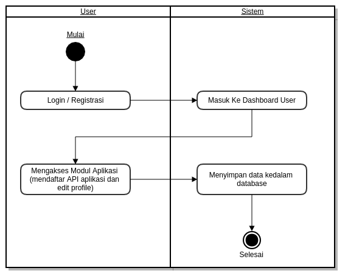
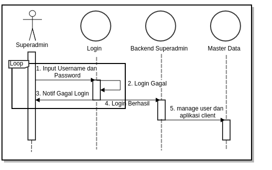
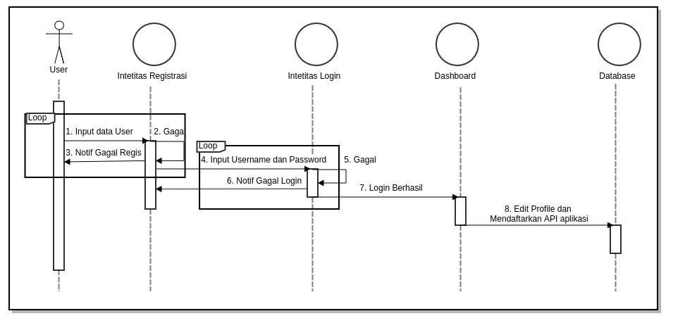
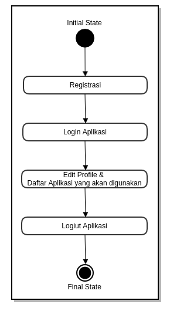
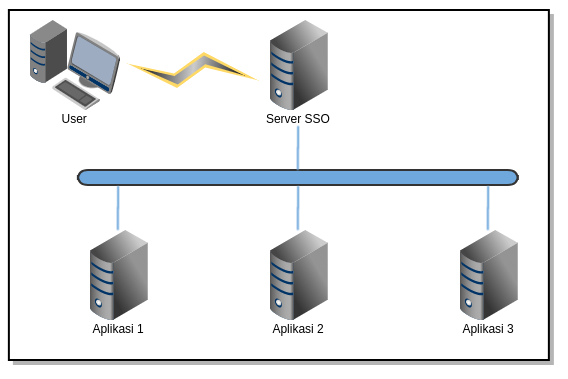

## ABSTRAK
Dewasa ini perkembangan teknologi komputer sangatlah pesat. Dengan menggunakan aplikasi komputer akan didapat informasi mengenai suatu tampilan objek yang ditampilkan lebih hidup dan menarik. Dengan banyaknya aplikasi pada pemerintahan sehingga membutuhkan suatu aplikasi yang mengijinkan *user* untuk mengakses semua aplikasi dengan satu akun login.

## Daftar Isi

[TOC]

## 1. Pendahuluan
Pada saat ini perkembangan dunia informasi semakin berkembang dengan pesat khusunya pada pemerintahan Provinsi Banten dengan banyaknya apliaksi yang dibuat untuk mempermudah dalam kegiatan pemerintahan.

Web portal merupakan sebuah teknologi yang akan berkembang pada teknologi web di masa depan. Satu halaman portal terdiri dari berbagai macam portlets yang dapat mengirimkan informasi dari banyak sumber (Braun et al, 2004). Selain informasi web portal juga dapat menggabungkan berbagai aplikasi web menjadi satu kesatuan, sebagai contoh adalah Banten Satu Data Jawara e-Gov.

Dalam sebuah web aplikasi, tentu tidak lepas dari pembahasan keamanannya. Ketika mengevaluasi keamanan sebuah web aplikasi, ada dikenal “CI4A” (*Confidentiality, Integrity, Authentication, Authorization, Availability, and Accountability*) (Lebanidze, 2006). Dari banyak kriteria keamanan web aplikasi, yang sering diabaikan adalah *authentication*, dan *authorization*. *Single sign-on* (SSO) adalah sebuah *session* atau proses autentikasi *user* yang mengijinkan user untuk menyediakan sebuah credential sekali dengan maksud untuk mengakses banyak aplikasi (Wikipedia, 2007n; Aaslund et al, 2007). *Single sign on* (SSO)
mengautentikasi *user* untuk mengakses semua aplikasi yang telah di-*authorized* untuk diakses. Ini menghilangkan permintaan *authenticaton* lagi ketika user mengganti aplikasi selama *session* berlaku (Aaslund et al, 2007).

## 2. Metode Penelitian
Untuk memperoleh data yang dapat menunjang aplikasi ini, maka di perlukan data teoritis dan data dinas terkait untuk mendapatkan data dan informasi yang berhubungan dengan aplikasi ini.
Adapun penyusun melakukan beberapa penelitian yang dilakukan dengan :

### 2.1 Metode Perancangan
Metode yang dilakukan adalah perancangan proses yang berupa diagram alir (flowchart). Diagram alir (flowchart) ini merupakan diagram yang menjelaskan hubungan dan urutan proses yang berjalan dalam sistem.
Ilustrasi alur 

### 2.2 Metode Pengumpulan Data
Untuk mengumpulkan data yang diperlukan untuk membangun sistem ini diadakan wawancara dan studi pustaka.
1. Wawancara ini dilakukan kepada Pemprov Banten. Wawancara dilakukan kepada sistem analist Pemprov Banten untuk mengetahui permasalahan dalam proses pendataan yang sedang berjalan sekarang.
2. Studi Pustaka, Melakukan pengumpulan melalui buku text, internet sebagai referensi.

## 3. HASIL DAN PEMBAHASAN
### 3.1 Kebutuhan Software dan Hardware
Adapun alat bantu software dan hardware dalam melakukan analisis dan perancangan adalah sebagai berikut:

#### 3.1.1 Software
1. Ubuntu 17.04
2. Typora (Markdown) & dillinger.io
3. Gliffy Diagram

#### 3.1.2 Hardware
Laptop dengan spesifikasi sebagai berikut:
1. Intel Celeron N2830 Speed 2.16 Ghz Turbo Boost 2.14 Ghz
2. Memori DDR3 2GB
3. Hard disk 500GB

### 3.2 Analisis Permasalahan
Permasalahan yang terjadi pada saat ini adalah sebagai berikut:
1. Belum adanya suatu aplikasi yang memungkinkan *user* untuk mengakses semua aplikasi menggunakan satu akun login.

### 3.3 Solusi
Solusi yang kami tawarkan adalah pembuatan aplikasi *Single Sign Out* (SSO) yang memungkinkan *user* untuk mengakses semua aplikasi dengan menggunakan satu akun login.

### 3.4 Perancangan Aplikasi
"Aplikasi *Single Sign Out* (SSO)" adalah sebuah aplikasi yang memberikan proses autentikasi *user* untuk melakukan login kepada semua apliaksi yang terdaftar pada aplikasi dengan menggunakan satu akun login.

### 3.5 Perancangan Database
pada database yang digunakan oleh single user atau hanya beberapa user saja, perancangan database tidak sulit. tetapi jika ukuran database yang sedang atau besar ( 25 - ratusan user yang berisikan jutaan bytes informasi dan melibatkan ratusan query dan program program aplikasi) perancangan database menjadi sangat komplek. Oleh karena itu para pemakai mengharapkan penggunaan database yang sedemikian rupa sehingga sistem harus dapat memenuhi kebutuhan-kebutuhan seluruh user tersebut.

#### 3.5.1 Tujuan perancangan database:
1. Untuk memenuhi informasi yang diberisikan kebutuhan-kebutuhan user secara khusus dan aplikasi-aplikasinya.
2. Memudahkan pengertian struktur informasi
3. Mendukung kebutuhan-kebutuhan pemrosesan dan beberapa obyek penampilan (response time, processing time dan storage space)

### 3.6 Perancangan Sistem
Permodelan rancangan sistem yang dgunakan adalah UML (Unified Modeling Language). Menurut Whitten dan Bentley (2007, p.381), Unified Modeling Language adalah kumpulan rancangan diagram untuk membangun sebuah sistem atau aplikasi yang dimana setiap diagram menyediakan sistem informasi kepada tim pengembang dengan berbagai sudut pandang yang berbeda-beda. UML yang kami gunakan terdiri dari use case diagram, activity diagram, sequence diagram, state chart diagram, class diagram, technology diagram dan deployment diagram.

#### 3.6.1 Use Case Diagram

##### 3.6.1.1 Use Case Diagram Superadmin

##### 3.6.1.2 Use Case Diagram User

#### 3.6.2 Activity Diagram

##### 3.6.2.1 Activity Diagram Superadmin

##### 3.6.2.2 Activity Diagram User

#### 3.6.3 Sequence Diagram

##### 3.6.3.1 Sequence Diagram Superadmin

##### 3.6.3.2 Sequence Diagram User

#### 3.6.4 State Chart Diagram

##### 3.6.4.1 Dtate Chart Diagram Superadmin

##### 3.6.4.2 Dtate Chart Diagram User

#### 3.6.5 Deployment Diagram

#### 3.6.6 Technology Stack Diagram

### 3.7 Tahapan Pekerjaan

Tahap-tahap atau langkah yang dilakukan dalam pembuatan aplikasi SSO adalah sebagai berikut:

#### 3.7.1 Analisis dan Perancangan

**Analisis**

Tim pengembang aplikasi akan melakukan analisis jika diperlukan dapat dilakukan survey pendahuluan untuk melihat sejauh mana kebutuhan pengguna akan sistem yang akan dibangun, fasiitas yang akan dibangun, data-data yang dibutuhkan, dll. Dalam analisis ini akan dilakukan diskusi-diskusi dengan bagian terkait pada satuan kerja.

**Perancangan Sistem**

Perancangan sistem dilaksanakan setelah proses analisis dilaksanakan dan telah disepakati modul dan prosedur-prosedur yang akan diterapkan dalam sistem.

#### 3.7.2 Pembangunan Sistem

Setelah proses analisis dan perancangan sistem selesai dilakukan, tahapan selanjutnya adalah pembangunan sistem, yang meliputi kegiatan: pembuatan struktur database, pembuatan kode program/coding, pembuatan laporan-laporan.

#### 3.7.3 Integrasi dan Pengujian

**Integrasi**

Setelah proses pengembangan sistem selesai dilakukan, tahapan selanjutnya adalah Integrasi sistem, yang meliputi kegiatan: pembuatan struktur database terkait integrasi, pembuatan kode program/coding terkait integrasi, pembuatan laporan-laporan terkait integrasi.

**Pengujian**

Sistem yang telah selesai dibuat akan diuji coba menggunakan data test sebelum sistem dijalankan. Dalam uji coba sistem ini akan diterapkan metode *prototype*, yaitu jika terjadi kesalahan/kekurangan baik proses maupun *output* sistem, maka kesalahan/kekurangan tersebut akan diperbaiki/ditambahkan,
sehingga memungkinkan pengembang untuk kembali ke tahapan pertama yaitu analisa (jika kekurangan sistem memang tidak terdefinisikan dalam dokumen perancangan sistem).

### 3.8 Hasil

Berikut ini adalah hasil eksekusi aplikasi SSO

