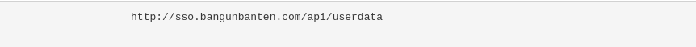
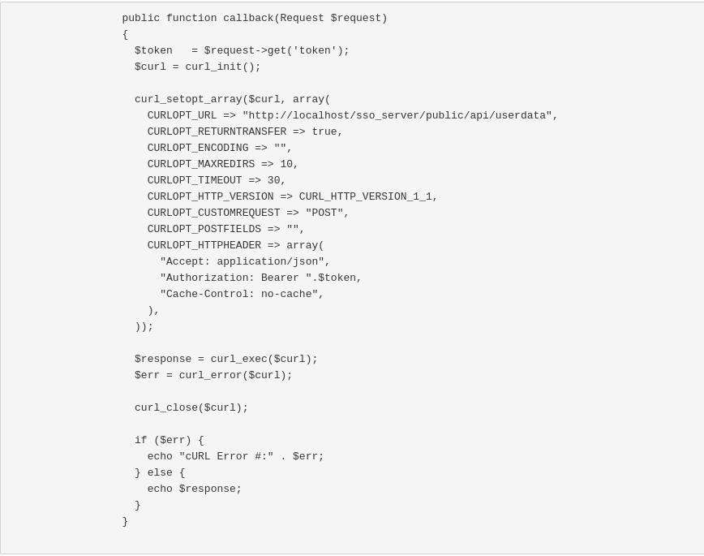
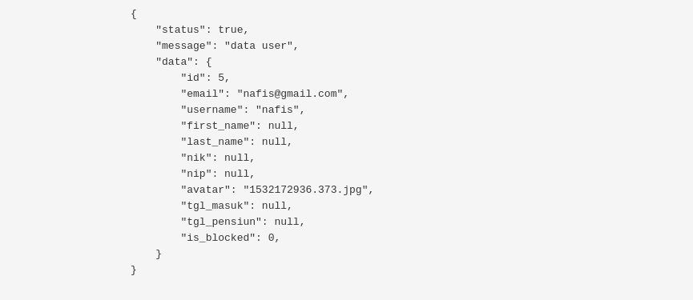

## Daftar Isi

* Will be replaced with the ToC, excluding the "Contents" header
{:toc}

## Integrasi dan Pengujian (UAT) SSO

Pada laporan ini akan membahas tentang Pengujian dan Integrasi aplikasi SSO, untuk pengujiannya menggunakan User Acceptance Test (UAT).

## 1. Integrasi
SSO (*Single Sign On*) adalah Sistem pada pemerintahan Provinsi Banten yang memungkinkan masyarakat khususnya pada Provinsi Banten untuk dapat mengakses semua fasilitas aplikasi dan layanan yang terdapat pada pemerintahan Provinsi Banten dengan melakukan otentikasi menggunakan satu akun id. Dalam kegiatannnya setiap kegiatan akan terdapat integrasi terhadap server yang bertujuan untuk melakukan integrasi aplikasi data, integrasi dilakukan tanpa membuat perubahan signifikan pada aplikasi dan sumber data.

Untuk melakukan integrasi dapat dilakukan dengan melakukan http request untuk mendapatkan detail *user* dengan token yang telah dikirim oleh SSO serverseperti pada gambar dibawah ini

Yang akan menghasilkan 2 response yaitu:

- Success Response seperti pada gambar dibawah ini

- Fail Response

## 2. Pengujian atau *User Acceptance Test* (UAT)

### 2.1 Tampilan Awal SSO

#### 2.1.1 Home

| Tampilan | URL/ Image                               | Ada  | Tidak |
| -------- | ---------------------------------------- | ---- | ----- |
| Home     |  |      |       |

Dalam tabel ini *user* dapat melakukan test ketika membuka Home apliksi SSO, apakah sudah dapat diakses oleh *user* atau tidak. Untuk mengecek dapat diakses tidaknya, user dapat mengklik menu Home, jika sudah dapat diakses user dapat ceklis pada kolom **Ada**, jika belum dapat diakses maka user dapat ceklis pada kolom **Tidak**.

#### 2.1.2 Dokumentasi

##### 2.1.2.1 Web Redirect

| Tampilan     | URL/ Image                               | Ada  | Tidak |
| ------------ | ---------------------------------------- | ---- | ----- |
| Web Redirect |  |      |       |

Dalam tabel ini *user* dapat melakukan test ketika membuka Sub Menu Web Redirect pada Menu Dokumentasi, apakah sudah dapat diakses oleh *user* atau tidak. Untuk mengecek dapat diakses tidaknya, user dapat mengklik Sub Menu Web Redirect pada Menu Dokumentasi, jika sudah dapat diakses user dapat ceklis pada kolom **Ada**, jika belum dapat diakses maka user dapat ceklis pada kolom **Tidak**.

##### 2.1.2.2 Android

| Tampilan | URL/ Image                               | Ada  | Tidak |
| -------- | ---------------------------------------- | ---- | ----- |
| Android  |  |      |       |

Dalam tabel ini *user* dapat melakukan test ketika membuka Sub Menu Android pada Menu Dokumentasi, apakah sudah dapat diakses oleh *user* atau tidak. Untuk mengecek dapat diakses tidaknya, user dapat mengklik Sub Menu Android pada Menu Dokumentasi, jika sudah dapat diakses user dapat ceklis pada kolom **Ada**, jika belum dapat diakses maka user dapat ceklis pada kolom **Tidak**.

#### 2.1.3 Registrasi

| Tampilan   | URL/ Image                               | Ada  | Tidak |
| ---------- | ---------------------------------------- | ---- | ----- |
| Registrasi |  |      |       |

Dalam tabel ini *user* dapat melakukan test ketika membuka Menu Registrasi, apakah sudah dapat diakses oleh *user* atau tidak. Untuk mengecek dapat diakses tidaknya, user dapat mengklik Menu Registrasi, jika sudah dapat diakses user dapat ceklis pada kolom **Ada**, jika belum dapat diakses maka user dapat ceklis pada kolom **Tidak**.

#### 2.1.4 Login

| Tampilan | URL/ Image                               | Ada  | Tidak |
| -------- | ---------------------------------------- | ---- | ----- |
| Login    |  |      |       |

Dalam tabel ini *user* dapat melakukan test ketika membuka Menu Login, apakah sudah dapat diakses oleh *user* atau tidak. Untuk mengecek dapat diakses tidaknya, user dapat mengklik Menu Login, jika sudah dapat diakses user dapat ceklis pada kolom **Ada**, jika belum dapat diakses maka user dapat ceklis pada kolom **Tidak**.

### 2.2 Tampilan Member SSO

#### 2.2.1 Dashboard Member

| Tampilan  | URL/ Image                               | Ada  | Tidak |
| --------- | ---------------------------------------- | ---- | ----- |
| Dashboard |  |      |       |

Dalam tabel ini *user* dapat melakukan test ketika membuka Dashboard, apakah sudah dapat diakses oleh *user* atau tidak. Untuk mengecek dapat diakses tidaknya, user dapat mengklik Modul Dashboard pada daftar menu dari *Main Navigation*, jika sudah dapat diakses user dapat ceklis pada kolom **Ada**, jika belum dapat diakses maka user dapat ceklis pada kolom **Tidak**.

#### 2.2.2 My Profile

##### 2.2.2.1 Profile

| Tampilan | URL/ Image                               | Ada  | Tidak |
| -------- | ---------------------------------------- | ---- | ----- |
| Profile  |  |      |       |

Dalam tabel ini *user* dapat melakukan test ketika membuka Profile, apakah sudah dapat diakses oleh *user* atau tidak. Untuk mengecek dapat diakses tidaknya, user dapat mengklik Tabel Profile pada modul My Profile, jika sudah dapat diakses user dapat ceklis pada kolom **Ada**, jika belum dapat diakses maka user dapat ceklis pada kolom **Tidak**.

##### 2.2.2.2 Password

| Tampilan | URL/ Image                               | Ada  | Tidak |
| -------- | ---------------------------------------- | ---- | ----- |
| Password |  |      |       |

Dalam tabel ini *user* dapat melakukan test ketika membuka Password, apakah sudah dapat diakses oleh *user* atau tidak. Untuk mengecek dapat diakses tidaknya, user dapat mengklik Tabel Password pada modul My Profile, jika sudah dapat diakses user dapat ceklis pada kolom **Ada**, jika belum dapat diakses maka user dapat ceklis pada kolom **Tidak**.

##### 2.2.2.3 Avatar

| Tampilan | URL/ Image                               | Ada  | Tidak |
| -------- | ---------------------------------------- | ---- | ----- |
| Avatar   |  |      |       |

Dalam tabel ini *user* dapat melakukan test ketika membuka Avatar, apakah sudah dapat diakses oleh *user* atau tidak. Untuk mengecek dapat diakses tidaknya, user dapat mengklik Tabel Avatar pada modul My Profile, jika sudah dapat diakses user dapat ceklis pada kolom **Ada**, jika belum dapat diakses maka user dapat ceklis pada kolom **Tidak**.

#### 2.2.3 SSO Apps

##### 2.2.3.1 Create SSO Apps

| Tampilan        | URL/ Image                               | Ada  | Tidak |
| --------------- | ---------------------------------------- | ---- | ----- |
| Create SSO Apps |  |      |       |

Dalam tabel ini *user* dapat melakukan test ketika membuka Create SSO Apps, apakah sudah dapat diakses oleh *user* atau tidak. Untuk mengecek dapat diakses tidaknya, user dapat mengklik sub modul Create SSO Apps pada modul SSO Apps, jika sudah dapat diakses user dapat ceklis pada kolom **Ada**, jika belum dapat diakses maka user dapat ceklis pada kolom **Tidak**.

##### 2.2.3.2 SSO Apps

| Tampilan | URL/ Image                               | Ada  | Tidak |
| -------- | ---------------------------------------- | ---- | ----- |
| SSO Apps |  |      |       |

Dalam tabel ini *user* dapat melakukan test ketika membuka SSO Apps, apakah sudah dapat diakses oleh *user* atau tidak. Untuk mengecek dapat diakses tidaknya, user dapat mengklik sub modul SSO Apps pada modul SSO Apps, jika sudah dapat diakses user dapat ceklis pada kolom **Ada**, jika belum dapat diakses maka user dapat ceklis pada kolom **Tidak**.

### 2.3 Tampilan Superadmin SSO

#### 2.3.1 Dashboard Superadmin

| Tampilan  | URL/ Image                               | Ada  | Tidak |
| --------- | ---------------------------------------- | ---- | ----- |
| Dashboard |  |      |       |

Dalam tabel ini *user* dapat melakukan test ketika membuka Dashboard, apakah sudah dapat diakses oleh *user* atau tidak. Untuk mengecek dapat diakses tidaknya, user dapat mengklik Modul Dashboard pada daftar menu dari *Main Navigation*, jika sudah dapat diakses user dapat ceklis pada kolom **Ada**, jika belum dapat diakses maka user dapat ceklis pada kolom **Tidak**.

#### 2.3.2 Member & Apps Management

##### 2.3.2.1 Member

| Tampilan | URL/ Image                               | Ada  | Tidak |
| -------- | ---------------------------------------- | ---- | ----- |
| Member   |  |      |       |

Dalam tabel ini *user* dapat melakukan test ketika membuka Member, apakah sudah dapat diakses oleh *user* atau tidak. Untuk mengecek dapat diakses tidaknya, user dapat mengklik sub modul Member pada modul Member & Apps Management, jika sudah dapat diakses user dapat ceklis pada kolom **Ada**, jika belum dapat diakses maka user dapat ceklis pada kolom **Tidak**.

##### 2.3.2.2 Apps

| Tampilan | URL/ Image                               | Ada  | Tidak |
| -------- | ---------------------------------------- | ---- | ----- |
| Apps     |  |      |       |

Dalam tabel ini *user* dapat melakukan test ketika membuka Apps, apakah sudah dapat diakses oleh *user* atau tidak. Untuk mengecek dapat diakses tidaknya, user dapat mengklik sub modul Apps pada modul Member & Apps Management, jika sudah dapat diakses user dapat ceklis pada kolom **Ada**, jika belum dapat diakses maka user dapat ceklis pada kolom **Tidak**.

