## Daftar Isi

[TOC]

SSO (Single Sign On) adalah Sistem pada pemerintahan Provinsi Banten yang memungkinkan masyarakat khususnya pada Provinsi Banten untuk dapat mengakses semua fasilitas aplikasi dan layanan yang terdapat pada pemerintahan Provinsi Banten dengan melakukan otentikasi menggunakan satu akun id. Deskripsi Umum kebutuhan aplikasi yang akan diimplementasikan meliputi semua informasi yang bersifat teknis dan menjadi acuan dalam pengembangan apliksi.

Berikut ini adalah tampilan - tampilan yang terdapat didalam apliaksi SSO:

## 1. Tampilan Awal SSO

Untuk memulai akses terhadap aplikasi SSO (Single Sign On), buka web browser (IE, Mozila Firefox atau yang lainnya) dengan menulis alamat url https://sso.bangunbanten.com/ kemudian tekan Enter pada tombol keyboard atau klik tombol Go pada browser. Sehingga akan muncul tampilan seperti dibawah ini :

### 1.1 Tampilan Home SSO

[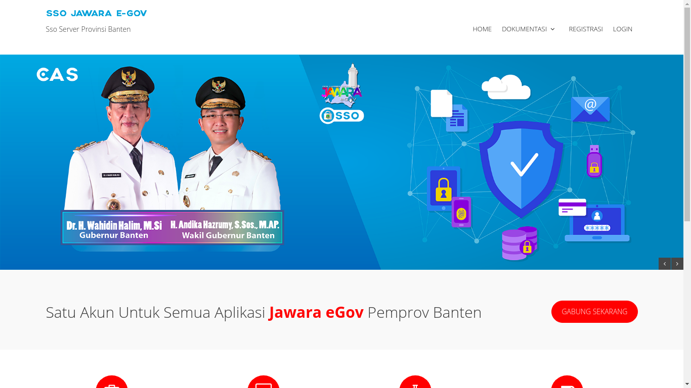](../images/sso/pengembangan/20180724_awal_home.png)

Pada tampilan ini *user* dapat melihat informasi mengenai aplikasi SSO seperti aplikasi yang sudah terdaftar pada SSO, info kontak dan pada tampilan ini user dapat melakukan registrasi dan login.

### 1.2 Tampilan Dokumentasi

#### 1.2.1 Web Redirect

[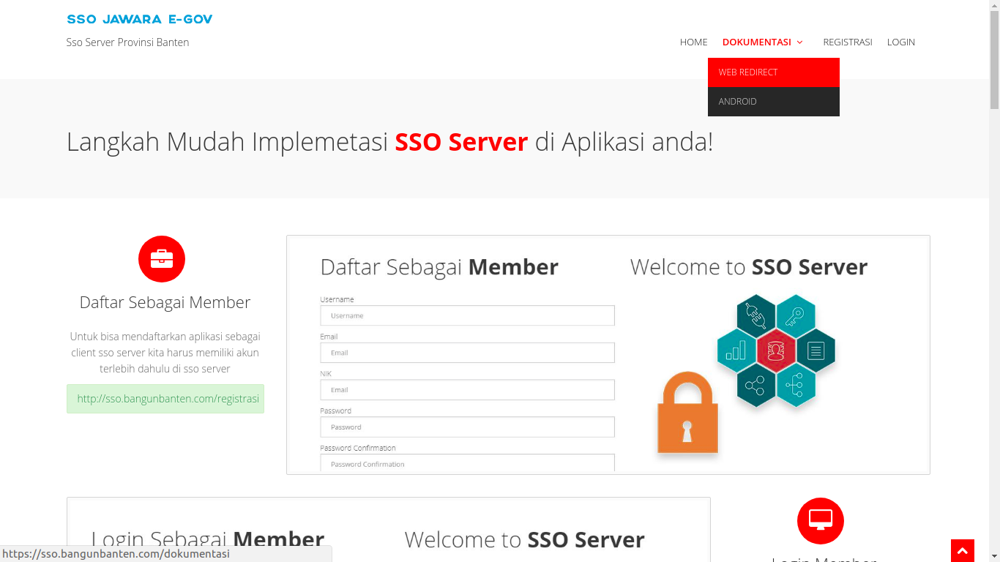](../images/sso/pengembangan/20180724_awal_dokumentasi_web-redirect.png)

Tampilan ini dapat diakses dengan mengklik "Web Redirect" pada modul "Dokumentasi". Tampilan ini memberitahukan cara pemakaian aplikasi SSO melalui web seperti mendaftar sebagai member, login, membuat SSo Apps, dll.

#### 1.2.2 Android

[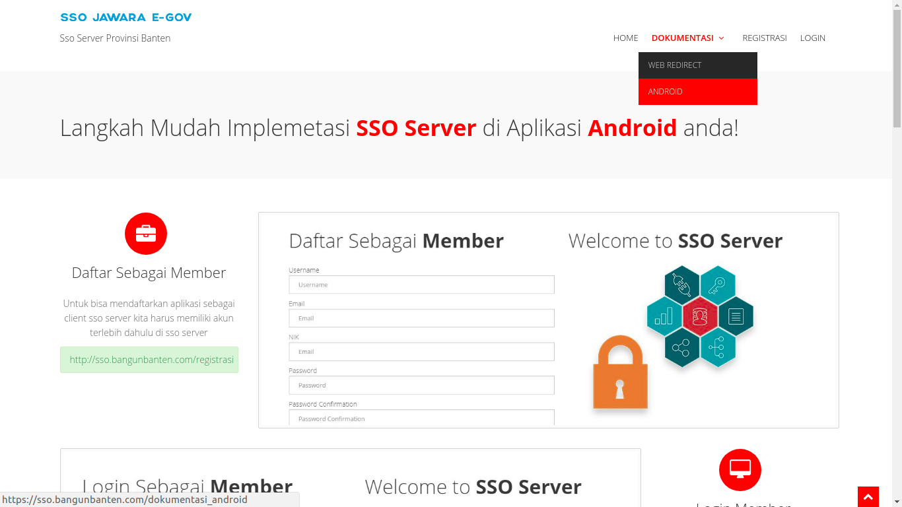](../images/sso/pengembangan/20180724_awal_dokumentasi_android.png)

Tampilan ini dapat diakses dengan mengklik "Android" pada modul "Dokumentasi". Tampilan ini memberitahukan cara pemakaian aplikasi SSO melalui Android seperti mendaftar sebagai member, login, membuat SSo Apps, dll.

### 1.3 Tampilan Registrasi

[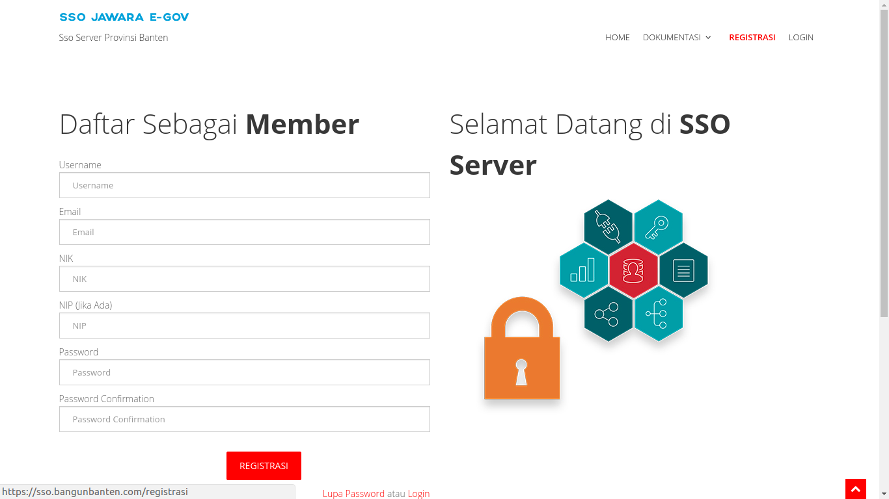](../images/sso/pengembangan/20180724_awal_registrasi.png)

Tampilan ini dapat diakses dengan mengklik modul "Registrasi" pada kanan atas halaman home SSO atau mengklik "Gabung Sekarang" pada halaman SSO. Pada tampilan ini *user* bisa mendaftarkan dirinya sebagai member aplikasi SSO dengan cara mengisi beberapa *field* yang tersedia pada form registrasi.

### 1.4 Tampilan Login

[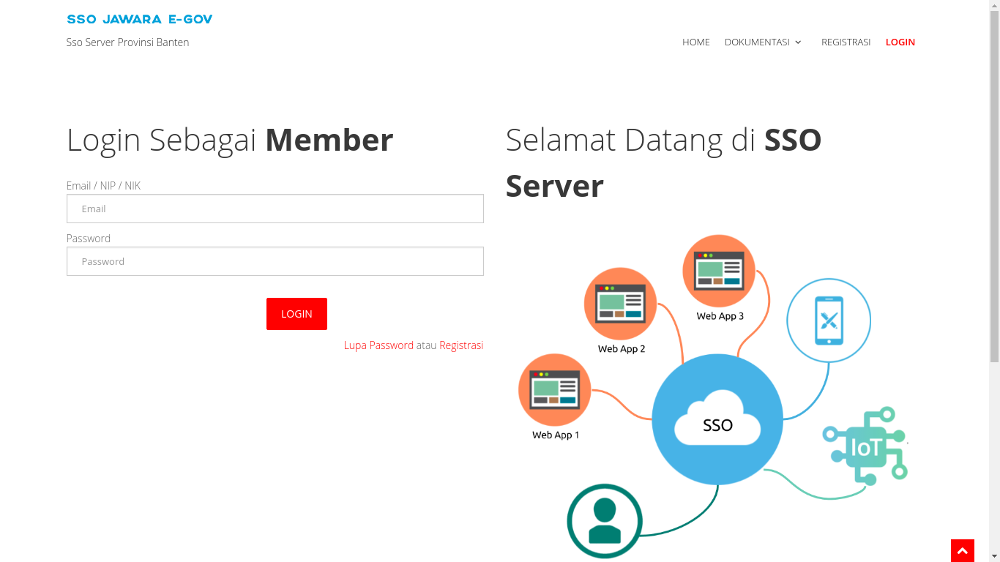](../images/sso/pengembangan/20180724_awal_login.png)

Tampilan ini dapat diakses dengan mengklik modul "Android" pada kanan atas halaman home SSO. Pada tampilan ini member yang sudah terdaftar pada aplikasi SSO dapat melakukan login untu masuk kedalam dashboard member.

## 2. Tampilan Member SSO

Tampilan ini dapat diakses ketika member aplikasi SSO berhasil melakukan Login.

### 2.1 Tamplan Dashboard Member

[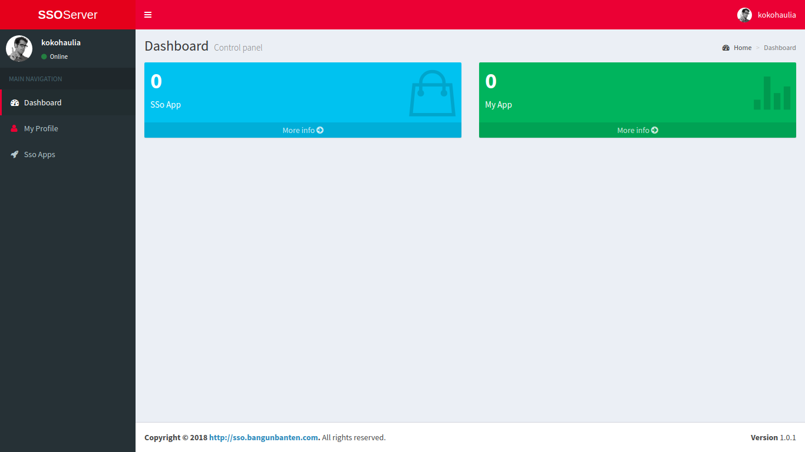](../images/sso/pengembangan/20180724_member_dashboard.png)

Tampilan ini yang akan pertama kali muncul setelah member sukses melakukan login, pada halaman ini terdapat beberapa informasi mengenai berapa banyaknya SSO Apps yang sudah didaftarkan member dan My Apps dari member.

### 2.2 Tampilan My Profile

Tampilan ini dapat diakses oleh member dengan mengklik modul "My Profile" pada daftar menu dari *Main Navigation*.

#### 2.2.1 Profile

[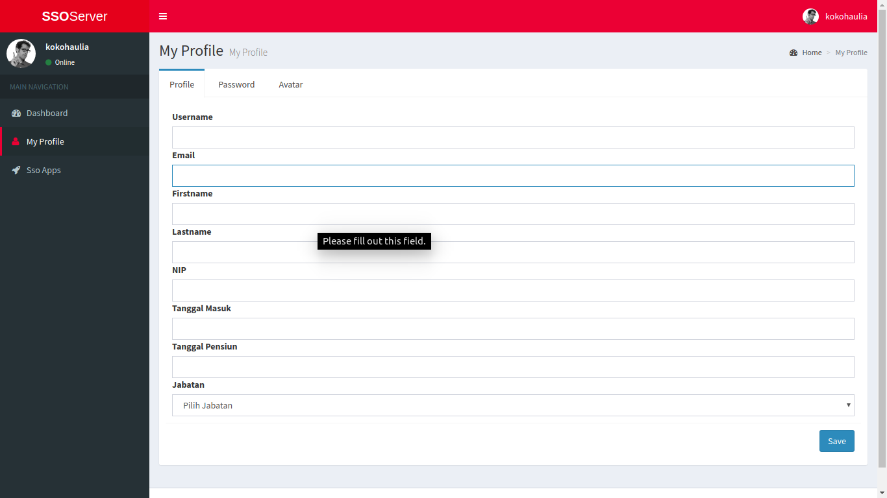](../images/sso/pengembangan/20180724_member_my-profile_profile.png)

Pada tampilan ini member dapat mengganti atau melengkapi data pribadinya. Pada tampilan terdapat beberapa *field* yang dapat diisi oleh member seperti Username, Email, *First Name*, *Last Name*, NIP, Tanggal Masuk, Tanggal Pensiun dan Jabatan.

#### 2.2.2 Password

[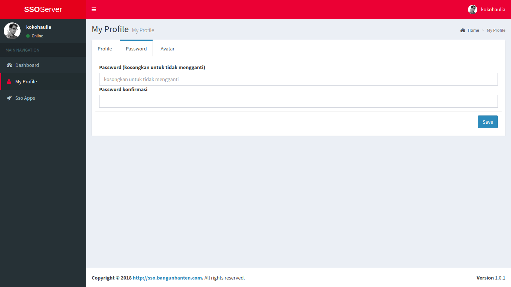](../images/sso/pengembangan/20180724_member_my-profile_password.png)

Pada tampilan ini member dapat mengganti password yang lama dengan password yang baru.

#### 2.2.3 Avatar

[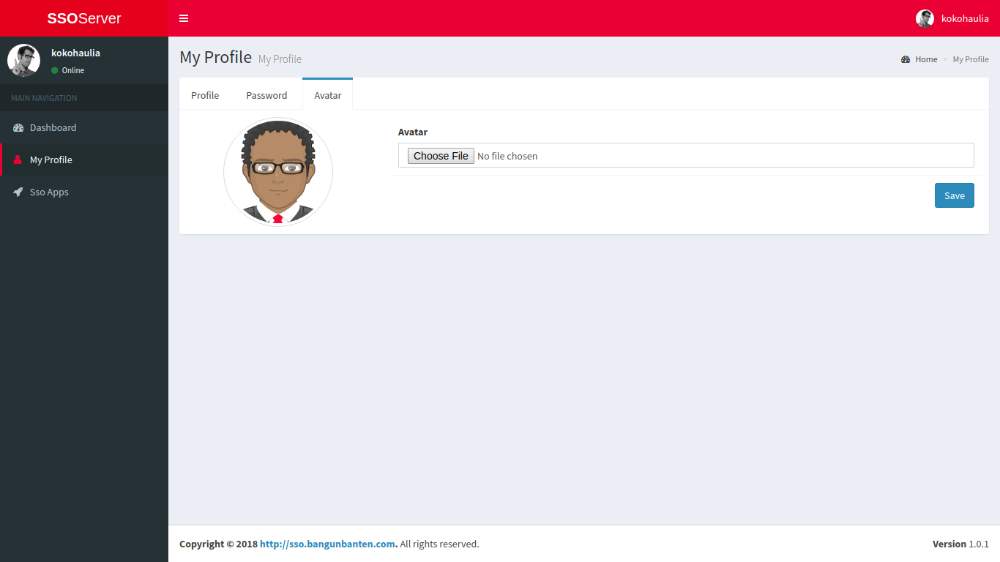](../images/sso/pengembangan/20180724_member_my-profile_avatar.png)

Pada tampilan ini dapat mengganti avatar dari memeber tersebut.

### 2.3 Tampilan SSO Apps

Tampilan ini dapat diakses oleh member dengan mengklik modul "SSO Apps" pada daftar menu dari *Main Navigation*.

#### 2.3.1 Create SSO Apps

[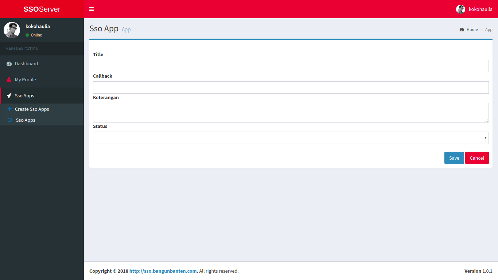](../images/sso/pengembangan/20180724_member_sso-apps_create-sso-apps.png)

Tampilan ini dapat diakses dengan cara mengklik sub modul Create SSo Apps pada modul SSO Apps. Pada sub modul ini member dapat mendaftarkan aplikasi SSO apps, SSO Apps yang telah didaftarkan secara otomatis akan mendapatkan App ID dan Secret Key.

#### 2.3.2 SSO Apps

[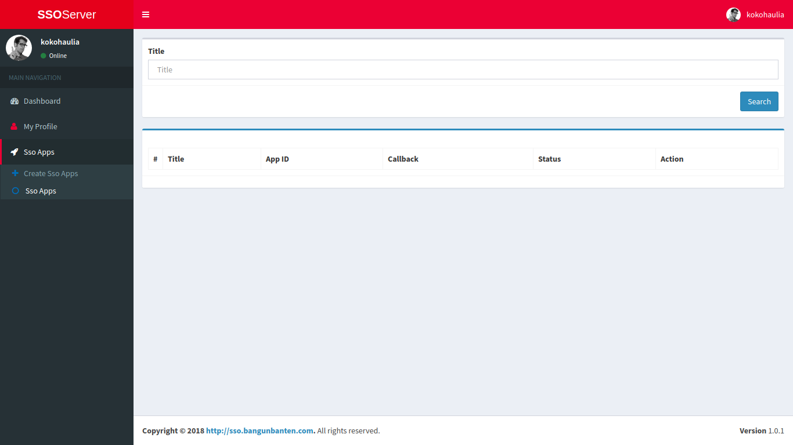](../images/sso/pengembangan/20180724_member_sso-apps_sso-apps.png)

Tampilan ini dapat diakses dengan cara mengklik sub modul SSo Apps pada modul SSO Apps. Pada sub modul ini member dapat melihat tabel SSO Apps apa saja yang telah didaftarkan oleh member.

## 3. Tampilan Superadmin SSO

Tampilan ini dapat diakses ketika superadmin aplikasi SSO berhasil melakukan Login.

### 3.1 Tampilan Dashboard Superadmin

[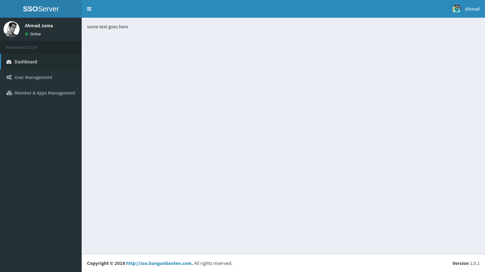](../images/sso/pengembangan/20180724_superadmin_dashboard.png)

Tampilan ini yang akan pertama kali muncul setelah superadmin sukses melakukan login.

### 3.2 Member & Apps Management

Tampilan ini dapat diakses oleh superadmin dengan mengklik modul "Member & Apps Management" pada daftar menu dari *Main Navigation*.

#### 3.2.1 Member

[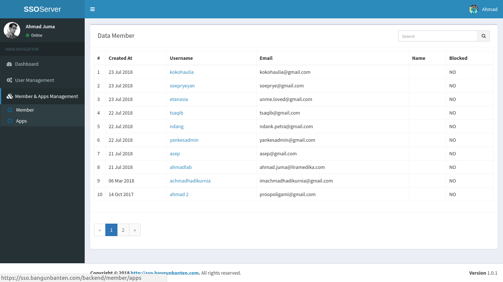](../images/sso/pengembangan/20180724_superadmin_member.png)

Tampilan ini dapat diakses dengan mengklik sub modul Member pada modul Member & Apps Management. Pada tampilan ini superadmin dapat melihat tabel data member yang sudah terdaftar pada aplikasi.

#### 3.2.2 Apps

[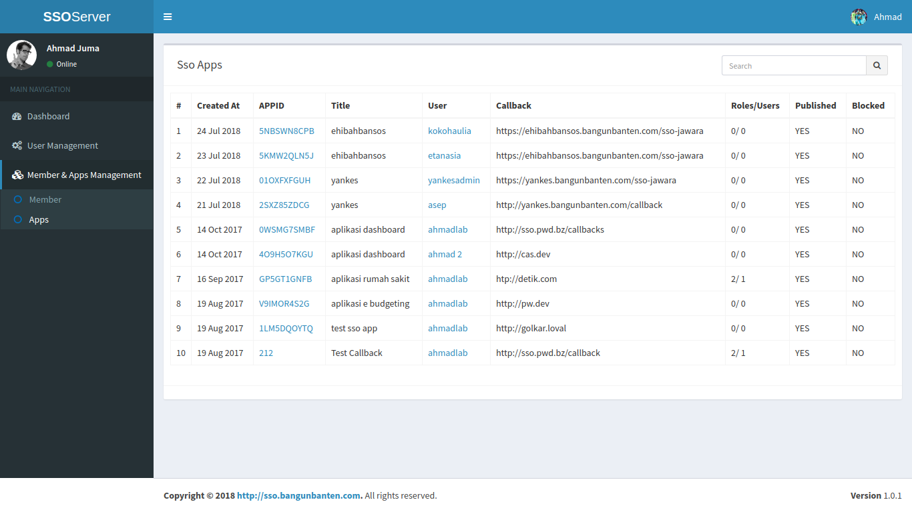](../images/sso/pengembangan/20180724_superadmin_apps.png)

Tampilan ini dapat diakses dengan mengklik sub modul Apps pada modul Member & Apps Management. Pada tampilan ini superadmin dapat melihat tabel data aplikasi yang sudah terdaftar didalam aplikasi SSO
