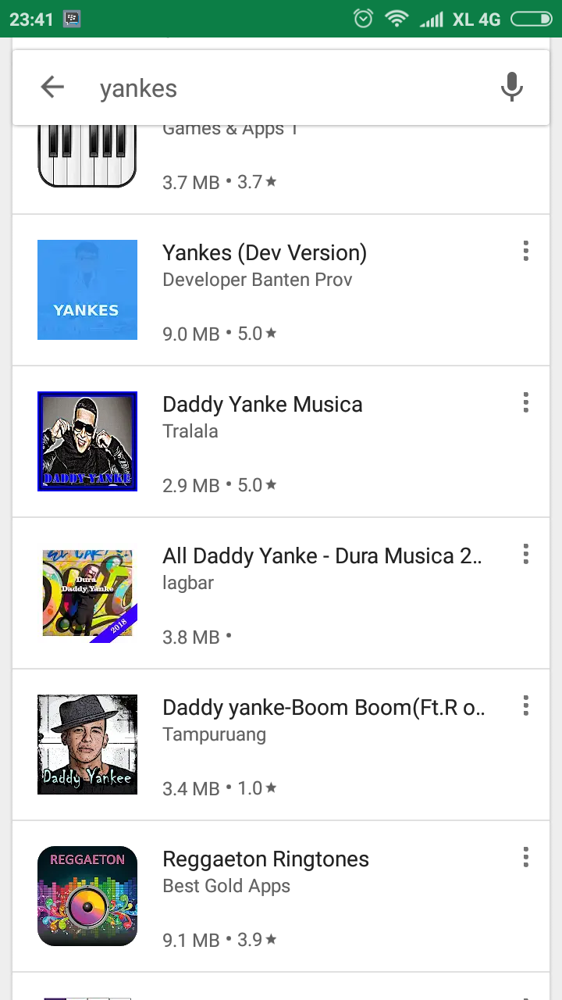
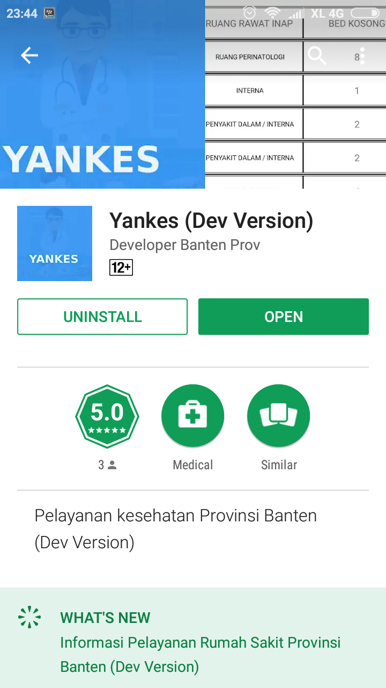
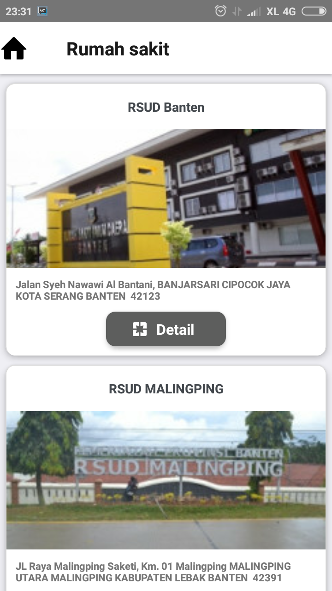
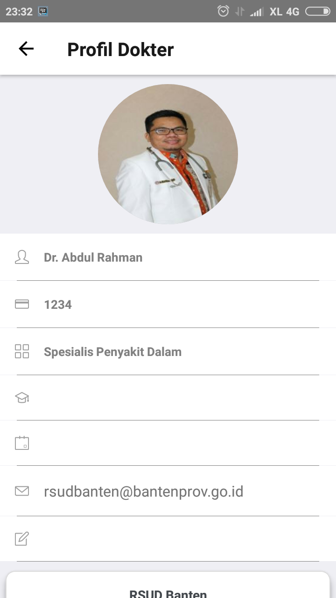
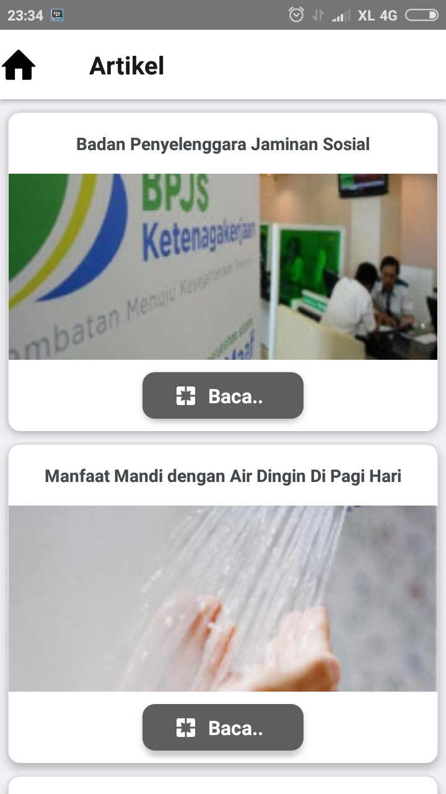

## Daftar Isi

## Daftar Isi
* Will be replaced with the ToC, excluding the "Contents" header
{:toc}

## 1.	Implementasi
Layanan kesehatan (Yankes) adalah suatu aplikasi yang akan dikeluarkan oleh pemerintah provinsi Banten untuk mendukung terlaksananya kesehatan masyarakat yang lebih baik. Didalam aplikasi ini masyarakat dapat mengakses informasi kesehatan yang terdapat di Banten, seperti melihat dokter, ruang rawat inap, info rumah sakit, jadwal dokter jaga dan informasi - informasi terkait kesehatan yang terdapat di Banten.

##  2.	Penggunaan
Pada bagian ini akan dijelaskan mengenai tata cara dalam pengaplikasikan Aplikasi Android YANKES. Berikut cara penggunaannya:

### 2.1 Cara Mendownload Aplikasi Mobile YANKES
1.	Bukalah Google Play Atau Apps Store yang ada di smartphone.
2.	Kemudian search dengan keyword “YANKES”

3.	Kemudian **Download** Aplikasi YANKES dan tunggu hingga selesai terinstal

Untuk menggunakan atau mengoperasikan Aplikasi mobile yankes, silahkan masuk dan pada Aplikasi Mobile Yankes.
Maka pada layar akan tampak menu login situs Ehibah-Bansos seperti dibawah ini:

### 2.2 Tampilan Menu Rumah Sakit

Didalam page ini user dapat melihat informasi tentang rumah sakit.Untuk melihat lebih detail tentang informasi rumah sakit user dapat memilih tombol "LIHAT" dibawah gambar rumah sakit.

#### 2.2.1	Tampilan Profile Rumah Sakit

Disaat membuka salah satu rumah sakit yang ada di aplikasi akan timbul tampilan seperti diatas, yang berisi dari nama rumah sakit tersebut, alamat, email, no telf, serta yang berhubungan dengan rumah sakit tersebut.

### 2.3	Tampilan Menu Dokter

Ditampilan ini user bisa melihat informasi tentang dokter yang terdaftar diaplikasi YANKES dan untuk melihat informasi lebih lengkap user dapat memilih tombol "PROFILE" dibawah informasi dokter.

#### 2.3.1	Tampilan Profile Dokter

Ditampilan ini user dapat melihat informasi dokter serta jadwal jaga dokter dan terdapat menu konsultasi didalam tampilan ini.

### 2.4	Tampilan Menu Rawat Inap

Didalam tampilan ini user dapat melihat list rumah sakit dan kamar rawat inap yang tersedia dirumah sakit tersebut. Serta dapat melihat “Detail” ada beberapa kamar yang kosong dan tersedia dari rumah sakit tersebut.

#### 2.4.1	Tampilan Detail Rawat Inap

Didalam tampilan ini user dapat melihat ada berapa kamar yang tersedia serta ruangan-ruangan yang ada dari rumah sakit tersebut tanpa harus kita telf atau mendatangi rumah sakit tersebut.

### 2.5 Tampilan Menu Ambulance

Didalam tampilan ini user dapat melihat list rumah sakit dan Ambulance yang digunakan rumah sakit tersebut, berapa jumlah Ambulance yang tersedia apakah Ambulance tersebut sedang kosong atau tidak.

#### 2.5.1	Tampilan Detail Menu Ambulance

Didalam tampilan ini user dapat melihat detail dari rumah sakit dan Ambulance yang di sediakan dari rumah sakit tersebut.

#### 2.6 Tampilan Menu Berita

Ditampilan ini user dapat melihat berita berita terkait yang berada di Provinsi Banten, untuk melihat lebih detail tentang berita user dapat memilih tombol " BACA".

#### 2.6.1	Tampilan Detail Menu Berita

Dalam tampilan ini user dapat membaca berita mengenai kesehatan secara keseluruhan, jika dalam tampilan menu berita tadi hanya ditampilkan list nya dan jika kita Klik baca maka user dapat membaca berita yang kita pilih sampai selesai.

### 2.7 Tampilan Menu Artikel

Didalam tampilan ini user dapat melihat artikel-artikel terkait kesehatan yang berada di Provinsi Banten, untuk melihat detail blog user dapat memilih tombol "BACA".

#### 2.7.1	Tampilan Detail Manu Artikel

Dalam tampilan ini user dapat membaca artikel/blog mengenai kesehatan secara keseluruhan, jika dalam tampilan menu berita tadi hanya ditampilkan list nya dan jika kita Klik baca maka user dapat membaca berita yang kita pilih sampai selesai.
