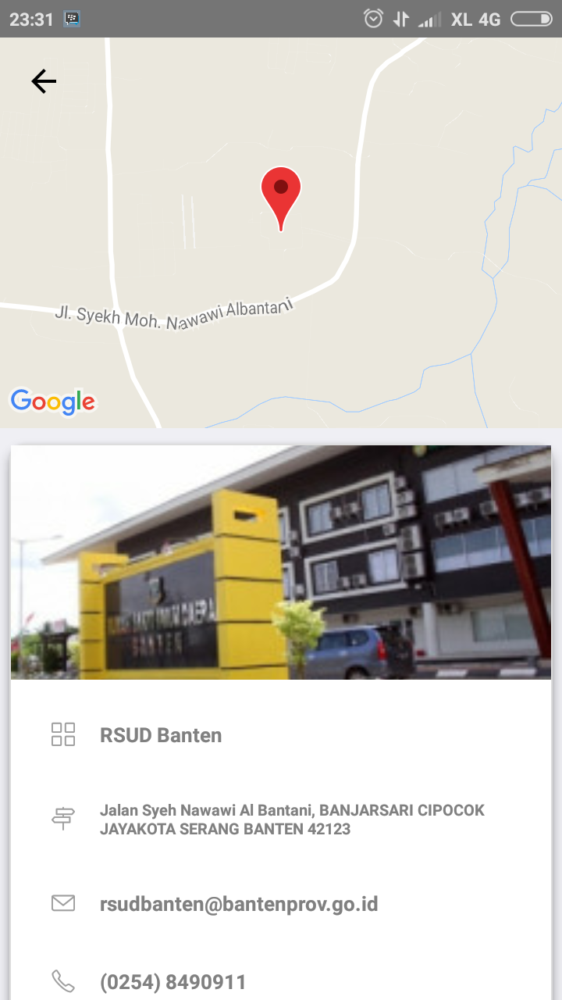

# Integrasi dan Pengujian Dashboard Pimpinan

Pada laporan ini akan membahas tentang Pengujian dan Integrasi Dashboard Pimpinan, untuk pengujiannya menggunakan User Acceptance Test.

## Daftar Isi
* Will be replaced with the ToC, excluding the "Contents" header
{:toc}

## 1. Integrasi

Integrasi aplikasi dilakukan dengan:

1. melalui antar muka aplikasi atau melalui method
2. focus method level
3. method dishare dengan meletakannnya pada sebuah server pusat / dengan mengakses method pada aplikasi.

Application Programming Interface mekanisme terdefinisi dibuat untuk berhubungan dengan sumber daya seperti server aplikasi, middleware, dan basis data.

Dibawah ini adalah contoh method, parameter dan response yang terdapat didalam Dashboard Pimpinan:

## 2.  User Acceptance Test

### 2.1 Tampilan Awal

| Tampilan           | URL/ Image                               | Ada  | Tidak |
| ------------------ | ---------------------------------------- | ---- | ----- |
| Tampilan awal      |  |      |       |

Dalam tampilan ini adalah tampilan awal dari Aplikasi Mobile Yankes.

### 2.2 Tampilan Menu Rumah Sakit

| Tampilan                       | URL/ Image                               | Ada  | Tidak |
| ------------------------------ | ---------------------------------------- | ---- | ----- |
| Tampilan menu rumah sakit      |  |      |       |

Didalam page ini user dapat melihat informasi tentang rumah sakit.Untuk melihat lebih detail tentang informasi rumah sakit user dapat memilih tombol "LIHAT" dibawah gambar rumah sakit.

### 2.3 Tampilan Profile Rumah Sakit

| Tampilan                       | URL/ Image                               | Ada  | Tidak |
| ------------------------------ | ---------------------------------------- | ---- | ----- |
| Tampilan profile rumah sakit   |  |      |       |

Disaat membuka salah satu rumah sakit yang ada di aplikasi akan timbul tampilan seperti diatas, yang berisi dari nama rumah sakit tersebut, alamat, email, no telf, serta yang berhubungan dengan rumah sakit tersebut.

### 2.4 Tampilan Menu Dokter

| Tampilan                       | URL/ Image                               | Ada  | Tidak |
| ------------------------------ | ---------------------------------------- | ---- | ----- |
| Tampilan menu dokter           |  |      |       |

Ditampilan ini user bisa melihat informasi tentang dokter yang terdaftar diaplikasi YANKES dan untuk melihat informasi lebih lengkap user dapat memilih tombol "PROFILE" dibawah informasi dokter.

### 2.5 Tampilan Profile Dokter

| Tampilan                       | URL/ Image                               | Ada  | Tidak |
| ------------------------------ | ---------------------------------------- | ---- | ----- |
| Tampilan profile dokter        |  |      |       |

Ditampilan ini user dapat melihat informasi dokter serta jadwal jaga dokter dan terdapat menu konsultasi didalam tampilan ini.

### 2.6 Tampilan Menu Rawat Inap

| Tampilan                       | URL/ Image                               | Ada  | Tidak |
| ------------------------------ | ---------------------------------------- | ---- | ----- |
| Tampilan menu rawat inap       |  |      |       |

Didalam tampilan ini user dapat melihat list rumah sakit dan kamar rawat inap yang tersedia dirumah sakit tersebut. Serta dapat melihat “Detail” ada beberapa kamar yang kosong dan tersedia dari rumah sakit tersebut.

### 2.7 Tampilan Detail Rawat Inap

| Tampilan                       | URL/ Image                               | Ada  | Tidak |
| ------------------------------ | ---------------------------------------- | ---- | ----- |
| Tampilan detail rawat inap     |  |      |       |

Didalam tampilan ini user dapat melihat ada berapa kamar yang tersedia serta ruangan-ruangan yang ada dari rumah sakit tersebut tanpa harus kita telf atau mendatangi rumah sakit tersebut.

