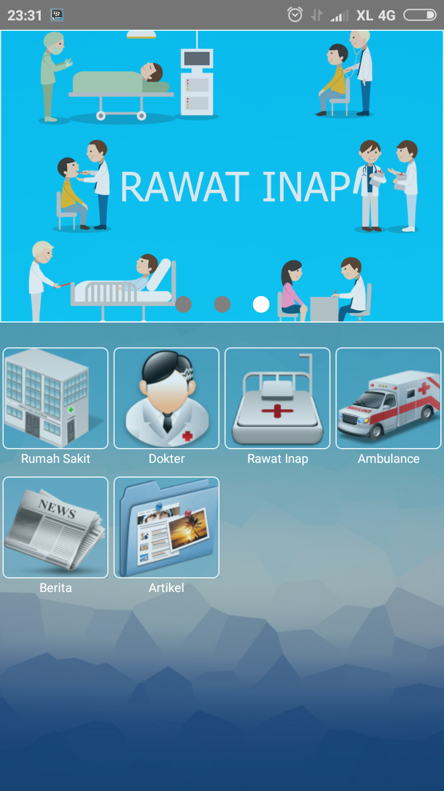
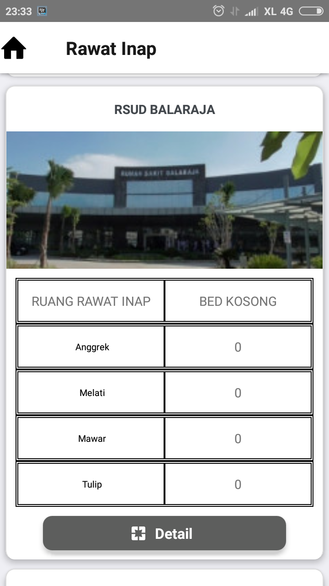
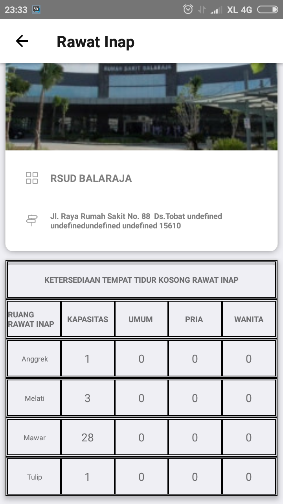
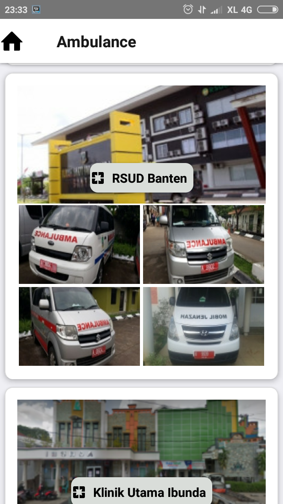
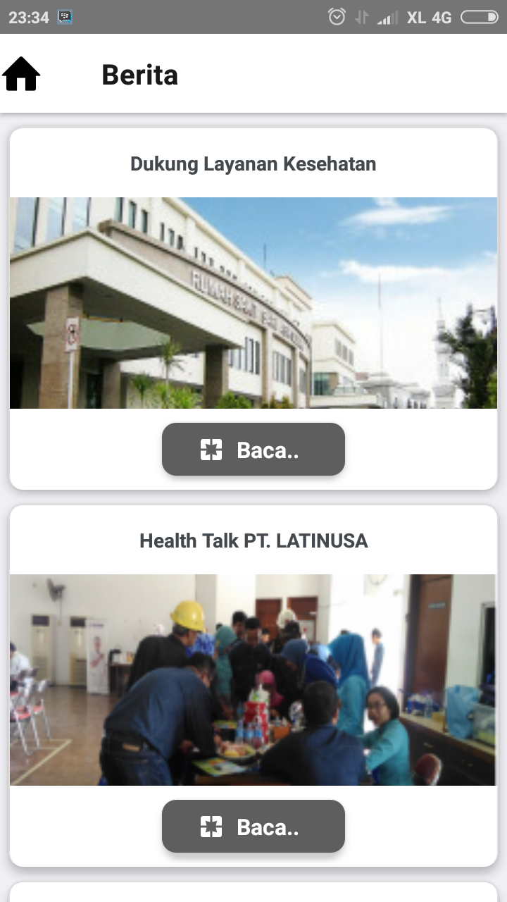
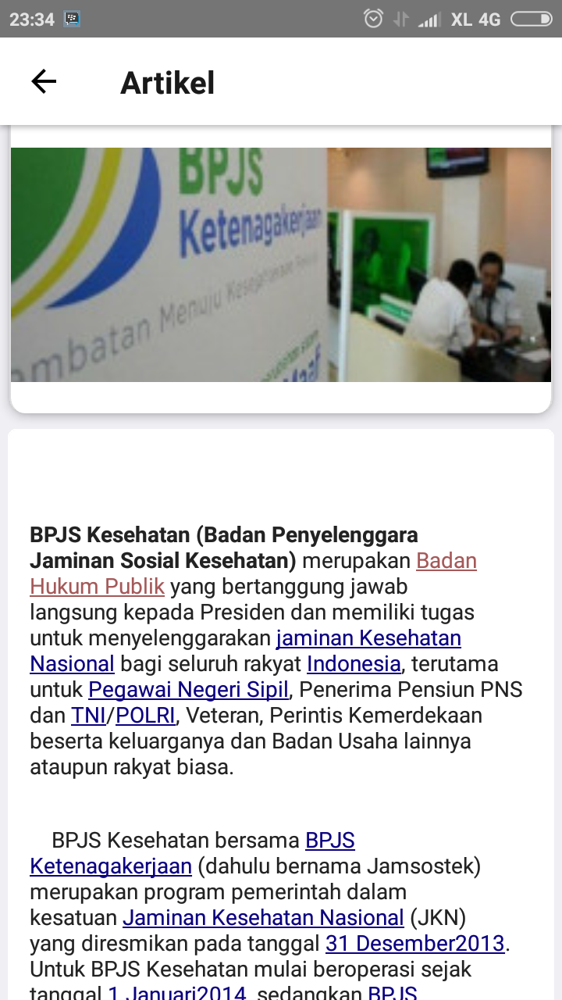

## Daftar Isi

## Daftar Isi
* Will be replaced with the ToC, excluding the "Contents" header
{:toc}

## PENDAHULUAN

YANKES adalah sebuah aplikasi yang akan dikeluarkan oleh pemerintah provinsi Banten untuk mendukung terlaksananya kesehatan masyarakat yang lebih baik. Didalam aplikasi ini masyarakat dapat mengakses informasi kesehatan yang terdapat di Banten, seperti melihat dokter, ruang rawat inap, info rumah sakit, jadwal dokter jaga dan informasi - informasi terkait kesehatan yang terdapat di Banten.
Didalam aplikasi ini terdapat 3 actor yang terlibat dalam pemakaian aplikasi yaitu: Super Admin, Admin Rumah Sakit dan User (Pasien dan Dokter) yang masing - masing dari actor ini mempunyai aktifitas yang berbeda antara satu dengan lainnya.
Berikut ini adalah tampilan - tampilan yang terdapat didalam apliaksi YANKES:

### 1.	Tampilan Dashboard Android Yankes

Disaat membuka aplikasi Android YANKES untuk admin maka akan timbul tampilan seperti gambar diatas. Dalam tampilan dashboard tersebut terdapat beberapa menu yang dapat diakses, seperti menu Rumah sakit, Dokter, Kamar Inap, Ambulance, Berita, Artikel.

### 2.	Tampilan Menu Rumah Sakit Android Yankes

Disaat membuka menu Rumah sakit  akan timbul tampilan seperti gambar diatas. Dalam menu rumah sakit terdapat tampilan rumah sakit yang berada di Provinsi banten dan di dalam aplikasi YANKES.

#### 2.1 Tampilan Detail Rumah Sakit Android Yankes

Disaat membuka salah satu rumah sakit yang ada di aplikasi akan timbul tampilan seperti diatas, yang berisi dari nama rumah sakit tersebut, alamat, email, no telf, serta yang berhubungan dengan rumah sakit tersebut.

### 3.	Tampilan Menu Dokter Android Yankes

Disaat membuka  menu Dokter akan timbul tampilan ini user bisa melihat informasi tentang dokter yang terdaftar diaplikasi YANKES dan untuk melihat informasi lebih lengkap user dapat mengklik salah satu dokter yang ingin dilihat.

#### 3.1 Tampilan Detail Dokter Android Yankes

Ditampilan ini user dapat melihat informasi dokter serta jadwal jaga dokter dan terdapat menu konsultasi didalam tampilan ini.

### 4.	Tampilan Menu Rawat Inap Android Yankes

Didalam tampilan ini user dapat melihat list rumah sakit dan kamar rawat inap yang tersedia dirumah sakit tersebut. Serta dapat melihat “Detail” ada beberapa kamar yang kosong dan tersedia dari rumah sakit tersebut.

#### 4.1 Tampilan Detail Rawat Inap Android Yankes

Didalam tampilan ini user dapat melihat ada berapa kamar yang tersedia serta ruangan-ruangan yang ada dari rumah sakit tersebut tanpa harus kita telf atau mendatangi rumah sakit tersebut.

### 5. Tampilan Menu Ambulance Android Yankes

Didalam tampilan ini user dapat melihat list rumah sakit dan Ambulance yang digunakan rumah sakit tersebut, berapa jumlah Ambulance yang tersedia apakah Ambulance tersebut sedang kosong atau tidak.

#### 5.1 Tampilan Detail Ambulance Android Yankes

Didalam tampilan ini user dapat melihat detail dari rumah sakit dan Ambulance yang di sediakan dari rumah sakit tersebut.

### 6.  Tampilan Menu Berita Android Yankes

Ditampilan ini user dapat melihat berita berita terkait yang berada di Provinsi Banten, untuk melihat lebih detail tentang berita user dapat memilih tombol " Baca".

#### 6.1 Tampilan Detail Berita Android Yankes

Ditampilan ini user dapat melihat berita berita terkait secara keseluruhan.

### 7.	Tampilan Menu Artikel Android Yankes

Didalam tampilan ini hampir sama dengan menu berita user dapat melihat detail dari blog (artikel) mengenai kesehatan.

#### 7.1 Tampilan Detail Artikel Android Yankes

Didalam tampilan ini hampir sama dengan menu berita user dapat melihat detail dari blog (artikel) mengenai kesehatan secara keseluruhan.
